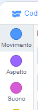

## Aggiunta e rimozione di blocchi di codice

Grande! Hai scritto il tuo primo programma Scratch. È ora di imparare un po' di più su come portare il codice dentro e fuori da Scratch! Il codice di Scratch è composto da **blocchi** come questi:


Troverai tutti i blocchi nella **tavolozza dei blocchi di codice**, ordinati in diverse categorie in base a ciò che fanno.

## \--- collapse \---

## title: Usare i blocchi delle diverse categorie

Clicca sul nome di una categoria per vedere i blocchi in quella categoria. Qui è selezionata la categoria **Movimento**:



Tutti i blocchi nella categoria che hai cliccato sono elencati:


You can click on the block you want, and then just drag it into the current sprite panel and let go. Quando è nel pannello, puoi spostarlo e collegarlo ad altri blocchi.

\--- /collapse \---

Se vuoi vedere cosa fa un blocco, puoi fare doppio clic su di esso per farlo funzionare!

\--- task \---

Prova a fare doppio clic su alcuni dei blocchi per vedere cosa fanno.

\--- /task \---

## \--- collapse \---

## title: Eseguire il codice

Di solito, vuoi che il tuo codice venga eseguito automaticamente ogni volta che accade qualcosa di specifico. Questo è il motivo per cui molti dei tuoi programmi inizieranno con un blocco della categoria **Situazioni**, quasi sempre questo:

```blocks3
    when green flag clicked
```

I blocchi di codice connessi a questo blocco verranno eseguiti dopo che si è fatto clic sulla **bandiera verde**.

I blocchi di codice vengono eseguiti dall'alto verso il basso, quindi l'ordine in cui si agganciano i blocchi è importante. In questo esempio, lo sprite `dirà`{:class = "block3looks"} `Ciao!` prima di `riprodurre`{:class = "block3sound"} il suono di `Miao`.

```blocks3
    when green flag clicked
    say [Hello]
    play sound [meow v]
```

\--- /collapse \---

Rimuovere o eliminare blocchi di codice che non vuoi nel tuo programma è facile! Basta trascinarli di nuovo nella tavolozza dei blocchi di codice.

**Fai attenzione:** trascinandoli sopra la tavolozza, tutti i blocchi collegati al blocco che trascini verranno cancellati, quindi assicurati di separare i blocchi di codice che vuoi tenere da quelli che vuoi rimuovere. Se si eliminano alcuni blocchi di codice per errore e si desidera ripristinarli, fare clic con il pulsante destro del mouse e quindi fare clic sull'opzione **annulla** per recuperare tutto.


\--- task \---

Prova ad aggiungere, eliminare e annullare l'eliminazione di alcuni blocchi di codice!

\--- /task \---

### Mettere tutto insieme

Ora sai come spostare il codice e fare in modo che le cose accadano, è il momento per te di creare un programma per far sì che il gatto Scratch faccia il girotondo!

\--- task \---

Assicurati di aver selezionato il gatto sprite nell'elenco sprite, quindi trascina i blocchi seguenti nel pannello dello sprite e collegali. Li troverai negli elenchi **Situazioni** e **Movimento**.

```blocks3
    when green flag clicked
    move [10] steps
```

\--- /task \---

\--- task \---

Ora, clicca sulla bandiera verde sopra lo stage.


\--- /task \---

Dovresti vedere il gatto camminare in linea retta... non esattamente quello che vuoi, giusto?

Nota: se fai clic sulla bandiera troppe volte e il gatto si allontana, puoi trascinarlo indietro!

\--- task \---

Aggiungi il blocco ruota per far camminare il gatto sprite in cerchio. Anche questo è nell'elenco **Movimento**.

```blocks3
    when green flag clicked
    move [10] steps
+    turn cw (15) degrees
```

\--- /task \---

## \--- collapse \---

## title: Come funziona la manovra di svolta?

Questo blocco fa girare lo sprite di 15 gradi dei 360 gradi completi che formano un cerchio. È possibile modificare tale numero e il numero di passaggi, facendo clic sul numero e digitando un nuovo valore.


\--- /collapse \---

\--- task \---

Ora salva il tuo lavoro!

\--- /task \---