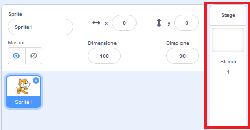

## Organizzare la scena

Scratch ha una libreria di sfondi e sprite da usare per rendere il tuo progetto fantastico.

--- task ---

Seleziona lo stage.

Clicca su **Sfondi**.

Fai clic sull'icona **Scegli uno sfondo dalla libreria**.

Quindi scegli il tuo sfondo subacqueo preferito!

--- /task ---

Grandioso! Certo, ora hai un gatto sott'acqua, e di solito i gatti non ne sono grandi amanti. Ma puoi aggiustarlo, perché puoi trasformare il gatto in uno squalo!

--- task ---

Per prima cosa, seleziona lo sprite del gatto e clicca sulla scheda **Costumi**.

Quindi, fai clic su **Scegli un costume dalla libreria**

Seleziona questa immagine di squalo e clicca **OK**.

Ora rimuovi il costume del gatto selezionandolo e facendo clic su **x**.

--- /task ---

Ora hai uno squalo - eccellente!