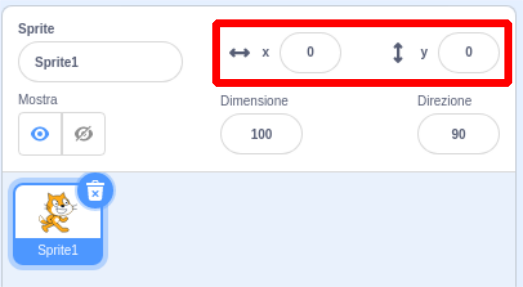

## Spostare le cose

In questo momento il tuo squalo si muove in circolo, e sarebbe molto più divertente controllarlo con i tasti freccia. Con questa scheda, imparerai come farlo!

\--- task \--- Inizia cancellando tutto il codice che hai per lo squalo. \--- /task \---

Come probabilmente hai intuito, avrai di nuovo bisogno di **blocchi Situazioni** e **Movimento**!

\--- task \--- Questa volta, cerca questo blocco e trascinalo nel pannello dello sprite corrente:

```blocks3
    quando si preme il tasto [space v]
```

Fare clic sulla piccola freccia (▼) accanto alla parola `spazio`. Verrà visualizzato un elenco di tutti i tasti della tastiera tra cui è possibile scegliere. \--- /task \---

Avrai bisogno di quattro blocchi `quando si preme il tasto`{: class = "block3events"} - uno per ciascuno dei tasti freccia.

\--- task \--- Per far muovere il tuo squalo, collega questi altri blocchi al blocco **Movimento** come qui sotto illlustrato:

```blocks3
    quando si preme il tasto [left arrow v]
fai (-10) passi
```

```blocks3
    quando si preme il tasto [right arrow v]
fai (10) passi
```

```blocks3
    quando si preme il tasto [up arrow v]
```

```blocks3
    quando si preme il tasto [down arrow v]
```

\--- /task \---

**Nota**: `-10` significa 'indietro 10 passi'.

\--- task \--- Ora fai clic sulla bandiera verde per testare il tuo codice. \--- /task \---

Ora il tuo squalo si muove avanti e indietro, il che è abbastanza bello, ma non si muove su o giù. Inoltre, se guardi attraverso i blocchi **Movimento**, vedrai che non ci sono blocchi per "su" o "giù". Ce ne sono molti relativi alle coordinate **x** e **y** però - proviamo con quelli!

\--- task \--- Prendi due blocchi `cambia y di`{: class = "block3motion"} e aggiorna il tuo codice in questo modo:

```blocks3
    quando si preme il tasto [up arrow v]
+ cambia y di (10)
```

```blocks3
    quando si preme il tasto [down arrow v]
+ cambia y di (-10)
```

\--- /task \---

Ora quando premi i tasti freccia, lo squalo si muove per tutta la scena!

## \--- collapse \---

## title: Come funzionano le coordinate x e y?

Per parlare delle posizioni degli oggetti, come gli sprite, usiamo spesso le coordinate X e Y. L'**asse x** del sistema di coordinate va da **sinistra a destra** mentre l'**asse y** dal **basso verso l'alto**.


Uno sprite può essere individuato dalle coordinate del suo centro, ad esempio `(15, -27)`, dove `15` è la sua posizione lungo l'asse x e `-27` la sua posizione lungo l'asse y.

+ Per avere un'idea di come funziona, seleziona uno sprite e usa i controlli **x** e **y** per spostarlo sullo stage impostando valori diversi per le coordinate.



+ Prova diverse coppie di valori per vedere dove si sposta lo sprite! In Scratch, l'asse x va da `-240` a `240` e l'asse y da `-180` a `180`.

\--- / chiudi \---

### Riavvio del gioco

Lo squalo si muove su tutto lo schermo ora, ma immagina che questo sia un gioco: come lo riavvii e cosa succede all'inizio di ogni partita?

Devi portare lo squalo nella sua posizione originale quando il giocatore inizia la partita. Avvieranno questo gioco facendo clic sulla bandiera verde, quindi è necessario modificare le coordinate x e y dello sprite squalo quando ciò accade.

Questo è in realtà piuttosto facile! Il centro dello stage è `(0, 0)` in coordinate `(x, y)`.

Quindi tutto ciò che serve è un blocco **Situazioni** per la bandiera verde, e un blocco **vai a** da **Movimento**.

\--- task \--- Trascina un `quando si clicca sulla bandiera verde`{: class = "block3events"} **dall'elenco Situazioni** sul pannello dello sprite corrente.

```blocks3
    quando si clicca sulla bandiera verde
```

Quindi trova il `vai a`{: class = "block3motion"} **dall'elenco Movimento** e collegalo al tuo blocco bandiera preso da **Situazioni**.

```blocks3
    quando si clicca sulla bandiera verde
+ vai a x: (0) y: (0)
```

Imposta la coordinata `x` e `y` al valore `0` nel blocco `vai a`{: class = "block3motion"} se già non valgono `0`.

\--- /task \---

\--- task \--- Ora fai clic sulla bandiera verde: dovresti vedere lo squalo tornare al centro della scena! \--- /task \---