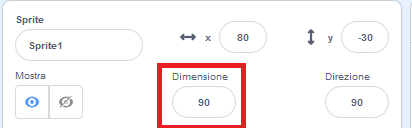
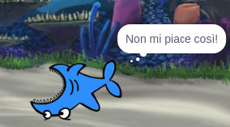

## Tutti gli sprite

Ora hai uno squalo che puoi muovere usando i tasti freccia. Bello! È ora di aggiungere del pesce da prendere.

\--- task \---

Fai clic sul pulsante **Scegli uno sprite** e, dalla schermata che apparirà, scegli un pesce.


Se il tuo pesce è un po' grande rispetto al tuo squalo, puoi usare il controllo delle dimensioni per rendere entrambi gli sprite della giusta misura!



Modificare il numero nel controllo della dimensione per rendere lo sprite più grande o più piccolo.

\--- /task \---

Grande! Successivamente, aggiungerai del codice per far muovere il pesce da solo, senza l'intervento del giocatore. Il tuo giocatore muoverà lo squalo e cercherà di catturare il pesce.

## \--- collapse \---

## title: What about the backwards shark?

It does look a little funny to have that shark swimming backwards. Just like you’d usually turn around rather than walking backwards, the shark would turn around rather than swimming backwards. Luckily for you, Scratch has a block for this!

The `point in direction`{:class="block3motion"} block lets you pick the direction your sprite is pointing in. You’ll find it in the **Motion** blocks section. You can type in any number of degrees, to point the sprite wherever you want. \--- /collapse \---

\--- task \--- Grab a couple of copies of the `point in direction`{:class="block3motion"} block from the **Motion** list and connect them to your shark's code, like this:

```blocks3
    when [left arrow v] key pressed
+     point in direction (-90)
    move (10) steps
```

```blocks3
    when [right arrow v] key pressed
+     point in direction (90)
    move (10) steps
```

\--- /task \---

\--- task \--- Change the number of steps in the `move`{:class="block3motion"} blocks from `-10` to `10`.

If you try moving the shark around now after you've added the `point in direction`{:class="block3motion"} blocks, you might notice something a little strange happening. The shark may not be turning quite right!



\--- /task \---

## \--- collapse \---

## title: Why does it go upside down?

The problem here is that the shark sprite started, as all sprites do, with the 'all around' **rotation style**, and what you need it to have is the 'left-right' style.

As usual, there’s a block for that, and it’s in **Motion**!

\--- /collapse \---

\--- task \--- Look in the **Motion** category for the block `set rotation style`{:class="block3motion"}.

Add the block to your shark reset code from earlier, and set the rotation style to `left-right`{:class="block3motion"}, like this:

```blocks3
    when green flag clicked
+     set rotation style [left-right v]
    go to x: (0) y: (0)
```

\--- /task \---