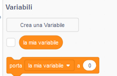
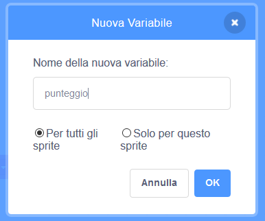

## Tenere il punteggio

Per tenere il conto del numero di pesci catturati dal giocatore, avrai bisogno di un posto in cui memorizzare il punteggio, un modo per aggiungerlo e uno per reimpostarlo quando il gioco viene riavviato.

Primo: memorizzare il punteggio!

\--- task \---

Vai nella categoria dei blocchi **Variabili** e clicca su **Crea una variabile**.



Inserisci `punteggio` come nome.



Controlla la tua nuova variabile!


\--- /task \---

## \--- collapse \---

## title: Cosa sono le variabili?

Quando vuoi memorizzare le informazioni in un programma, usi una cosa chiamata **variabile**. Pensala come una scatola con un'etichetta su di essa: puoi mettere qualcosa dentro, controllare cosa c'è dentro e cambiare ciò che contiene. Troverai le variabili nella sezione **Variabili**, ma devi prima crearle per farle apparire lì!

\--- /collapse \---

Ora devi aggiornare la variabile ogni volta che lo squalo mangia un pesce e ripristinarla quando il gioco viene riavviato. Fare entrambe le cose è abbastanza semplice:

\--- task \---

Dalla sezione **Variabili**, prendi i blocchi `porta [my variable v] a [0]`{:class="block3variables"} e `porta [my variable v] a [1]`{:class="block3variables"}. Fai clic sulle piccole frecce nei blocchi, scegli `punteggio` dall'elenco e quindi inserisci i blocchi nel tuo programma:

### Codice per lo squalo

```blocks3
    when green flag clicked
+    set [score v] to [0]
    set rotation style [left-right v]
    go to x: (0) y: (0)
```

### Codice per il pesce

```blocks3
    if <touching [Sprite1 v] ?> then
+        change [score v] by [1]
        hide
        wait (1) secs
        go to x: (pick random (-240) to (240)) y: (pick random (-180) to (180))
        show
    end
```

\--- /task \---

Mitico! Ora hai un punteggio e tutto il resto.