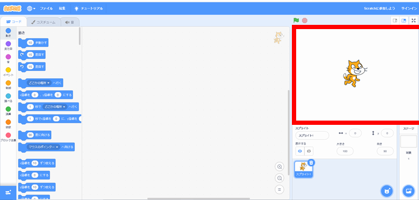
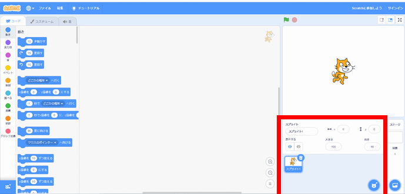
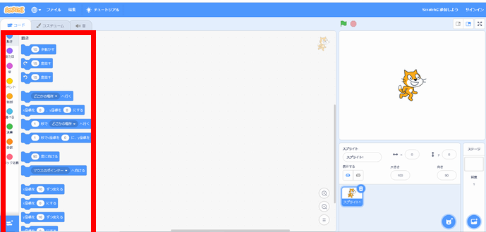
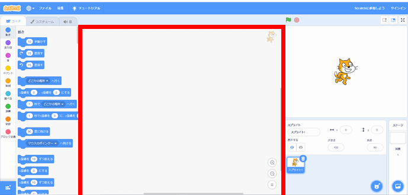
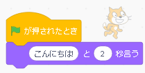

## セットアップ

--- task ---

[新しいScratchプロジェクト](https://rpf.io/scratch-new){:target="_blank"}を開きます。 スクラッチはブラウザの別のタブで開きます。

[[[working-offline]]]

--- /task ---

Scratchを開くと、次のようなウィンドウが表示されます。

--- task ---

次の各領域を確認し、それらがどこにあるかを覚えておいてください。

--- /task ---

### ステージ



--- collapse ---
---
title: ステージとは
---

ここは、Scratchプログラムが実行される場所です。 次のものが含まれます。

* 1つ以上の背景 （画面の背景の画像）

* それに関連する コードブロック （これを取得します）

--- /collapse ---

### スプライトリスト



--- collapse ---
---
title: スプライトとは
---

ステージ上に追加できるアイテムは、 **スプライト**のみです。

スプライトには次のものが含まれます。

* ステージ上の 画像
* いくつかの特別なコスチューム
* それに関連する音
* それに関連する コードブロック 

--- /collapse ---

### コードブロックパレット



--- collapse ---
---
title: コードブロック
---

Scratchのコード（プログラム）は、ブロックを組み合わせることで作られます。 **コードブロックパレット**からブロックを選択し、 **スプライトパネル**にドラッグし、ブロック同士を接続します。

ブロックには10のカテゴリがあります。 これらは色分けされており、**コードブロックパレット**の上部にあるリスト内のアイテムをクリックして選択できます。

--- /collapse ---

### 現在のスプライトパネル



--- collapse ---
---
title: 現在のスプライトとは何ですか？
--- 

**現在のスプライト**とは、**スプライトリスト**から選択されているものです。

**現在のスプライトパネル** とは、あなたが選択したスプライトのコード、衣装、そして音を確認できる場所です。

--- /collapse ---

さあ、コーディングの時間です！

--- task ---

スプライトリストで、ScratchCatをクリックします。 猫が現在のスプライトです。

コードブロックパレットの中にある**イベント**カテゴリを選択し、`フラグがクリックされたとき`{:class="block3events"}ブロックをクリックし、現在のスプライトパネルにドラッグします。

```blocks3
    when green flag clicked
```

--- /task ---

--- task ---

次に、コードブロックパレットの中にある **みため**に移動し、次のブロックを見つけます。

```blocks3
    say [こんにちは！] for (2) secs
```

それをクリックし、マウスボタンを押したまま、現在のスプライトパネルにドラッグし、ボタンをはなします。

--- /task ---

--- task ---

2つ目のブロックが現在のスプライトパネルにあるので、 最初のブロックの下部に接続するには、もう一度それをクリックして、最初ブロックの下にドラッグして移動します。 こんな感じです。



--- /task ---

--- task ---

次に、 **Green Flag** をクリックしてプログラムを開始し、何が起こるか見てみましょう！

--- /task ---