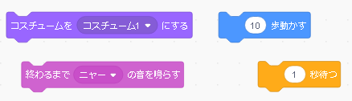
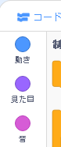
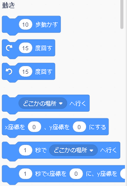
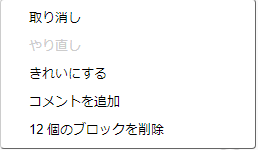

## コードブロックの追加と削除

すばらしいです！ 初めてのスクラッチプログラムを作成しました。 ここでもう少しスクラッチの馴染んで詳しくなっておきましょう。 スクラッチのコードは、次のように **ブロック**から 構成されています。



全てのブロックは **コードブロックパレット**の中にあり、用途のカテゴリに分類されています。

## \--- collapse \---

## title：さまざまなカテゴリのブロックを使う

カテゴリ名をクリックすると、そのカテゴリのブロックが表示されます。 ここでは、 **うごき** カテゴリが選択されています。



クリックしたカテゴリ内のすべてのブロックがリストに表示されます。



目的のブロックをクリックして、現在のスプライトパネルにドラッグして放します。 パネルに配置したら、移動して他のブロックに接続できます。

\--- /collapse \---

ブロックの動作を確認したい場合は、ブロックをダブルクリックして実行します。

\--- task \---

一部のブロックをダブルクリックしてみて、それらの機能を確認してください。

\--- /task \---

## \--- collapse \---

## title：コードの実行

通常、何か特定の事象が発生したときにコードが自動的に実行されるようにしたいです。 これが、多くのプログラムが**イベント**カテゴリーのブロックから始まる理由です。最も多いのはこれです。

```blocks3
    緑色の旗がクリックされたとき
```

このブロックに接続されたコードブロックは、**緑色のフラグ**がクリックされた後に実行されます。

コードブロックは上から下へと動くので、ブロックをくっつける順番が重要です。 この例では、スプライトは`ニャー`の音を`再生`{:class="block3sound"}する前に、`こんにちは！`を`言います`{:class="block3looks"}。

```blocks3
    緑の旗がクリックされたとき
    言う [Hello]
    サウンドを再生する[meow v]
```

\--- /collapse \---

プログラムの不要なコードブロックを外すまたは削除するのは簡単です！ それらをコードブロックパレットに戻すだけです。

**注意:**それらをコードブロックパレットにドラッグすると、ドラッグしたブロックに接続されているすべてのブロックは削除されます。そのため、保持したいコードブロックと削除したいブロックを必ず別々にしてください。 誤って削除したコードブロックを取り戻したい場合は、 右クリックし**元に戻す**というオプションをクリックしてすべてを元に戻します。



\--- task \---

いくつかのコードブロックを追加、削除、削除解除をしてみてください！

\--- /task \---

### すべてを一緒に入れて

これでコードを移動して物事を実現する方法がわかったので、そろそろスクラッチキャットを丸く歩かせるプログラムを作成しましょう！

\--- task \---

スプライトリストにある猫のスプライトが選択されていることを確認し、次のブロックをスプライトパネルにドラッグして接続します。 ブロックは**イベント**と**動き**のリストから見つかりますよ。

```blocks3
    緑色の旗がクリックされたとき
    移動 [10] ステップ
```

\--- /task \---

\--- task \---

次に、ステージの上にある緑の旗をクリックします。


\--- /task \---

猫が直線を歩いているのが見えるはずです...これは違いますよね?

注意：フラグを何度もクリックしすぎて猫が離れた場合は、ドラッグして戻せますよ！

\--- task \---

曲がるブロックを端っこにくっつけて、猫のスプライトが円を歩くようにします。 ブロックは**動き**のリストから見つかりますよ。

```blocks3
    緑色の旗がクリックされたとき
    移動 [10] ステップ
+ cw（15）度を回す
```

\--- /task \---

## \--- collapse \---

## title：回転はどのように働くのか？

このブロックは、スプライトを円を構成する全360度の15度分だけ回転させます。 度数とステップ数を変更するには、その数字をクリックして新しい値を入力します。


\--- /collapse \---

\--- task \---

さあ、今までの作業を保存しましょう！

\--- /task \---