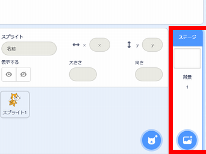
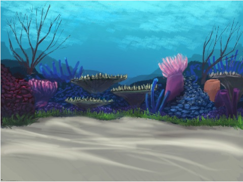
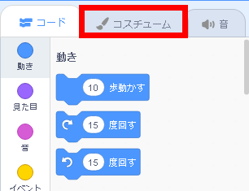
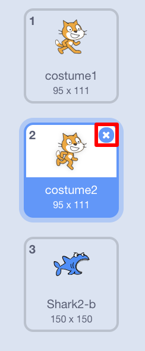

## シーンを設定する

Scratchには、プロジェクトの見栄えを良くするために使用できる背景とスプライトのライブラリがあります。

\--- task \---

Select the Stage.

背景タブをクリックします 。

![[背景]タブ](images/looksBackdrops.png)

[ ライブラリから背景を選択 ]をクリックします。

次に、お気に入りの水中背景を選んでください！

\--- /task \---

素晴らしいです！ もちろん、今あなたは水中で猫を飼っています。しかし通常、猫は水中が好きではありません。 しかし、猫をサメに変えることができるので、あなたはそれを修正することができます！

\--- task \---

First, select the cat sprite and click on the **Costumes** tab.

次に、[ ライブラリからコスチュームを選択 ]をクリックします

このサメの画像を選択して[ OK ]をクリックします。

Now remove the cat costumes by selecting each of them and clicking on the **x**.

\--- /task \---

これでサメができました。すばらしいです！