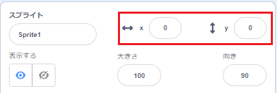

## 物を動かす

今、あなたのサメは円を描いて動きます。矢印キーでそれを制御する方がずっと楽しいでしょう。 このカードでは、その方法を学習します！

\--- task \---

Start by deleting all code that you have for the shark.

\--- /task \---

おそらくご想像のとおり、再び「イベント」ブロックと「動き」ブロックが必要になります！

\--- task \---

This time, look for this block and drag it into the current sprite panel:

```blocks3
    when [space v] key pressed
```

スペースの横にある小さな下矢印（▼）をクリックします 。 選択できるすべてのキーボードキーのリストが表示されます。

\--- /task \---

キーが押されたときのブロックが4つ必要になります（矢印キーごとに1つ）。

\--- task \---

To make your shark move, connect these blocks to **Motion** blocks like this:

```blocks3
    when [left arrow v] key pressed
    move (-10) steps
```

```blocks3
    when [right arrow v] key pressed
    move (10) steps
```

```blocks3
    when [up arrow v] key pressed
```

```blocks3
    when [down arrow v] key pressed
```

\--- /task \---

注：-10は「10ステップ戻る」ことを意味します。

\--- task \---

Now click the green flag to test out your code.

\--- /task \---

これでサメが前後に移動します。これはかなりクールですが、上下には移動しません。 また、「動き」ブロックを見ると、「上」または「下」のブロックがないことがわかります。 There are a whole bunch of them related to **x** and **y** coordinates though — let's try those!

\--- task \---

Grab two `change y by`{:class="block3motion"} blocks, and update your code like this:

```blocks3
    when [up arrow v] key pressed
+     change y by (10)
```

```blocks3
    when [down arrow v] key pressed
+     change y by (-10)
```

\--- /task \---

Now when you press the arrows keys, the shark moves all around the stage!

## \--- collapse \---

## title: How do x- and y-coordinates work?

To talk about the positions of objects, such as sprites, we often use x- and y-coordinates. The **x-axis** of the Stage coordinate system runs from **left to right**, and the **y-axis** runs from **bottom to top**.


A sprite can be located by the coordinates of its centre, for example `(15, -27)`, where `15` is its position along the x-axis , and `-27` its position along the y-axis.

+ To get a feel for how this actually works, select a sprite and use the **x** and **y** controls to move it around the stage by setting different values for the coordinates.



+ Try different pairs of values to see where the sprite goes! In Scratch, the x-axis goes from `-240` to `240`, and the y-axis goes from `-180` to `180`.

\--- /collapse \---

### Restarting the game

The shark moves all over the screen now, but imagine this is a game: how do you restart it, and what happens at the start of each game?

You need to get the shark to its original location when the player starts the game. They'll start this game by clicking on the green flag, so you need to change the shark sprite's x- and y-coordinates when that happens.

That’s actually pretty easy! The centre of the stage is `(0, 0)` in `(x, y)` coordinates.

So all you need is an **Event** block for that green flag, and the **go to** block from **Motion**.

\--- task \---

Drag a `when green flag clicked`{:class="block3events"} **Event** block onto the current sprite panel.

```blocks3
    when green flag clicked
```

Then find the `go to`{:class="block3motion"} **Motion** block, and attach it to your flag **Event** block.

```blocks3
    when green flag clicked
+     go to x: (0) y: (0)
```

Set the both the `x` and the `y` coordinate to `0` in the `go to`{:class="block3motion"} block if they are not already `0`.

\--- /task \---

\--- task \---

Now click the green flag: you should see the shark return to the centre of the stage!

\--- /task \---