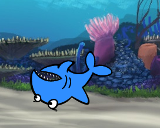

## すべてのスプライト

これで、矢印キーを使用して移動できるサメができました。 すばらしい！ 魚を追加して捕まえる時間です。

\--- タスク \---

[ 新規スプライト ]ボタンをクリックし、開いた画面で魚を選択します。


サメに比べて魚が少し大きい場合は、サイズコントロールを使用して両方のスプライトを適切なサイズにすることができます！


Change the number in the size control to make the sprite bigger or smaller.

\--- /タスク \---

素晴らしいです！ 後で、プレイヤーの助けを借りずに、魚を自力で動き回らせるためのコードを追加します。 プレイヤーはサメを動かし、魚を捕まえようとします。

## \--- 折りたたむ \---

## タイトル：後方のサメはどうですか？

そのサメが後ろに泳いでいるのは少しおかしく見えます。 後方を泳ぐのではなく通常は向きを変えるように、サメは向きを変えます。 幸いなことに、Scratchにはこのためのブロックがあります！

「○度に向ける」ブロックを使用すると、スプライトが指している方向を選択できます。 これは[動き]セクションにあります。 任意の角度で入力して、好きな場所にスプライトを向けることができます。

\--- /collapse \---

\--- task \---

Grab a couple of copies of the `point in direction`{:class="block3motion"} block from the **Motion** list and connect them to your shark's code, like this:

```blocks3
    [左矢印]キーを押したとき
+（-90）度に向ける
    （10）歩動かす
```

```blocks3
    [右矢印]キーを押したとき
+（90）度に向ける
    （10）歩動かす
```

\--- /task \---

\--- task \---

Change the number of steps in the `move`{:class="block3motion"} blocks from `-10` to `10`.

方向ブロックにポイントを追加した後、サメを今すぐ動かしてみると、少し奇妙なことが起こっていることに気付くかもしれません。 サメは完全に右に曲がっていないかもしれません！



\--- /task \---

## \--- 折りたたむ \---

## タイトル：なぜ逆さまになるのですか？

ここでの問題は、すべてのスプライトが行うように、サメのスプライトが「自由に回転」の**回転スタイル**になっていることで、必要なのは回転方法を「左右のみ」スタイルであるということです。

いつものように、そのためのブロックがあって、それは**動き**の中にあります ！

\--- /collapse \---

\--- task \---

Look in the **Motion** category for the block `set rotation style`{:class="block3motion"}.

ブロックを以前のサメのコードに追加し、次のように回転方法を`左右のみ`に限定します。

```blocks3
    緑の旗が押されたとき
+回転方法を[左右のみ]にする
    x座標：（0）y座標：（0）にする
```

\--- /task \---