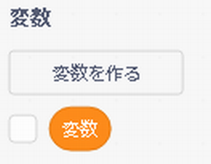
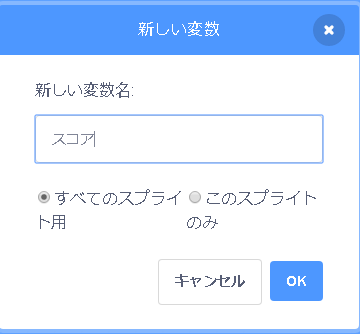
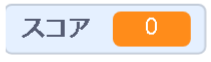

## スコアを保つ

プレイヤーが釣った魚の数のスコアを保持するには、スコアを保存する場所、それを追加する方法、およびゲームを再起動したときにリセットする方法が必要になります。

まず最初に：スコアを保存します！

\--- task \---

Go to the **Variables** blocks category and click on **Make a Variable**.



新しい変数名を「スコア」と入力します。



新しい変数をチェックしてください！



\--- /task \---

## \--- 折りたたむ \---

## タイトル：変数とは何ですか？

プログラムに情報を保存する場合、変数と呼ばれるものを使用します。 ラベルの付いた箱のようなものだと考えてください。何かを入れて、何が入っているかを確認し、何が入っているかを変更できます。 [ 変数]セクションに変数がありますが、そこに表示するには変数を最初に作成する必要があります。

\--- /collapse \---

ここで、サメが魚を食べるたびに変数を更新し、ゲームの再起動時に変数をリセットする必要があります。 両方を行うのはとても簡単です：

\--- task \---

From the **Variables** section, take the `set [my variable v] to [0]`{:class="block3variables"} and `change [my variable v] by [1]`{:class="block3variables"} blocks. ブロック内の小さな矢印をクリックし、リストからスコアを選択して、ブロックをプログラムに追加します。

### サメのコード

```blocks3
    緑の旗が押されたとき
+　スコアを[0]にする
　回転方法を[左右のみ]にする
    x座標：（0）y座標：（0）にする
```

### 魚のコード

```blocks3
    もし　なら
+　スコアを[1]ずつ変える
　　隠す
　（1）秒待つ
　 1秒でx座標を：（（-240）から（240）までの乱数に）y座標を：（（-180）から（180)までの乱数に）））に変える
+　  表示する
    終了
```

\--- /task \---

素敵! これでスコアとすべてが手に入りました。