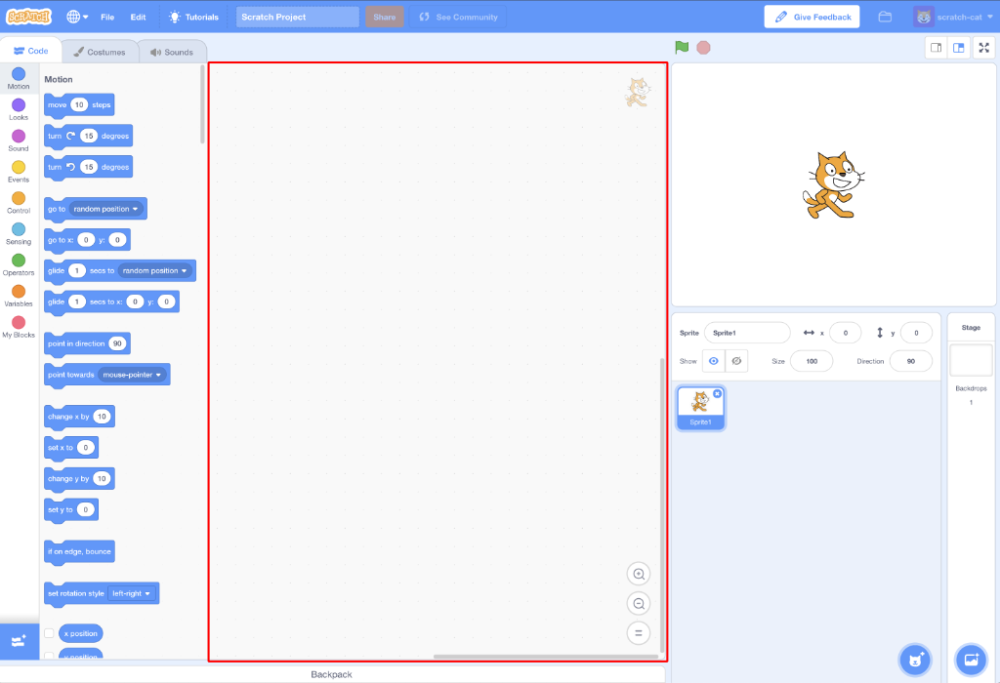
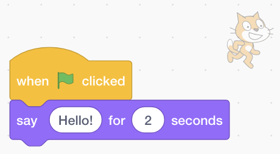

## ಹೊಂದಿಸಲಾಗುತ್ತಿದೆ

ನೀವು Scratch ಅನ್ನು ತೆರೆದ ನಂತರ, ಕೆಳಗಿನ ವಿಂಡೋವನ್ನು ನೋಡುತ್ತೀರಿ.

\--- task \---

ಕೆಳಗಿನ ಪ್ರತಿಯೊಂದು ಪ್ರದೇಶಗಳನ್ನು ನೋಡಿ ಮತ್ತು ಅವುಗಳು ಎಲ್ಲಿವೆ ಎಂಬುದನ್ನು ನೆನಪಿಡಿ.

\--- /task \---

### ಸ್ಟೇಜ್


## \--- collapse \---

## title: ಸ್ಟೇಜ್ ಎಂದರೇನು?

ನಿಮ್ಮ Scratch ಪ್ರೋಗ್ರಾಂಗಳು ಇಲ್ಲಿ run ಮಾಡಲಾಗುತ್ತದೆ. ಇದರಲ್ಲಿ:

* ಒಂದು ಅಥವಾ ಹೆಚ್ಚಿನ **backgrounds** \ (ಪರದೆಯ ಹಿನ್ನೆಲೆಯಲ್ಲಿ ಚಿತ್ರಗಳು \)

* ಯಾವುದೇ **ಕೋಡ್ ಬ್ಲಾಕ್‌ಗಳು** ಇದರೊಂದಿಗೆ ಸಂಯೋಜಿಸಲಾಗಿದೆ \ (ನಾವು ಇದಕ್ಕೆ ಬರೋಣ \)

\--- /collapse \---

### Sprite ಪಟ್ಟಿ


## \--- collapse \---

## title: Sprite ಎಂದರೇನು?

ಸ್ಟೇಜ್ನಲ್ಲಿ ನೀವು ಸೇರಿಸಬಹುದಾದ ಯಾವುದೇ ಐಟಂ **Sprite**.

Sprite ಇವುಗಳನ್ನು ಒಳಗೊಂಡಿದೆ:

* **Image** ಸ್ಟೇಜ್ ನ ಮೇಲೆ
* ಯಾವುದೇ ಹೆಚ್ಚುವರಿ **costumes** \ (ಕಾಣುತ್ತದೆ \) ಅದು ಹೊಂದಿದೆ
* ಯಾವುದೇ **ಶಬ್ದಗಳು** ಅದರೊಂದಿಗೆ ಸಂಬಂಧಿಸಿದೆ
* ಯಾವುದೇ **ಕೋಡ್ ಬ್ಲಾಕ್** ಅದರೊಂದಿಗೆ ಸಂಬಂಧಿಸಿದೆ 

\--- /collapse \---

### ಕೋಡ್ ಬ್ಲಾಕ್ ಪ್ಯಾಲೆಟ್


## \--- collapse \---

## title: ಕೋಡ್ ಬ್ಲಾಕ್ಗಳು

Scratchನಲ್ಲಿ ಕೋಡ್ ಬ್ಲಾಕ್ಸ್ ನ ರೂಪದಲ್ಲಿ ಬರುತ್ತದೆ ನೀವು ಪ್ರೋಗ್ರಾಂಗಳನ್ನು ಮಾಡಲು ಅವುಗಳನ್ನು ಕನೆಕ್ಟ್ ಮಾಡಿ. ನೀವು **ಕೋಡ್ ಬ್ಲಾಕ್ ಪ್ಯಾಲೆಟ್**ನಿಂದ ಬ್ಲಾಕ್ಗಳನ್ನು ಆಯ್ಕೆ ಮಾಡಿ, ಅವುಗಳನ್ನು **ಪ್ರಸ್ತುತ sprite ಪ್ಯಾನೆಲ್ಗೆ**ಎಳೆಯಿರಿ, ತದನಂತರ ಅವುಗಳನ್ನು ಪರಸ್ಪರ ಕನೆಕ್ಟ್ ಮಾಡಿ.

ಬ್ಲಾಕ್ಗಳಲ್ಲಿ ಹತ್ತು ವಿಭಾಗಗಳಿವೆ. ಅವು ಕಲರ್-ಕೋಡೆಡ್ ಆಗಿದ್ದು, **ಕೋಡ್ ಬ್ಲಾಕ್ಸ್ ಪ್ಯಾಲೆಟ್** ನ ಮೇಲ್ಭಾಗದಲ್ಲಿರುವ ಪಟ್ಟಿಯಲ್ಲಿರುವ ಐಟಂಗಳ ಮೇಲೆ ಕ್ಲಿಕ್ ಮಾಡುವುದರ ಮೂಲಕ ನೀವು ಅವುಗಳ ನಡುವೆ ಆಯ್ಕೆ ಮಾಡಬಹುದು.

\--- /collapse \---

### ಪ್ರಸ್ತುತ sprite ಪ್ಯಾನೆಲ್



## \--- collapse \---

## title: ಕರೆಂಟ್ sprite ಎಂದರೇನು?

**ಕರೆಂಟ್ sprite****sprite ಪಟ್ಟಿ**ಯಲ್ಲಿ ಆಯ್ಕೆಮಾಡಲಾಗಿದೆ.

**ಕರೆಂಟ್ sprite ಪ್ಯಾನೆಲ್** ಆಯ್ದ spriteಗಾಗಿ ನೀವು code, costumes ಮತ್ತು ಶಬ್ದಗಳನ್ನು ನೋಡಬಹುದು.

\--- /collapse \---

ಕೋಡಿಂಗ್ ಮಾಡುವ ಸಮಯ!

\--- task \---

Sprite ಪಟ್ಟಿಯಲ್ಲಿ, Scratch ಕ್ಯಾಟ್ ಕ್ಲಿಕ್ ಮಾಡಿ. ಕ್ಯಾಟ್ ಈಗ ಪ್ರಸ್ತುತ sprite ಆಗಿದೆ.

**Events**ವರ್ಗವನ್ನು ಕೋಡ್ ಬ್ಲಾಕ್ಗಳ ಪ್ಯಾಲೆಟ್ನಲ್ಲಿ ಆರಿಸಿ, `when flag clicked` {:class="block3events"} ಬ್ಲಾಕ್ ಕ್ಲಿಕ್ಮಾಡಿ, ಮತ್ತು ಅದನ್ನು ಪ್ರಸ್ತುತ sprite ಪ್ಯಾನೆಲ್‌ಗೆ ಎಳೆಯಿರಿ.

```blocks3
    when green flag clicked
```

\--- /task \---

\--- task \---

ನಂತರ **Looks**ಗೆ ಹೋಗಿ ಕೋಡ್ ಬ್ಲಾಕ್ಗಳ ಪ್ಯಾಲೆಟ್ನಲ್ಲಿ ಈ ಬ್ಲಾಕ್ ಅನ್ನು ಹುಡುಕಿ:

```blocks3
    say [Hello!] for (2) secs
```

ಅದರ ಮೇಲೆ ಕ್ಲಿಕ್ ಮಾಡಿ, ಮೌಸ್ ಬಟನ್ಅನ್ನು ಒತ್ತಿಹಿಡಿಯಿರಿ, ತದನಂತರ ಅದನ್ನು ಪ್ರಸ್ತುತ sprite ಪ್ಯಾನೆಲ್‌ಗೆ ಎಳೆಯಿರಿ ಮತ್ತು ಬಟನ್ಅನ್ನು ಬಿಡಿ.

\--- /task \---

\--- task \---

ಈಗ ಎರಡನೇ ಬ್ಲಾಕ್ ಪ್ರಸ್ತುತ sprite ಪ್ಯಾನೆಲ್‌ನಲ್ಲಿದೆ, ಅದನ್ನು ಒಟ್ಟಿಗೆ ಸ್ನ್ಯಾಪ್ ಮಾಡುವವರೆಗೆ ಅದನ್ನು ಇತರ block ಕೆಳಗೆ ಸರಿಸಲು ಅದನ್ನು ಕ್ಲಿಕ್ ಮಾಡಿ ಮತ್ತು ಮತ್ತೆ ಎಳೆಯುವ ಮೂಲಕ ಅದನ್ನು ಮೊದಲ ಬ್ಲಾಕ್ ಕೆಳಭಾಗಕ್ಕೆ ಸಂಪರ್ಕಪಡಿಸಿ:



\--- /task \---

\--- task \---

ಈಗ **Start Program** ಬಟನ್ ಅನ್ನು ಕ್ಲಿಕ್ ಮಾಡಿ ಮತ್ತು ಏನಾಗುತ್ತದೆ ನೋಡಿ!

\--- /task \---