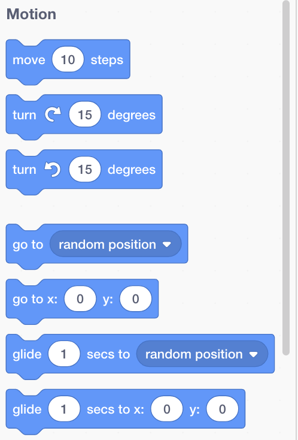

## ಕೋಡ್ ಬ್ಲಾಕ್ ಅನ್ನು ಸೇರಿಸುವುದು ಮತ್ತು ತೆಗೆದುಹಾಕುವುದು

ಅತ್ಯುತ್ತಮ! ನಿಮ್ಮ ಮೊದಲ Scratch ಪ್ರೋಗ್ರಾಂ ಅನ್ನು ನೀವು ಬರೆದಿದ್ದೀರಿ. ಈಗ Scratch ಒಳಗೆ ಮತ್ತು ಹೊರಗೆ ಕೋಡ್ ಪಡೆಯುವ ಬಗ್ಗೆ ಸ್ವಲ್ಪ ಹೆಚ್ಚು ಕಲಿಯುವ ಸಮಯ! Scratch ಕೋಡ್ **ಬ್ಲಾಕ್ಗಳಿಂದ** (blocks) ಕೂಡಿದೆ. ಉದಾಹರಣೆಗೆ:


** ಕೋಡ್ ಬ್ಲಾಕ್ಗಳ ಪ್ಯಾಲೆಟ್** ನಲ್ಲಿ ನೀವು ಎಲ್ಲಾ ಬ್ಲಾಕ್ಗಳನ್ನು ಕಾಣಬಹುದು, ಅವರು ಏನು ಮಾಡುತ್ತವೆ ಎಂಬುದರ ಪ್ರಕಾರ ವಿಭಿನ್ನ ವರ್ಗಗಳಾಗಿ ವಿಂಗಡಿಸಲಾಗಿದೆ.

## \--- collapse \---

## title: ವಿಭಿನ್ನ ವರ್ಗಗಳಿಂದ ಬ್ಲಾಕ್ಗಳನ್ನು ಬಳಸುವುದು

ಆ ವರ್ಗದಲ್ಲಿನ ಬ್ಲಾಕ್ಗಳನ್ನು ನೋಡಲು ವರ್ಗದ ಹೆಸರಿನ ಮೇಲೆ ಕ್ಲಿಕ್ ಮಾಡಿ. ಇಲ್ಲಿ, **Motion** ವರ್ಗವನ್ನು ಆಯ್ಕೆ ಮಾಡಲಾಗಿದೆ:


ನೀವು ಕ್ಲಿಕ್ ಮಾಡಿದ ವರ್ಗದಲ್ಲಿನ ಎಲ್ಲಾ ಬ್ಲಾಕ್‌ಗಳನ್ನು ಪಟ್ಟಿಯಲ್ಲಿ ತೋರಿಸಲಾಗಿದೆ:



ನಿಮಗೆ ಬೇಕಾದ ಬ್ಲಾಕ್ ಅನ್ನು ನೀವು ಕ್ಲಿಕ್ ಮಾಡಬಹುದು, ತದನಂತರ ಅದನ್ನು ಪ್ರಸ್ತುತ sprite ಪ್ಯಾನೆಲ್‌ಗೆ ಎಳೆಯಿರಿ ಮತ್ತು ಹೋಗಲು ಬಿಡಿ. ಅದು ಪ್ಯಾನಲ್ ನಲ್ಲಿದ್ದಾಗ, ನೀವು ಅದನ್ನು ಸುತ್ತಲೂ ಚಲಿಸಬಹುದು ಮತ್ತು ಅದನ್ನು ಇತರ ಬ್ಲಾಕ್‌ಗಳಿಗೆ ಕನೆಕ್ಟ್ ಮಾಡಬಹುದು.

\--- /collapse \---

ಒಂದು ಬ್ಲಾಕ್ ಏನು ಮಾಡುತ್ತದೆ ಎಂಬುದನ್ನು ನೀವು ನೋಡಲು ಬಯಸಿದರೆ, ಅದನ್ನು ಚಲಾಯಿಸಲು ನೀವು ಅದರ ಮೇಲೆ ಡಬಲ್ ಕ್ಲಿಕ್ ಮಾಡಬಹುದು!

\--- task \---

ಬ್ಲಾಕ್ಗ‌ಳು ಏನು ಮಾಡುತ್ತವೆ ಎಂಬುದನ್ನು ನೋಡಲು ಕೆಲವು ಬ್ಲಾಕುಗಳ ಮೇಲೆ ಡಬಲ್ ಕ್ಲಿಕ್ ಮಾಡಲು ಪ್ರಯತ್ನಿಸಿ.

\--- /task \---

## \--- collapse \---

## title: ಕೋಡ್ ರನ್ ಮಾಡುವುದು

ಸಾಮಾನ್ಯವಾಗಿ, ಏನಾದರೂ ಸಂಭವಿಸಿದಾಗ ನಿಮ್ಮ ಕೋಡ್ ಸ್ವಯಂಚಾಲಿತವಾಗಿ ಕಾರ್ಯನಿರ್ವಹಿಸಲು ನೀವು ಬಯಸುತ್ತೀರಿ. ಇದಕ್ಕಾಗಿಯೇ ನಿಮ್ಮ ಅನೇಕ ಪ್ರೋಗ್ರಾಂಗಳು **Events‌** ವರ್ಗಗಳ ಬ್ಲಾಕ್‌ನೊಂದಿಗೆ ಪ್ರಾರಂಭವಾಗುತ್ತವೆ, ಹೆಚ್ಚಾಗಿ ಇದು:

```blocks3
    when green flag clicked
```

ಈ ಬ್ಲಾಕ್‌ಗೆ ಸಂಪರ್ಕಗೊಂಡಿರುವ ಕೋಡ್ ಬ್ಲಾಕ್‌ಗಳು **green flag** (ಹಸಿರು ಧ್ವಜ) ವನ್ನು ಕ್ಲಿಕ್ ಮಾಡಿದ ನಂತರ ರನ್ ಆಗುತ್ತವೆ.

ಕೋಡ್ ಬ್ಲಾಕ್‌ಗಳು ಮೇಲಿನಿಂದ ಕೆಳಕ್ಕೆ ರನ್ ಆಗುತ್ತವೆ, ಆದ್ದರಿಂದ ನಿಮ್ಮ ಬ್ಲಾಕ್‌ಗಳನ್ನು ನೀವು ಒಟ್ಟಿಗೆ ಸ್ನ್ಯಾಪ್ ಮಾಡುವ ಕ್ರಮವು ಮುಖ್ಯವಾಗಿರುತ್ತದೆ. ಈ ಉದಾಹರಣೆಯಲ್ಲಿ, sprite `Hello!` `say`{:class="block3looks"} `meow` ಧ್ವನಿ `play`{:class="block3sound"} ಆಗುವ ಮೊದಲು.

```blocks3
    when green flag clicked
    say [Hello]
    play sound [meow v]
```

\--- /collapse \---

ನಿಮ್ಮ ಪ್ರೋಗ್ರಾಂನಲ್ಲಿ ನೀವು ಬಯಸದ ಕೋಡ್ ಬ್ಲಾಕ್ಗಳನ್ನು ತೆಗೆದುಹಾಕುವುದು ಅಥವಾ ಅಳಿಸುವುದು ಸುಲಭ! ಅವುಗಳನ್ನು ಕೋಡ್ ಬ್ಲಾಕ್ ಪ್ಯಾಲೆಟ್‌ಗೆ ಪುನಃ ಎಳೆಯಿರಿ.

**ಜಾಗರೂಕರಾಗಿರಿ:** ಅವುಗಳನ್ನು ಕೋಡ್ ಬ್ಲಾಕ್‌ ಪಾಲೆಟ್ ಗೆ ಎಳೆಯುವುದರಿಂದ ನೀವು ಎಳೆಯುವ ಬ್ಲಾಕ್‌ಗೆ ಸಂಪರ್ಕಗೊಂಡಿರುವ ಎಲ್ಲಾ ಬ್ಲಾಕ್‌ಗಳನ್ನು ಅಳಿಸುತ್ತದೆ, ಆದ್ದರಿಂದ ನೀವು ತೆಗೆದುಹಾಕಲು ಬಯಸುವುದರಿಂದ ನೀವು ಇರಿಸಿಕೊಳ್ಳಲು ಬಯಸುವ ಕೋಡ್ ಬ್ಲಾಕ್‌ಗಳನ್ನು ಪ್ರತ್ಯೇಕವಾಗಿ ಇರಿಸಿಕೊಳ್ಳಿ. ನೀವು ಕೆಲವು ಕೋಡ್ ಬ್ಲಾಕ್‌ಗಳನ್ನು ಆಕಸ್ಮಿಕವಾಗಿ ಅಳಿಸಿದರೆ ಮತ್ತು ಅವುಗಳನ್ನು ಮರಳಿ ಪಡೆಯಲು ಬಯಸಿದರೆ, ರೈಟ್ ಕ್ಲಿಕ್ ಮಾಡಿ ಮತ್ತು ನಂತರ **undo**ಒಪ್ಶನ್ ಕ್ಲಿಕ್ ಮಾಡಿ ಎಲ್ಲವನ್ನೂ ಮರಳಿ ಪಡೆಯಿರಿ.


\--- task \---

ಕೆಲವು ಕೋಡ್ ಬ್ಲಾಕ್‌ಗಳನ್ನು ಸೇರಿಸಲು, ಡಿಲೀಟ್ ಮತ್ತು ಅನ್ ಡಿಲೀಟ್ ಮಾಡಲು ಪ್ರಯತ್ನಿಸಿ!

\--- /task \---

### ಎಲ್ಲವನ್ನೂ ಒಟ್ಟಿಗೆ ಸೇರಿಸುವುದು

ಕೋಡ್ ಅನ್ನು ಹೇಗೆ ಸರಿಸುವುದು ಮತ್ತು ವಿಷಯಗಳನ್ನು ಆಗುವಂತೆ ಮಾಡುವುದು ಈಗ ನಿಮಗೆ ತಿಳಿದಿದೆ, Scratch ಕ್ಯಾಟ್ ಅನ್ನು ವೃತ್ತದಲ್ಲಿ ನಡೆಯುವಂತೆ ಮಾಡಲು ನೀವು ಪ್ರೋಗ್ರಾಂ ಅನ್ನು ರಚಿಸುವ ಸಮಯ!

\--- task \---

Sprite ಪಟ್ಟಿಯಲ್ಲಿ ನೀವು ಕ್ಯಾಟ್ sprite ಅನ್ನು ಆಯ್ಕೆ ಮಾಡಿದ್ದೀರಿ ಎಂದು ಖಚಿತಪಡಿಸಿಕೊಳ್ಳಿ, ತದನಂತರ ಈ ಕೆಳಗಿನ ಬ್ಲಾಕ್ಗಳನ್ನು sprite ಪ್ಯಾನೆಲ್‌ಗೆ ಎಳೆಯಿರಿ ಮತ್ತು ಅವುಗಳನ್ನು ಕನೆಕ್ಟ್ ಮಾಡಿ. ನೀವು ಅವುಗಳನ್ನು **Events** ಮತ್ತು **Motion** ಪಟ್ಟಿ ‌ಗಳಲ್ಲಿ ಕಾಣಬಹುದು.

```blocks3
    when green flag clicked
    move [10] steps
```

\--- /task \---

\--- task \---

ಈಗ, ಸ್ಟೇಜ್ ಮೇಲಿನ ಹಸಿರು ಧ್ವಜದ ಮೇಲೆ ಕ್ಲಿಕ್ ಮಾಡಿ.


\--- /task \---

ಬೆಕ್ಕು ನೇರ ಸಾಲಿನಲ್ಲಿ ನಡೆಯುವುದನ್ನು ನೀವು ನೋಡುವಿರಿ... ನಿಮಗೆ ಬೇಕಾದುದು ಇದು ಅಲ್ಲ ಅಲ್ಲವೇ?

ಗಮನಿಸಿ: ನೀವು ಧ್ವಜವನ್ನು ಹಲವಾರು ಬಾರಿ ಕ್ಲಿಕ್ ಮಾಡಿದರೆ ಮತ್ತು ಬೆಕ್ಕು ಹೊರನಡೆದರೆ, ನೀವು ಅದನ್ನು ಹಿಂದಕ್ಕೆ ಎಳೆಯಬಹುದು!

\--- task \---

ಕ್ಯಾಟ್ sprite ವೃತ್ತದಲ್ಲಿ ನಡೆಯುವಂತೆ ಮಾಡಲು ಟರ್ನ್ ಬ್ಲಾಕ್ ಅನ್ನು ಕೊನೆಯಲ್ಲಿ ಸ್ನ್ಯಾಪ್ ಮಾಡಿ. ಇದು **Motion** ಪಟ್ಟಿಯಲ್ಲಿ ಕೂಡ ಇದೆ.

```blocks3
    when green flag clicked
    move [10] steps
+    turn cw (15) degrees
```

\--- /task \---

## \--- collapse \---

## title: ತಿರುವು ಹೇಗೆ ಕೆಲಸ ಮಾಡುತ್ತದೆ?

ಈ ಬ್ಲಾಕ್ spriteಅನ್ನು ವೃತ್ತವನ್ನು ರೂಪಿಸುವ ಪೂರ್ಣ 360 ಡಿಗ್ರಿಗಳಲ್ಲಿ 15 ಡಿಗ್ರಿ ತಿರುಗುವಂತೆ ಮಾಡುತ್ತದೆ. ಸಂಖ್ಯೆಯನ್ನು ಕ್ಲಿಕ್ ಮಾಡಿ ಮತ್ತು ಹೊಸ ಮೌಲ್ಯವನ್ನು ಟೈಪ್ ಮಾಡುವ ಮೂಲಕ ನೀವು ಆ ಸಂಖ್ಯೆಯನ್ನು ಮತ್ತು ಹಂತಗಳ ಸಂಖ್ಯೆಯನ್ನು ಬದಲಾಯಿಸಬಹುದು.


\--- /collapse \---

\--- task \---

ಈಗ ನಿಮ್ಮ ಕೆಲಸವನ್ನು ಉಳಿಸಿ!

\--- /task \---