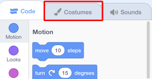

## ದೃಶ್ಯವನ್ನು ಹೊಂದಿಸಲಾಗುತ್ತಿದೆ

ನಿಮ್ಮ ಪ್ರಾಜೆಕ್ಟ್ ಅದ್ಭುತವಾಗಿ ಕಾಣುವಂತೆ ಮಾಡಲು Scratch ನೀವು ಬಳಸಲು ಹಿನ್ನೆಲೆ ಲೈಬ್ರರಿ ಮತ್ತು sprites ‌ಗಳಯನ್ನು ಹೊಂದಿದೆ.

\--- task \---

ಸ್ಟೇಜ್ ಆಯ್ಕೆಮಾಡಿ.

**ಬ್ಯಾಕ್‌ಡ್ರಾಪ್ಸ್** ಕ್ಲಿಕ್ ಮಾಡಿ.

**ಲೈಬ್ರರಿಯಿಂದ ಬ್ಯಾಕ್‌ಡ್ರಾಪ್ ಆಯ್ಕೆಮಾಡಿ** ಐಕಾನ್ ಮೇಲೆ ಕ್ಲಿಕ್ ಮಾಡಿ.

ನಂತರ ನಿಮ್ಮ ನೆಚ್ಚಿನ ನೀರೊಳಗಿನ ಹಿನ್ನೆಲೆಯನ್ನು ಆರಿಸಿ!

\--- /task \---

ಅದ್ಭುತವಾಗಿದೆ! Of course, now you have a cat underwater, and cats aren't usually big fans of that. But you can fix that, because you can turn the cat into a shark!

\--- task \---

First, select the cat sprite and click on the **Costumes** tab.

Then, click on **Choose costume from Library**

Select this shark image and click **OK**.

Now remove the cat costumes by selecting each of them and clicking on the **x**.

\--- /task \---

Now you have a shark – excellent!