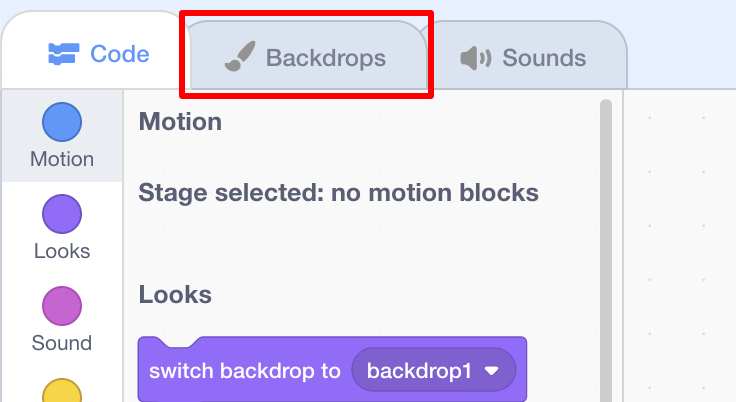
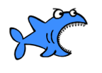

## ದೃಶ್ಯವನ್ನು ಹೊಂದಿಸಲಾಗುತ್ತಿದೆ

ನಿಮ್ಮ ಪ್ರಾಜೆಕ್ಟ್ ಅದ್ಭುತವಾಗಿ ಕಾಣುವಂತೆ ಮಾಡಲು Scratch ನೀವು ಬಳಸಲು ಹಿನ್ನೆಲೆ ಲೈಬ್ರರಿ ಮತ್ತು sprites ‌ಗಳಯನ್ನು ಹೊಂದಿದೆ.

\--- task \---

ಸ್ಟೇಜ್ ಆಯ್ಕೆಮಾಡಿ.

**ಬ್ಯಾಕ್‌ಡ್ರಾಪ್ಸ್** ಕ್ಲಿಕ್ ಮಾಡಿ.

**ಲೈಬ್ರರಿಯಿಂದ ಬ್ಯಾಕ್‌ಡ್ರಾಪ್ ಆಯ್ಕೆಮಾಡಿ** ಐಕಾನ್ ಮೇಲೆ ಕ್ಲಿಕ್ ಮಾಡಿ.

ನಂತರ ನಿಮ್ಮ ನೆಚ್ಚಿನ ನೀರೊಳಗಿನ ಹಿನ್ನೆಲೆಯನ್ನು ಆರಿಸಿ!

\--- /task \---

ಅದ್ಭುತವಾಗಿದೆ! ಸಹಜವಾಗಿ, ಈಗ ನೀವು ನೀರೊಳಗೆ ಬೆಕ್ಕನ್ನು ಹೊಂದಿದ್ದೀರಿ, ಮತ್ತು ಬೆಕ್ಕುಗಳು ಸಾಮಾನ್ಯವಾಗಿ ಅದರ ದೊಡ್ಡ ಅಭಿಮಾನಿಗಳಲ್ಲ. ಆದರೆ ನೀವು ಅದನ್ನು ಸರಿಪಡಿಸಬಹುದು, ಏಕೆಂದರೆ ನೀವು ಬೆಕ್ಕನ್ನು ಶಾರ್ಕ್ ಆಗಿ ಪರಿವರ್ತಿಸಬಹುದು!

\--- task \---

ಮೊದಲು, ಕ್ಯಾಟ್ sprite ಆಯ್ಕೆಮಾಡಿ ಮತ್ತು ** ವೇಷಭೂಷಣಗಳ** ಟ್ಯಾಬ್ ಮೇಲೆ ಕ್ಲಿಕ್ ಮಾಡಿ.

ನಂತರ, **ಲೈಬ್ರರಿಯಿಂದ ವೇಷಭೂಷಣವನ್ನು ಆರಿಸಿ** ಮೇಲೆ ಕ್ಲಿಕ್ ಮಾಡಿ

ಈ ಶಾರ್ಕ್ ಚಿತ್ರವನ್ನು ಆಯ್ಕೆ ಮಾಡಿ ಮತ್ತು **ಸರಿ** ಕ್ಲಿಕ್ ಮಾಡಿ.

ಈಗ ಬೆಕ್ಕಿನ ವೇಷಭೂಷಣಗಳನ್ನು ಪ್ರತಿಯೊಂದನ್ನು ಆರಿಸಿ ಮತ್ತು **x** ಕ್ಲಿಕ್ ಮಾಡುವ ಮೂಲಕ ತೆಗೆದುಹಾಕಿ.

\--- /task \---

ಈಗ ನೀವು ಶಾರ್ಕ್ ಹೊಂದಿದ್ದೀರಿ - ಅತ್ಯುತ್ತಮ!