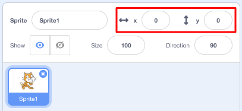

## ಸುತ್ತಲೂ ವಿಷಯಗಳನ್ನು ಚಲಿಸುವುದು

ಇದೀಗ ನಿಮ್ಮ ಶಾರ್ಕ್ ವೃತ್ತದಲ್ಲಿ ಚಲಿಸುತ್ತದೆ, ಮತ್ತು ಅದನ್ನು ಆರೋ ಕೀಗಳಿಂದ ನಿಯಂತ್ರಿಸಲು ಹೆಚ್ಚು ಖುಷಿಯಾಗುತ್ತದೆ. ಈ ಕಾರ್ಡ್‌ನಲ್ಲಿ, ಅದನ್ನು ಹೇಗೆ ಮಾಡಬೇಕೆಂದು ನೀವು ಕಲಿಯಲಿದ್ದೀರಿ!

\--- task \---

ಶಾರ್ಕ್ಗಾಗಿ ನೀವು ಹೊಂದಿರುವ ಎಲ್ಲಾ ಕೋಡ್ ಅನ್ನು ಅಳಿಸುವ ಮೂಲಕ ಪ್ರಾರಂಭಿಸಿ.

\--- /task \---

ನೀವು ಬಹುಶಃ ಊಹಿಸಿದಂತೆ, ನಿಮಗೆ ಮತ್ತೆ**ಈವೆಂಟ್** ಮತ್ತು **ಮೋಶನ್**ಬ್ಲಾಕ್ ಗಳ ಅಗತ್ಯವಿರುತ್!

\--- task \---

ಈ ಸಮಯದಲ್ಲಿ, ಈ ಬ್ಲಾಕ್ ಅನ್ನು ಹುಡುಕಿ ಮತ್ತು ಅದನ್ನು ಪ್ರಸ್ತುತ sprite ಪ್ಯಾನೆಲ್‌ಗೆ ಎಳೆಯಿರಿ:

```blocks3
    when [space v] key pressed
```

`ಸ್ಪೇಸ್` ಪಕ್ಕದಲ್ಲಿರುವ ಚಿಕ್ಕ ಆರೋ (▼) ಕ್ಲಿಕ್ ಮಾಡಿ. ನೀವು ಆರಿಸಬಹುದಾದ ನಿಮ್ಮ ಎಲ್ಲಾ ಕೀಬೋರ್ಡ್ ಕೀಗಳ ಪಟ್ಟಿಯನ್ನು ನೀವು ನೋಡುತ್ತೀರಿ.

\--- /task \---

ನಿಮಗೆ ನಾಲ್ಕು`ಕೀಯನ್ನು ಒತ್ತಿದಾಗ`{:class="block3events"} ಬ್ಲಾಕ್‌ಗಳ ಅಗತ್ಯವಿರುತ್ತದೆ - ನಿಮ್ಮ ಪ್ರತಿಯೊಂದು ಆರೋ ಕೀಗಳಿಗೆ ಒಂದು.

\--- task \---

ನಿಮ್ಮ ಶಾರ್ಕ್ ಚಲಿಸುವಂತೆ ಮಾಡಲು, ಈ ಬ್ಲಾಕ್‌ಗಳನ್ನು **ಮೋಶನ್** ಬ್ಲಾಕ್ ಗೆ ಸಂಪರ್ಕಪಡಿಸಿ ಈ ರೀತಿಯಾಗಿ:

```blocks3
    when [left arrow v] key pressed
    move (-10) steps
```

```blocks3
    when [right arrow v] key pressed
    move (10) steps
```

```blocks3
    when [up arrow v] key pressed
```

```blocks3
    when [down arrow v] key pressed
```

\--- /task \---

**ಗಮನಿಸಿ**:` -10` ಅಂದರೆ '10 ಹಂತಗಳನ್ನು ಹಿಂತಿರುಗಿ'.

\--- task \---

ನಿಮ್ಮ ಕೋಡ್ ಅನ್ನು ಪರೀಕ್ಷಿಸಲು ಈಗ ಹಸಿರು ಧ್ವಜವನ್ನು ಕ್ಲಿಕ್ ಮಾಡಿ.

\--- /task \---

ಈಗ ನಿಮ್ಮ ಶಾರ್ಕ್ ಹಿಂದಕ್ಕೆ ಮತ್ತು ಮುಂದಕ್ಕೆ ಚಲಿಸುತ್ತದೆ, ಅದು ತುಂಬಾ ಒಳ್ಳೆಯದು, ಆದರೆ ಅದು ಮೇಲಕ್ಕೆ ಅಥವಾ ಕೆಳಕ್ಕೆ ಚಲಿಸುವುದಿಲ್ಲ. ಅಲ್ಲದೆ, ನೀವು **ಮೋಶನ್**ಬ್ಲಾಕ್ಗಳನ್ನು ನೋಡಿದರೆ, 'ಅಪ್' ಅಥವಾ 'ಡೌನ್' ಗೆ ಯಾವುದೇ ಬ್ಲಾಕ್ಗಳಿಲ್ಲ ಎಂದು ನೀವು ನೋಡುತ್ತೀರಿ. ಆದರೂ ಅವುಗಳಲ್ಲಿ ಸಂಪೂರ್ಣ ಗುಂಪೇ **x** ಮತ್ತು **y**ಕೋ ಒರ್ದಿನಟ್ಸ್ ಗೆ ಸಂಬಂಧಿಸಿದೆ - ಅವುಗಳನ್ನು ಪ್ರಯತ್ನಿಸೋಣ!

\--- task \---

ಎರಡು`y ನಿಂದ ಬದಲಾಯಿಸಿ` {:class="block3motion"} ಬ್ಲಾಕ್‌ಗಳನ್ನು ಹಿಡಿಯಿರಿ, ಮತ್ತು ನಿಮ್ಮ ಕೋಡ್ ಅನ್ನು ಈ ರೀತಿ ಅಪ್ಡೇಟ್ ಮಾಡಿ:

```blocks3
    when [up arrow v] key pressed
+     change y by (10)
```

```blocks3
    when [down arrow v] key pressed
+     change y by (-10)
```

\--- /task \---

ಈಗ ನೀವು ಆರೋ ಕೀಗಳನ್ನು ಒತ್ತಿದಾಗ, ಶಾರ್ಕ್ ಸ್ಟೇಜ್ ನ ಸುತ್ತಲೂ ಚಲಿಸುತ್ತದೆ!

## \--- collapse \---

## title: How do x- and y-coordinates work?

To talk about the positions of objects, such as sprites, we often use x- and y-coordinates. The **x-axis** of the Stage coordinate system runs from **left to right**, and the **y-axis** runs from **bottom to top**.


A sprite can be located by the coordinates of its centre, for example `(15, -27)`, where `15` is its position along the x-axis , and `-27` its position along the y-axis.

+ To get a feel for how this actually works, select a sprite and use the **x** and **y** controls to move it around the stage by setting different values for the coordinates.



+ Try different pairs of values to see where the sprite goes! In Scratch, the x-axis goes from `-240` to `240`, and the y-axis goes from `-180` to `180`.

\--- /collapse \---

### ಆಟವನ್ನು ಮರುಪ್ರಾರಂಭಿಸಲಾಗುತ್ತಿದೆ

The shark moves all over the screen now, but imagine this is a game: how do you restart it, and what happens at the start of each game?

You need to get the shark to its original location when the player starts the game. They'll start this game by clicking on the green flag, so you need to change the shark sprite's x- and y-coordinates when that happens.

ಅದು ನಿಜಕ್ಕೂ ಬಹಳ ಸುಲಭ! The centre of the stage is `(0, 0)` in `(x, y)` coordinates.

So all you need is an **Event** block for that green flag, and the **go to** block from **Motion**.

\--- task \---

Drag a `when green flag clicked`{:class="block3events"} **Event** block onto the current sprite panel.

```blocks3
    when green flag clicked
```

Then find the `go to`{:class="block3motion"} **Motion** block, and attach it to your flag **Event** block.

```blocks3
    when green flag clicked
+     go to x: (0) y: (0)
```

Set the both the `x` and the `y` coordinate to `0` in the `go to`{:class="block3motion"} block if they are not already `0`.

\--- /task \---

\--- task \---

Now click the green flag: you should see the shark return to the centre of the stage!

\--- /task \---