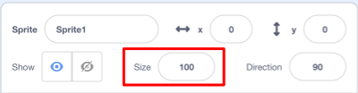
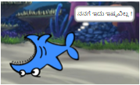

## ಎಲ್ಲಾ sprites

ಈಗ ನೀವು ಬಾಣದ ಕೀಲಿಗಳನ್ನು ಬಳಸಿ ಚಲಿಸಬಹುದಾದ ಶಾರ್ಕ್ ಅನ್ನು ಹೊಂದಿದ್ದೀರಿ. ಸೊಗಸಾಗಿದೆ! ಅದು ಹಿಡಿಯಲು ಕೆಲವು ಮೀನುಗಳನ್ನು ಸೇರಿಸುವ ಸಮಯ.

\--- task \---

**New sprite** ಬಟನ್ ಕ್ಲಿಕ್ ಮಾಡಿ, ಮತ್ತು ಅದು ತೆರೆಯುವ ಪರದೆಯಲ್ಲಿ, ಮೀನನ್ನು ಆಯ್ಕೆಮಾಡಿ.


ನಿಮ್ಮ ಶಾರ್ಕ್ಗೆ ಹೋಲಿಸಿದರೆ ನಿಮ್ಮ ಮೀನು ಸ್ವಲ್ಪ ದೊಡ್ಡದಾಗಿದ್ದರೆ, ಎರಡೂ sprite‌ಗಳನ್ನು ಸರಿಯಾದ ಗಾತ್ರಕ್ಕೆ ಮಾಡಲು ನೀವು ಗಾತ್ರ ನಿಯಂತ್ರಣವನ್ನು ಬಳಸಬಹುದು!



Change the number in the size control to make the sprite bigger or smaller.

\--- /task \---

ಅದ್ಭುತವಾಗಿದೆ! ನಂತರ, ನೀವು ಆಟಗಾರನ ಸಹಾಯವಿಲ್ಲದೆ ಮೀನುಗಳನ್ನು ತಾನಾಗಿಯೇ ಚಲಿಸಲು ಕೆಲವು ಕೋಡ್ ಅನ್ನು ಸೇರಿಸಲಿದ್ದೀರಿ. ನಿಮ್ಮ ಆಟಗಾರನು ಶಾರ್ಕ್ ಅನ್ನು ಸರಿಸುತ್ತಾನೆ ಮತ್ತು ಮೀನು ಹಿಡಿಯಲು ಪ್ರಯತ್ನಿಸುತ್ತಾನೆ.

## \--- collapse \---

## title: ಹಿಂದೆ ಚಲಿಸುವ ಶಾರ್ಕ್ ಬಗ್ಗೆ ಏನು?

ಆ ಶಾರ್ಕ್ ಹಿಂದಕ್ಕೆ ಈಜುವುದು ಸ್ವಲ್ಪ ತಮಾಷೆಯಾಗಿ ಕಾಣುತ್ತದೆ. ನೀವು ಸಾಮಾನ್ಯವಾಗಿ ಹಿಂದಕ್ಕೆ ನಡೆಯುವುದಕ್ಕಿಂತ ಹೆಚ್ಚಾಗಿ ತಿರುಗುವಂತೆಯೇ, ಶಾರ್ಕ್ ಹಿಂದಕ್ಕೆ ಈಜುವ ಬದಲು ತಿರುಗುತ್ತದೆ. ಅದೃಷ್ಟವಶಾತ್ ನಿಮಗಾಗಿ, Scratch ಇದಕ್ಕಾಗಿ ಒಂದು ಬ್ಲಾಕ್ ಅನ್ನು ಹೊಂದಿದೆ!

`point in direction`{:class="block3motion"} ಬ್ಲಾಕ್ ನಿಮ್ಮ sprite ಸೂಚಿಸುವ ದಿಕ್ಕನ್ನು ಆರಿಸಲು ನಿಮಗೆ ಅನುಮತಿಸುತ್ತದೆ. ನೀವು ಅದನ್ನು **Motion** ಬ್ಲಾಕ್ಗಳ ವಿಭಾಗದಲ್ಲಿ ಕಾಣಬಹುದು. ನೀವು ಎಲ್ಲಿ ಬೇಕಾದರೂ sprite ಅನ್ನು ಸೂಚಿಸಲು ನೀವು ಯಾವುದೇ ಸಂಖ್ಯೆಯ ಡಿಗ್ರಿಗಳನ್ನು ಟೈಪ್ ಮಾಡಬಹುದು.

\--- /collapse \---

\--- task \---

`point in direction`{:class="block3motion"} ಬ್ಲಾಕ್ ಗಳ ಒಂದೆರಡು ಪ್ರತಿಗಳನ್ನು ** Motion** ಪಟ್ಟಿಇಂದ ಪಡೆದುಕೊಳ್ಳಿ ಮತ್ತು ಅವುಗಳನ್ನು ನಿಮ್ಮ ಶಾರ್ಕ್ ಕೋಡ್‌ಗೆ ಕನೆಕ್ಟ್ ಮಾಡಿ,ಈ ರೀತಿಯಾಗಿ:

```blocks3
    when [left arrow v] key pressed
+     point in direction (-90)
    move (10) steps
```

```blocks3
    when [right arrow v] key pressed
+     point in direction (90)
    move (10) steps
```

\--- /task \---

\--- task \---

`move`{:class="block3motion"}ಬ್ಲಾಕ್ನಲ್ಲಿ ಹಂತಗಳ ಸಂಖ್ಯೆಯನ್ನು ಬದಲಾಯಿಸಿ `-10` ರಿಂದ `10`ರ ವರೆಗೆ.

ನೀವು `point in direction`{:class="block3motion"}ಬ್ಲಾಕ್‌ಗಳನ್ನು ಸೇರಿಸಿದ ನಂತರ ನೀವು ಈಗ ಶಾರ್ಕ್ ಅನ್ನು ಸರಿಸಲು ಪ್ರಯತ್ನಿಸಿದರೆ, ಸ್ವಲ್ಪ ವಿಚಿತ್ರವಾದ ಸಂಗತಿಯನ್ನು ನೀವು ಗಮನಿಸಬಹುದು. ಶಾರ್ಕ್ ಸರಿಯಾಗಿ ತಿರುಗುತ್ತಿಲ್ಲ!



\--- /task \---

## \--- collapse \---

## title: ಅದು ಏಕೆ ತಲೆಕೆಳಗಾಗಿ ಹೋಗುತ್ತದೆ?

ಇಲ್ಲಿರುವ ಸಮಸ್ಯೆ ಏನೆಂದರೆ, ಎಲ್ಲಾ sprite‌ಗಳು ಮಾಡುವಂತೆ ಶಾರ್ಕ್ sprite ಕೂಡಾ, 'all round' **rotation style** ಉಪಯೋಗಿಸುತದೆ. ಇದರ ಅರ್ಥ ಪೂರ್ತಿ ಸುತ್ತುವ ಶೈಲಿ. ಆದರೆ ನಿಮಗೆ ಅದು ಬೇಕಾಗಿರುವುದು 'left-right' ಅಥವಾ 'ಎಡ-ಬಲ' ಶೈಲಿ.

ಎಂದಿನಂತೆ ಅದಕ್ಕಾಗಿ ಒಂದು ಬ್ಲಾಕ್ ಇದೆ, ಮತ್ತು ಅದು **Motion** ನಲ್ಲಿದೆ!

\--- /collapse \---

\--- task \---

**Motion** ವರ್ಗದಲ್ಲಿ `set rotation style`{:class="block3motion"} ಬ್ಲಾಕ್ಗಾಗಿ ಹುಡುಕಿ.

ಮೊದಲಿನಿಂದ ನಿಮ್ಮ ಶಾರ್ಕ್ ರಿಸೆಟ್ ಕೋಡ್‌ಗೆ ಬ್ಲಾಕ್ ಅನ್ನು ಸೇರಿಸಿ, ಮತ್ತು ತಿರುಗುವಿಕೆಯ ಶೈಲಿಯನ್ನು `left-right`{:class="block3motion"} ಹೊಂದಿಸಿ, ಈ ರೀತಿ:

```blocks3
    when green flag clicked
+     set rotation style [left-right v]
    go to x: (0) y: (0)
```

\--- /task \---