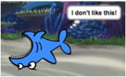

## ಎಲ್ಲಾ sprites

ಈಗ ನೀವು ಬಾಣದ ಕೀಲಿಗಳನ್ನು ಬಳಸಿ ಚಲಿಸಬಹುದಾದ ಶಾರ್ಕ್ ಅನ್ನು ಹೊಂದಿದ್ದೀರಿ. ಸೊಗಸಾಗಿದೆ! ಅದು ಹಿಡಿಯಲು ಕೆಲವು ಮೀನುಗಳನ್ನು ಸೇರಿಸುವ ಸಮಯ.

\--- task \---

**ಹೊಸ sprite**ಬಟನ್ ಕ್ಲಿಕ್ ಮಾಡಿ, ಮತ್ತು ಅದು ತೆರೆಯುವ ಪರದೆಯಲ್ಲಿ, ಮೀನನ್ನು ಆಯ್ಕೆಮಾಡಿ.


ನಿಮ್ಮ ಶಾರ್ಕ್ಗೆ ಹೋಲಿಸಿದರೆ ನಿಮ್ಮ ಮೀನು ಸ್ವಲ್ಪ ದೊಡ್ಡದಾಗಿದ್ದರೆ, ಎರಡೂ sprite‌ಗಳನ್ನು ಸರಿಯಾದ ಗಾತ್ರಕ್ಕೆ ಮಾಡಲು ನೀವು ಗಾತ್ರ ನಿಯಂತ್ರಣವನ್ನು ಬಳಸಬಹುದು!


ಸ್ಪಿರಿಟ್ ಅನ್ನು ದೊಡ್ಡದಾಗಿ ಅಥವಾ ಚಿಕ್ಕದಾಗಿ ಮಾಡಲು ಗಾತ್ರ ನಿಯಂತ್ರಣದಲ್ಲಿ ಸಂಖ್ಯೆಯನ್ನು ಬದಲಾಯಿಸಿ.

\--- /task \---

ಅದ್ಭುತವಾಗಿದೆ! ನಂತರ, ನೀವು ಆಟಗಾರನ ಸಹಾಯವಿಲ್ಲದೆ ಮೀನುಗಳನ್ನು ತಾನಾಗಿಯೇ ಚಲಿಸಲು ಕೆಲವು ಕೋಡ್ ಅನ್ನು ಸೇರಿಸಲಿದ್ದೀರಿ. ನಿಮ್ಮ ಆಟಗಾರನು ಶಾರ್ಕ್ ಅನ್ನು ಸರಿಸುತ್ತಾನೆ ಮತ್ತು ಮೀನು ಹಿಡಿಯಲು ಪ್ರಯತ್ನಿಸುತ್ತಾನೆ.

## \--- collapse \---

## title: ಹಿಂದೆ ಚಲಿಸುವ ಶಾರ್ಕ್ ಬಗ್ಗೆ ಏನು?

ಆ ಶಾರ್ಕ್ ಹಿಂದಕ್ಕೆ ಈಜುವುದು ಸ್ವಲ್ಪ ತಮಾಷೆಯಾಗಿ ಕಾಣುತ್ತದೆ. ನೀವು ಸಾಮಾನ್ಯವಾಗಿ ಹಿಂದಕ್ಕೆ ನಡೆಯುವುದಕ್ಕಿಂತ ಹೆಚ್ಚಾಗಿ ತಿರುಗುವಂತೆಯೇ, ಶಾರ್ಕ್ ಹಿಂದಕ್ಕೆ ಈಜುವ ಬದಲು ತಿರುಗುತ್ತದೆ. ಅದೃಷ್ಟವಶಾತ್ ನಿಮಗಾಗಿ, Scratch ಇದಕ್ಕಾಗಿ ಒಂದು ಬ್ಲಾಕ್ ಅನ್ನು ಹೊಂದಿದೆ!

`ದಿಕ್ಕಿನಲ್ಲಿರುವ ಬಿಂದು` {: class = "block3motion"} ಬ್ಲಾಕ್ ನಿಮ್ಮ sprite ಸೂಚಿಸುವ ದಿಕ್ಕನ್ನು ಆರಿಸಲು ನಿಮಗೆ ಅನುಮತಿಸುತ್ತದೆ. ನೀವು ಅದನ್ನು **ಮೋಶನ್** ಬ್ಲಾಕ್ಗಳ ವಿಭಾಗದಲ್ಲಿ ಕಾಣಬಹುದು. ನೀವು ಎಲ್ಲಿ ಬೇಕಾದರೂ sprite ಅನ್ನು ಸೂಚಿಸಲು ನೀವು ಯಾವುದೇ ಸಂಖ್ಯೆಯ ಡಿಗ್ರಿಗಳನ್ನು ಟೈಪ್ ಮಾಡಬಹುದು.

\--- /collapse \---

\--- task \---

Grab a couple of copies of the `point in direction`{:class="block3motion"} block from the **Motion** list and connect them to your shark's code, like this:

```blocks3
    when [left arrow v] key pressed
+     point in direction (-90)
    move (10) steps
```

```blocks3
    when [right arrow v] key pressed
+     point in direction (90)
    move (10) steps
```

\--- /task \---

\--- task \---

Change the number of steps in the `move`{:class="block3motion"} blocks from `-10` to `10`.

If you try moving the shark around now after you've added the `point in direction`{:class="block3motion"} blocks, you might notice something a little strange happening. The shark may not be turning quite right!



\--- /task \---

## \--- collapse \---

## title: Why does it go upside down?

The problem here is that the shark sprite started, as all sprites do, with the 'all around' **rotation style**, and what you need it to have is the 'left-right' style.

As usual, there’s a block for that, and it’s in **Motion**!

\--- /collapse \---

\--- task \---

Look in the **Motion** category for the block `set rotation style`{:class="block3motion"}.

Add the block to your shark reset code from earlier, and set the rotation style to `left-right`{:class="block3motion"}, like this:

```blocks3
    when green flag clicked
+     set rotation style [left-right v]
    go to x: (0) y: (0)
```

\--- /task \---