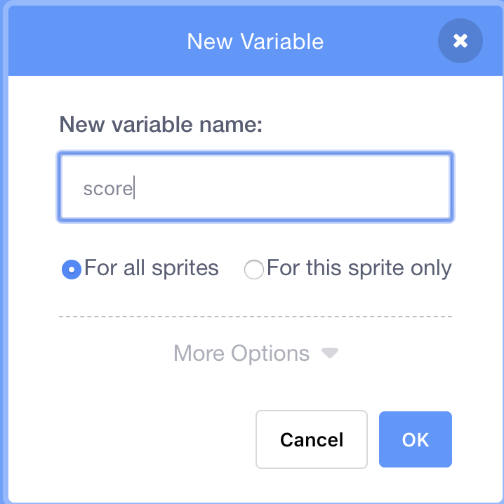

## ಸ್ಕೋರ್ ಇಟ್ಟುಕೊಳ್ಳುವುದು

ಆಟಗಾರನು ಎಷ್ಟು ಮೀನುಗಳನ್ನು ಹಿಡಿಯುತ್ತಾನೆ ಎಂಬುದರ ಸ್ಕೋರ್ ಇರಿಸಿಕೊಳ್ಳಲು, ನಿಮಗೆ ಎಲ್ಲೋ ಸ್ಕೋರ್ ಅನ್ನು ಸಂಗ್ರಹಿಸುವ ಅಗತ್ಯವಿರುತ್ತದೆ. ಅದಕ್ಕೆ ಸೇರಿಸುವ ವಿಧಾನ ಮತ್ತು ಆಟವನ್ನು ಪುನರಾರಂಭಿಸಿದಾಗ ಅದನ್ನು ಮರುಹೊಂದಿಸುವ ವಿಧಾನ.

ಮೊದಲನೆಯದು: ಸ್ಕೋರ್ ಸಂಗ್ರಹಿಸುವುದು!

\--- task \---

**Variables (ವೇರಿಯೇಬಲ್ಸ್)**ಬ್ಲಾಕ್ಗಳಿಗೆ ಹೋಗಿ, ನಂತರ **Make a Variable (ಮೇಕ್ ಎ ವೇರಿಯಬಲ್)**ಕ್ಲಿಕ್ ಮಾಡಿ.


`ಸ್ಕೋರ್` ಅನ್ನು ಹೆಸರಿನಂತೆ ನಮೂದಿಸಿ.



ನಿಮ್ಮ ಹೊಸ ವೇರಿಯಬಲ್ ಪರಿಶೀಲಿಸಿ!


\--- /task \---

## \--- collapse \---

## title: ವೇರಿಯಬಲ್ ಯಾವುವು?

ನೀವು ಪ್ರೋಗ್ರಾಂನಲ್ಲಿ ಮಾಹಿತಿಯನ್ನು ಸಂಗ್ರಹಿಸಲು ಬಯಸಿದಾಗ, ನೀವು **ವೇರಿಯಬಲ್** ಅನ್ನು ಬಳಸಬಹುದು. ಅದನ್ನು ಹೆಸರು ಬರೆದಿರುವ ಪೆಟ್ಟಿಗೆಯಂತೆ ಯೋಚಿಸಿ: ನೀವು ಅದರಲ್ಲಿ ಏನನ್ನಾದರೂ ಹಾಕಬಹುದು, ಅದರಲ್ಲಿ ಏನಿದೆ ಎಂಬುದನ್ನು ಪರಿಶೀಲಿಸಬಹುದು ಮತ್ತು ಅದರಲ್ಲಿರುವುದನ್ನು ಬದಲಾಯಿಸಬಹುದು. **Variables**cವಿಭಾಗ ದಲ್ಲಿ ನೀವು ವೇರಿಯೇಬಲ್ಗಳನ್ನು ಕಾಣುತ್ತೀರಿ, ಆದರೆ ಅಲ್ಲಿ ಅವುಗಳನ್ನು ತೋರಿಸಲು ನೀವು ಮೊದಲು ಅವುಗಳನ್ನು ರಚಿಸಬೇಕಾಗಿದೆ!

\--- /collapse \---

ಈಗ ನೀವು ಶಾರ್ಕ್ ಮೀನುಗಳನ್ನು ತಿನ್ನುವಾಗಲೆಲ್ಲಾ ವೇರಿಯೇಬಲ್ ಅನ್ನು ನವೀಕರಿಸಬೇಕು ಮತ್ತು ಆಟವನ್ನು ಮರುಪ್ರಾರಂಭಿಸಿದಾಗ ಅದನ್ನು ಮರುಹೊಂದಿಸಬೇಕು. ಎರಡನ್ನೂ ಮಾಡುವುದು ಬಹಳ ಸುಲಭ:

\--- task \---

** ವೇರಿಯೇಬಲ್** ವಿಭಾಗದಿಂದ, `set [my variable v] to
 [0]` {: class = "block3variables"} ಮತ್ತು `change [my variable v] by [1]` {: class = "block3variables"} ಬ್ಲಾಕ್‌ಗಳು. ಬ್ಲಾಕ್‌ಗಳಲ್ಲಿನ ಸಣ್ಣ ಆರೋಗಳ ಮೇಲೆ ಕ್ಲಿಕ್ ಮಾಡಿ, `ಸ್ಕೋರ್`ಅನ್ನು ಪಟ್ಟಿಯಿಂದ ಆಯ್ಕೆಮಾಡಿ, ತದನಂತರ ಬ್ಲಾಕ್ಗಳನ್ನು ನಿಮ್ಮ ಪ್ರೋಗ್ರಾಂಗೆ ಇರಿಸಿ:

### ಶಾರ್ಕ್ಗಾಗಿ ಕೋಡ್

```blocks3
    when green flag clicked
+    set [score v] to [0]
    set rotation style [left-right v]
    go to x: (0) y: (0)
```

### ಮೀನಿಗಾಗಿ ಕೋಡ್

```blocks3
    if <touching [Sprite1 v] ?> then
+        change [score v] by [1]
        hide
        wait (1) secs
        go to x: (pick random (-240) to (240)) y: (pick random (-180) to (180))
        show
    end
```

\--- /task \---

ಚೆನ್ನಾಗಿದೆ! ಈಗ ನೀವು ಸ್ಕೋರ್ ಮತ್ತು ಎಲ್ಲವನ್ನೂ ಪಡೆದುಕೊಂಡಿದ್ದೀರಿ.