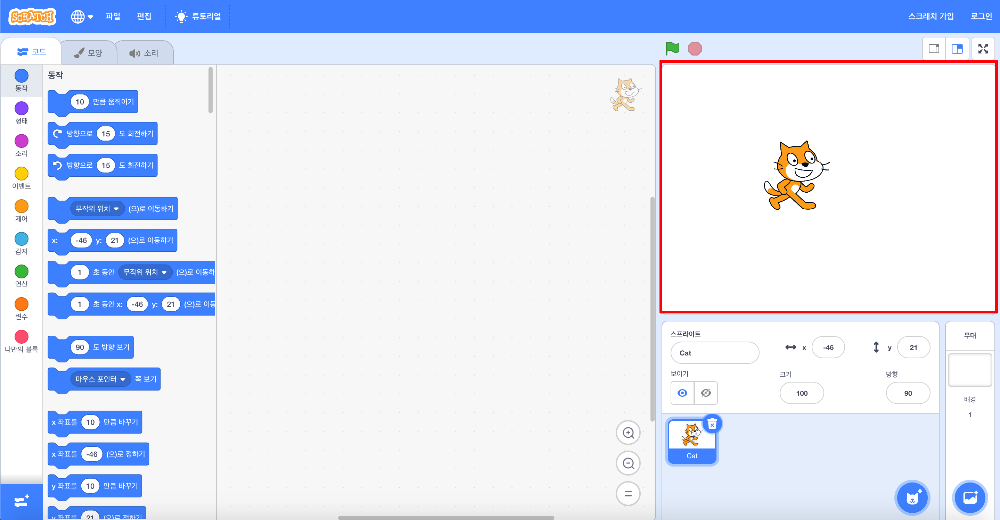
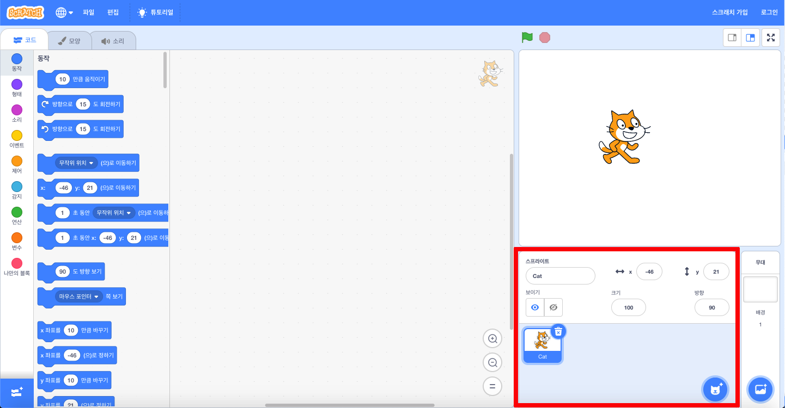
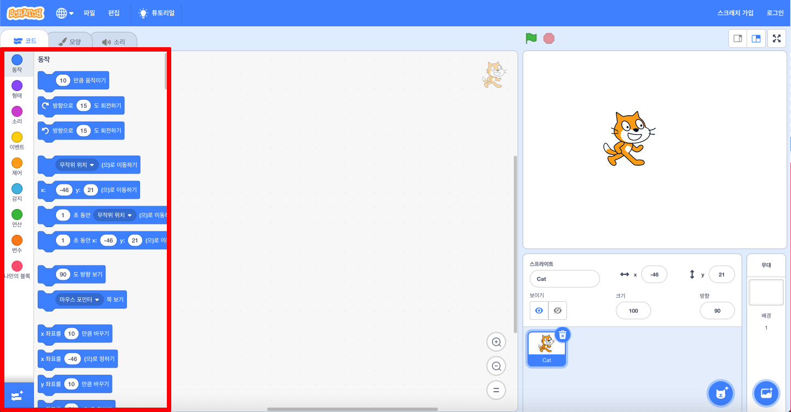
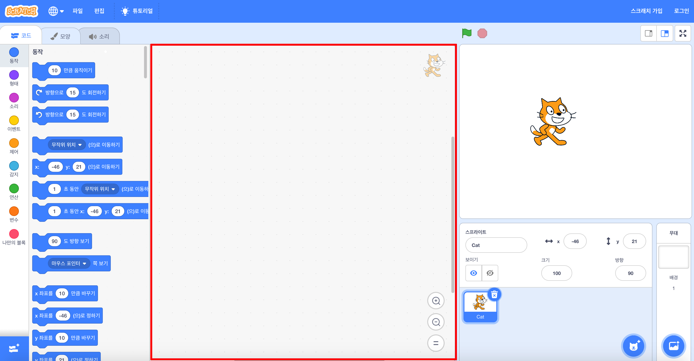
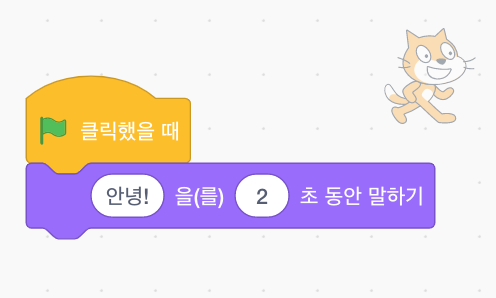

## 설정하기

스크래치를 열면 아래와 같은 화면을 볼 수 있습니다.

\--- task \---

Look for each of the following areas and remember where they are.

\--- /task \---

### 무대



## \--- collapse \---

## 제목 : 무대는 무엇입니까?

This is where your Scratch programs run. It has:

* 하나 이상의 **배경** \(화면 배경의 이미지\)

* 이와 관련된 **코드 블록**

\--- /collapse \---

### 스프라이트 목록



## \--- collapse \---

## 제목 : 스프라이트 란 무엇입니까?

Any item you can add on the Stage is a **sprite**.

A sprite includes:

* 스테이지의 **이미지**
* **모양** 추가 가능
* 스프라이트와 관련된 모든 **소리**
* 스프라이트와 관련된 **코드 블럭** 

\--- /collapse \---

### 코드 블록 팔레트



## \--- collapse \---

## title : 코드 블록

Code in Scratch comes in the form of blocks that you connect to make programs. You choose blocks from the **code blocks palette**, drag them into the **current sprite panel**, and then connect them to each other.

There are ten categories of blocks. They are colour-coded, and you can choose between them by clicking on the items in the list at the top of the **code blocks palette**.

\--- /collapse \---

### 현재 스크립트 영역



## \--- collapse \---

## title : 현재 스프라이트는 무엇입니까?

The **current sprite** is the one that's selected in the **sprite list**.

The **current sprite panel** is where you can see the code, costumes, and sounds for the selected sprite.

\--- /collapse \---

Time to get coding!

\--- task \---

In the sprite list, click on the Scratch Cat. The cat is now the current sprite.

Choose the **Events** category in the code blocks palette, click the `when flag clicked`{:class="block3events"} block, and drag it into the current sprite panel.

```blocks3
    녹색 깃발이 클릭되었을 때
```

\--- /task \---

\--- task \---

Then go to **Looks** in the code blocks palette and find this block:

```blocks3
    [Hello!]라고 (2) 초 동안 말하기
```

Click on it, hold down the mouse button, and then just drag it into the current sprite panel and let go of the button.

\--- /task \---

\--- task \---

Now that the second block is in the current sprite panel, connect it to the bottom of the first block by clicking and dragging it again to move it below the other block until they snap together, like this:



\--- /task \---

\--- task \---

Now click the **Start Program** button and watch what happens!

\--- /task \---