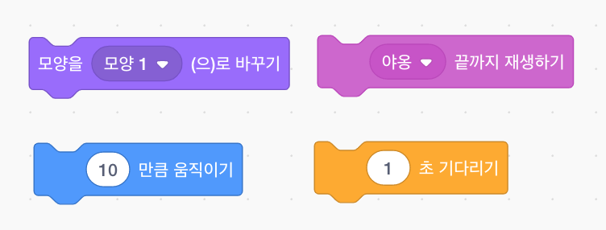
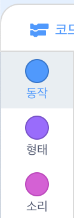
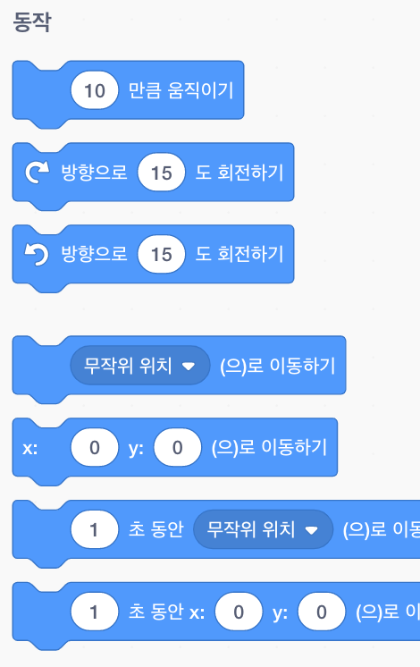
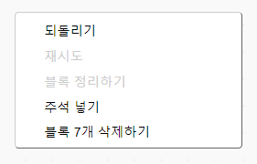

## 코드 블록 추가 및 제거

잘하셨어요! 첫 번째 스크래치 프로그램을 작성하셨습니다. 이번에는 스크래치 블록들에 대해 조금 더 배워보도록 하겠습니다. 스크래치 코드는 다음과 같이 **블록** 로 구성됩니다.



**코드 블록 팔레트** 에있는 모든 블록은, 해당 블록이 하는 일에 따라 다른 카테고리로 정렬됩니다.

## \--- collapse \---

## 제목: 다른 카테고리의 블록 사용

해당 카테고리의 블록을 보려면 카테고리 이름을 클릭하세요. 여기에서는 **동작** 카테고리가 선택됩니다.



클릭 한 카테고리의 모든 블록이 목록에 표시됩니다.



원하는 블록을 클릭 한 다음 현재 스크립트 영역으로 드래그하여 놓으십시오. 일단 블록이 스크립트 영역에 있으면, 당신은 블록을 옮기고 그것을 다른 블록에 연결할 수 있습니다.

-- /collapse \---

블록이 무엇을하는지 보려면 블록을 두 번 클릭하여 실행할 수 있습니다.

\--- task \--- 블록을 더블 클릭하면 블록이 하는 일을 볼 수 있습니다. \--- /task \---

## \--- collapse \---

## title : 코드 실행

일반적으로 특정 상황이 발생할 때마다 코드가 자동으로 실행되도록 설정합니다. 이것은 많은 프로그램이 **이벤트** 블록으로 시작하는 이유입니다.

```blocks3
    녹색 깃발이 클릭되었을 때
```

이 블록에 연결된 코드 블록은 **녹색 깃발** 이 클릭된 이후에 실행됩니다.

코드 블록은 위에서 아래로 실행되므로 블록을 연결하는 순서가 중요합니다. 이 예제에서 이 스프라이트는 `야옹` 소리를 `재생`{:class="block3sound"}하기 전에 `안녕!` 을 `말하기`{:class="block3looks"}합니다. 

```blocks3
    녹색 깃발이 클릭되었을 때
    [안녕!] 말하기
    [야옹 v] 재생하기
```

\--- /collapse \---

프로그램에서 원하지 않는 코드 블록을 제거하거나 삭제하는 것은 쉽습니다! 코드 블록 팔레트로 다시 드래그하면 됩니다.

**주의: ** 코드 블록으로 팔레트를 드래그하면 드래그하는 블록에 연결된 모든 블록이 삭제되므로 제거하려는 코드 블록과 유지하려는 코드 블록을 분리해야합니다. 실수로 일부 코드 블록을 삭제하고 다시 가져 오려면 마우스 오른쪽 버튼을 클릭 한 다음 ** 취소 **를 클릭하면 다시 되돌아옵니다.



\--- task \--- 일부 코드 블록을 추가, 삭제 해보십시오! \--- /task \---

### 모두 합쳐서 코드 만들기

코드를 옮겨서 일을 수행하는 방법을 알았습니다. 이제 여러분이 스크래치 고양이 스프라이트가 원을 그리도록 프로그램을 만들 차례입니다.

\--- task \--- 스프라이트 목록에서 고양이 스프라이트가 선택되어 있는지 확인한 후 다음 블록을 스크립트 영역으로 끌어 연결하십시오. 이 블록은 **이벤트** 와 **동작** 카테고리에서 찾을 수 있습니다.

```blocks3
    녹색 깃발이 클릭되었을 때
    [10] 만큼 움직이기
```

\--- /task \---

\--- task \--- 이제 스테이지 위의 녹색 깃발을 클릭하세요.

 \--- /task \---

고양이가 직선으로 걷는것이 보일 것입니다.... 그러나 원하는 대로 걷지 않죠?

참고: 녹색 깃발을 너무 여러 번 클릭하여 고양이가 무대를 빠져나가면 고양이를 무대로 다시 끌어 올 수 있습니다!

\--- task \--- 고양이 스프라이트가 원을 그리도록 회전 블록을 끝까지 회전합니다. **동작** 카레고리에 있습니다.

```blocks3
    녹색 깃발이 클릭되었을 때
    [10] 만큼 움직이기
+    cw 방향으로 (15) 도 회전하기
```

\--- /task \---

## \--- collapse \---

## 제목 : 회전은 어떻게 작동합니까?

이 블록은 스프라이트가 원을 구성하는 360도 전체에서 15도를 회전시킵니다. 숫자를 클릭하고 새 값을 입력하여 해당 숫자와 단계수를 변경할 수 있습니다.


\--- /collapse \---

\--- task \--- 이제 프로젝트를 저장하십시오! \--- /task \---