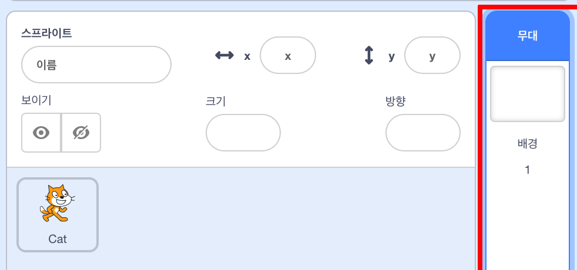
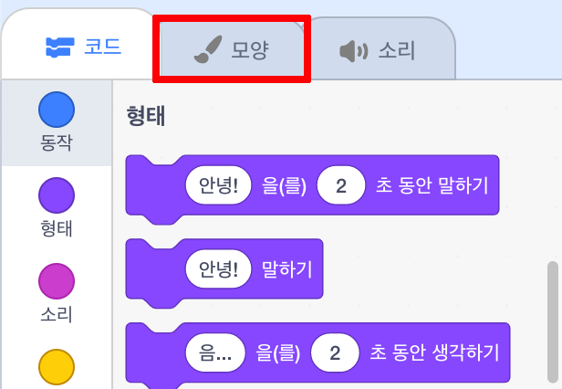
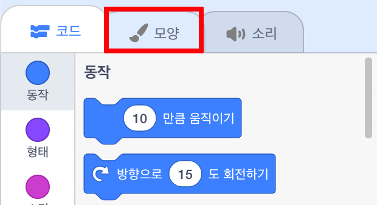

## 장면 설정하기

스크래치에는 프로젝트를 멋지게 보이게 하는 데 사용할 수있는 배경 및 스프라이트 라이브러리가 있습니다.

--- task --- 스테이지를 선택합니다.

**배경**을 누릅니다.

**배경 선택**아이콘을 클릭하세요.

그런 다음 좋아하는 물 속 배경을 선택하십시오!

 --- /task ---

잘하셨어요! 근데 지금 물 속에 고양이가 있습니다. 뭔가 안 어울리지 않나요? 그럼 이번에는 고양이를 상어로 바꿔 보겠습니다.

--- task --- 고양이 스프라이트를 클릭하고 **모양** 탭을 누르세요.

그런 다음, **모양고르기**아이콘을 클릭하세요.

상어 이미지를 선택하고 **확인**을 클릭하세요.

이제 고양이 스프라이트의 모양을 선택하고 **x**를 클릭하여 고양이 모양을 제거합니다.

 --- /task ---

이제 상어가 있습니다 - 훌륭합니다!