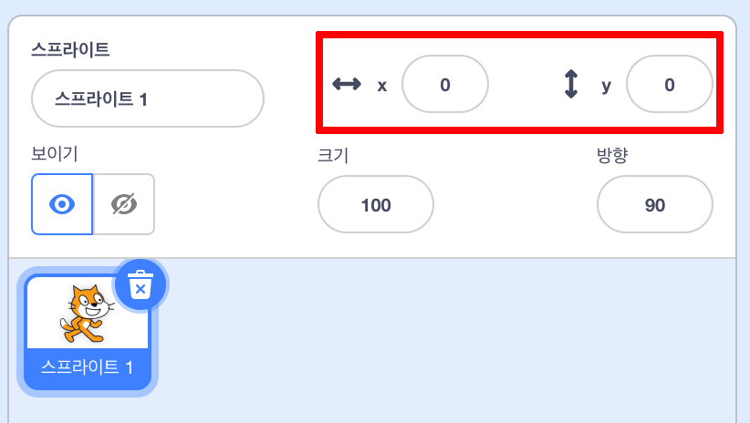

## 사물 이동

지금 상어가 원을 그리며 움직이는 것보다, 화살표 키로 상어를 제어하는 것이 훨씬 더 재미있을 것입니다. 이 과정에서 이렇게 하는 방법을 배우게됩니다!

\--- task \---

Start by deleting all code that you have for the shark.

\--- /task \---

As you’ve probably guessed, you’re going to need **Event** and **Motion** blocks again!

\--- task \---

This time, look for this block and drag it into the current sprite panel:

```blocks3
    [스페이스 v] 키를 눌렀을 때
```

Click the little arrow (▼) beside `space`. You will see a list of all your keyboard keys that you can pick from.

\--- /task \---

You’re going to need four of the `when key pressed`{:class="block3events"} blocks — one for each of your arrow keys.

\--- task \---

To make your shark move, connect these blocks to **Motion** blocks like this:

```blocks3
    [왼쪽 화살표 v] 키를 눌렀을 때
    (-10) 만큼 움직이기
```

```blocks3
    [오른쪽 화살표 v] 키를 눌렀을 때
    (10) 만큼 움직이기
```

```blocks3
    [위쪽 화살표 v] 키를 눌렀을 때
```

```blocks3
    [아래쪽 화살표 v] 키를 눌렀을 때
```

\--- /task \---

**Note**: `-10` means 'go back 10 steps'.

\--- task \---

**Test:** Press the left arrow key and right arrow key multiple times to test your code.

\--- /task \---

Now your shark moves back and forwards, which is pretty cool, but it doesn’t move up or down. Also, if you look through the **Motion** blocks, you’ll see there are no blocks for 'up' or 'down'. There are a whole bunch of them related to **x** and **y** coordinates though — let's try those!

\--- task \---

Grab two `change y by`{:class="block3motion"} blocks, and update your code like this:

```blocks3
    [위쪽 화살표 v] 키를 눌렀을 때
+     y 좌표를 (10) 만큼 바꾸기
```

```blocks3
    [아래쪽 화살표 v] 키를 눌렀을 때
+     y 좌표를 (-10) 만큼 바꾸기
```

\--- /task \---

Now when you press the arrows keys, the shark moves all around the stage!

## \--- collapse \---

## 제목: x 및 y 좌표는 어떻게 동작합니까?

To talk about the positions of objects, such as sprites, we often use x- and y-coordinates. The **x-axis** of the Stage coordinate system runs from **left to right**, and the **y-axis** runs from **bottom to top**.


A sprite can be located by the coordinates of its centre, for example `(15, -27)`, where `15` is its position along the x-axis , and `-27` its position along the y-axis.

+ 이것이 실제로 어떻게 작동하는지 관찰하려면 스프라이트를 선택하고 ** x ** 그리고 ** y ** 좌표에 다른 값을 설정하여 스테이지 주위로 이동하도록 제어합니다.



+ 스프라이트의 위치를 확인하려면 다른 값으로 시도해 보세요! 스크래치에서, x축은 `-240` 부터 `240` 까지, y축은 `-180` 부터 `180` 까지 입니다.

\--- /collapse \---

### 게임 다시 시작

The shark moves all over the screen now, but imagine this is a game: how do you restart it, and what happens at the start of each game?

You need to get the shark to its original location when the player starts the game. They'll start this game by clicking on the green flag, so you need to change the shark sprite's x- and y-coordinates when that happens.

That’s actually pretty easy! The centre of the stage is `(0, 0)` in `(x, y)` coordinates.

So all you need is an **Event** block for that green flag, and the **go to** block from **Motion**.

\--- task \---

Drag a `when green flag clicked`{:class="block3events"} **Event** block onto the current sprite panel.

```blocks3
    녹색 깃발을 클릭했을 때
```

Then find the `go to`{:class="block3motion"} **Motion** block, and attach it to your flag **Event** block.

```blocks3
    녹색 깃발을 클릭했을 때
+     x: (0) y: (0) 로 이동하기
```

Set the both the `x` and the `y` coordinate to `0` in the `go to`{:class="block3motion"} block if they are not already `0`.

\--- /task \---

\--- task \---

Now click the green flag: you should see the shark return to the centre of the stage!

\--- /task \---