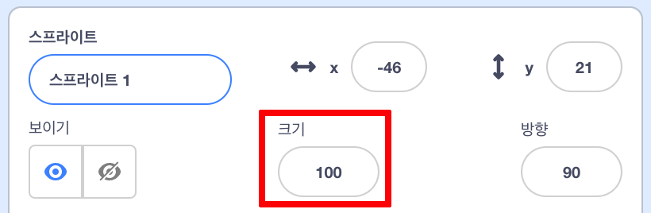
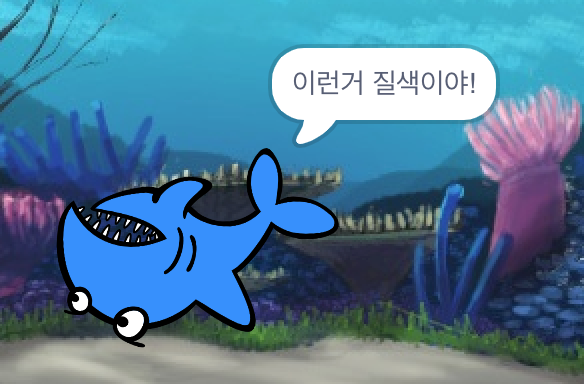

## 모든 스프라이트

이제 화살표 키를 사용하여 상어를 움직일 수 있습니다. 좋아요! 이제는 물고기를 잡을 시간입니다.

\--- task \---

**스프라이트 고르기** 버튼을 클릭하여 물고기 스프라이트를추가하세요! 


물고기가 상어에 비해 약간 큰 경우 크기를 조절하는 메뉴를 사용하여 두 스프라이트를 모두 적당한 크기로 만들 수 있습니다!



Change the number in the size control to make the sprite bigger or smaller.

\--- /task \---

잘하셨어요! 나중에 플레이어의 도움 없이 물고기가 스스로 움직일 수 있도록 코드를 추가 할 것입니다. 플레이어는 상어를 움직여 물고기를 잡으려고 합니다.

## \--- collapse \---

## 제목: 뒤로 움직이는 상어는 어떻습니까?

상어가 거꾸로 수영하는 것은 조금 재미있어 보일 것입니다. 뒤로 가려고 할 때 뒤로 걷는 대신 몸을 돌아서듯이 보통 상어가 돌아 다니듯이 돌아 서도록 하면 됩니다. 다행히도 스크래치는 이것에 대한 블록을 가지고 있습니다!

`도 방향 보기`{:class="block3motion"} 블록은 스프라이트가 가리킬 방향을 선택할 수 있습니다. **동작** 블록 카테고리에서 찾을 수 있습니다. 원하는 각도로 스프라이트를 가리키도록 원하는 각도를 입력 할 수 있습니다.

\--- /collapse \---

\--- task \---

Grab a couple of copies of the `point in direction`{:class="block3motion"} block from the **Motion** list and connect them to your shark's code, like this:

```blocks3
    [왼쪽 화살표 v] 키를 눌렀을 때
+     (-90) 도 방향 보기
    (10) 만큼 움직이기
```

```blocks3
    [오른쪽 화살표 v] 키를 눌렀을 때
+     (90) 도 방향 보기
    (10) 만큼 움직이기
```

\--- /task \---

\--- task \---

Change the number of steps in the `move`{:class="block3motion"} blocks from `-10` to `10`.

If you try moving the shark around now after you've added the `point in direction`{:class="block3motion"} blocks, you might notice something a little strange happening. The shark may not be turning quite right!



\--- /task \---

## \--- collapse \---

## 제목: 왜 거꾸로 되나요?

The problem here is that the shark sprite started, as all sprites do, with the 'all around' **rotation style**, and what you need it to have is the 'left-right' style.

As usual, there’s a block for that, and it’s in **Motion**!

\--- /collapse \---

\--- task \---

Look in the **Motion** category for the block `set rotation style`{:class="block3motion"}.

Add the block to your shark reset code from earlier, and set the rotation style to `left-right`{:class="block3motion"}, like this:

```blocks3
    녹색 깃발을 클릭했을 때
+     회전 방식을 [왼쪽-오른쪽 v] 으로 정하기
    x: (0) y: (0) 으로 이동하기
```

\--- /task \---