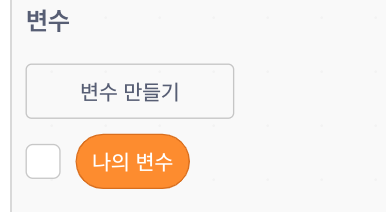
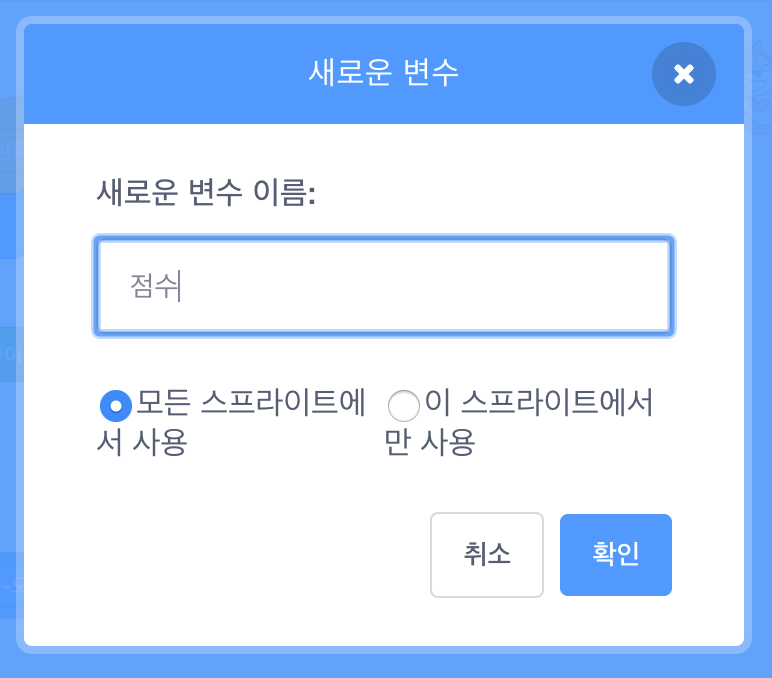
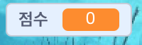

## 점수 사용하기

플레이어가 잡은 물고기의 수를 점수로 저장하고, 게임을 다시 시작할 때 초기화되는 방법을 알아보도록 하겠습니다.

첫번째: 점수 저장!

--- task --- **변수** 카테고리에서 **변수 만들기**를 클릭하십시오.



변수 이름을 `점수` 로 정합니다.



새로운 변수를 확인하십시오!

 --- /task ---

--- collapse ---
---
title: 변수란 무엇인가요?
---

프로그램의 정보를 저장하는데 사용하는 공간입니다. 라벨이 붙은 상자를 생각해 보세요. 상자에 내용물을 넣고 내용물을 확인하고, 변경할 수 있습니다. **변수** 카테고리에서 변수를 찾을 수 있습니다. 카테고리에서 변수 목록을 보려면 먼저 변수를 만들어야 합니다.

--- /collapse ---

이제 상어가 물고기를 먹을 때마다 변수를 업데이트하여 점수를 증가시키고, 게임을 다시 시작할 때 변수를 초기화해야 합니다. 두 가지 모두 하는 것은 매우 쉽습니다.

--- task --- **변수** 카테고리에서, `[나의 변수 v] 를 [0] 로 정하기`{:class="block3variables"} 와 `[나의 변수 v] 를 [1] 만큼 바꾸기`{:class="block3variables"} 블록을 꺼내세요. 블록의 작은 화살표를 클릭하고 `점수` 를 선택합니다. 그리고 블록을 프로그램에 아래와 같이 추가합니다.

### 상어에 대한 코드

```blocks3
    ⚑ 클릭했을 때
 +   [점수 v] 을\(를\) [0] 로 정하기
    회전 방식을 [왼쪽-오른쪽 v] \(으\)로 정하기
    x: (0) y: (0) \(으\)로 이동하기
```

### 물고기에 대한 코드

```blocks3
    만약 <[Sprite1 v] 에 닿았는가?> \(이\)라면 
+        [점수 v] 을\(를\) [1] 만큼 바꾸기
        숨기기
        (1) 초 기다리기
        x: ((-240) 부터 (240) 사이의 난수) y: ((-180) 부터 (180) 사이의 난수) \(으\)로 이동하기
        보이기
    end
```

--- /task ---

멋져요! 이제 당신은 점수증가와 점수 초기화 하는 것을 모두 하였습니다.