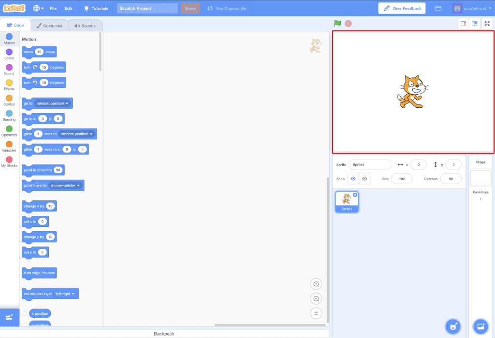

## सुरुवात अशी करा

एकदा आपण Scratch उघडल्यानंतर आपल्याला खालील प्रमाणे विंडो दिसेल.

\--- task \---

पुढीलपैकी प्रत्येक क्षेत्र शोधा आणि ते कोठे आहेत ते लक्षात ठेवा.

\--- /task \---

### स्टेज



## \--- collapse \---

## title: स्टेज म्हणजे काय?

येथेच आपले Scratch प्रोग्राम चालतात. इथे असते:

* एक किंवा अधिक **backgrounds** \(स्क्रीनच्या पार्श्वभूमीवरील प्रतिमा \)

* त्याच्याशी संबंधित कोणतेही **code blocks** \(आम्ही यावर पोहोचू\)

\--- /collapse \---

### Sprite यादी


## \--- collapse \---

## title: एक स्प्राइट म्हणजे काय?

आपण स्टेजवर जोडू शकता अशी कोणतीही वस्तू **sprite** असते.

एका स्प्राइटमध्ये समाविष्ट आहे:

* स्टेज वरील **image**
* कोणतीही अतिरिक्त **costumes** \(looks\) दिसतो
* कोणताही **sounds** त्याच्याशी संबंधित
* कोणतेही **code blocks** त्याच्याशी संबंधित 

\--- /collapse \---

### The code blocks palette


## \--- collapse \---

## title: कोड ब्लॉक्स

स्क्रॅचमधील कोड आपण प्रोग्राम बनविण्यासाठी कनेक्ट केलेल्या ब्लॉकच्या रूपात असतो. आपण **code blocks palette** मधून ब्लॉक्स निवडा, त्यांना ** current sprite panel** मध्येड्रॅ ग करा, आणि नंतर त्यांना एकमेकांशी कनेक्ट करा.

ब्लॉक्सचे दहा प्रकार असतात. ते रंगानुसार विभक्त आहेत आणि ** code blocks palette** च्या शीर्षस्थानी असलेल्या सूचीतील आयटमवर क्लिक करून आपण त्या दरम्यान निवडू शकता.

\--- /collapse \---

### सद्य स्प्राइट पॅनेल


## \--- collapse \---

## title: सध्याचे स्प्राइट म्हणजे काय?

**sprite list** मधून**current site** निवडलेले असतात.

** current sprite panel ** येथे आपण निवडलेल्या स्प्राइटसाठी कोड, कॉस्ट्युम आणि आवाज पाहू शकता.

\--- /collapse \---

आता कोडिंग करण्याची वेळ!

\--- task \---

स्प्राईट यादीमध्ये स्क्रॅच कॅटवर क्लिक करा. मांजर आता सद्य स्प्राईट आहे.

कोड ब्लॉक पॅलेटमधील **Events** श्रेणी निवडा, `when flage clicked `{:class= "block3events"} ब्लॉक क्लिक करा आणि त्यास सध्याच्या स्प्राइट पॅनेलमध्ये ड्रॅग करा.

```blocks3
    when green flag clicked
```

\--- /task \---

\--- task \---

नंतर कोड ब्लॉक पॅलेटमध्ये **Looks ** मधे जा आणि हा ब्लॉक शोधा:

```blocks3
    say [Hello!] for (2) secs
```

त्यावर क्लिक करा, माऊस बटण दाबून ठेवा आणि नंतर त्यास सध्याच्या स्प्राइट पॅनेलमध्ये ड्रॅग करा आणि बटणास सोडून द्या.

\--- /task \---

\--- task \---

आता दुसरा ब्लॉक सध्याच्या स्प्राइट पॅनेलमध्ये आहे, त्यास क्लिक आणि ड्रॅग करून पहिल्या ब्लॉकच्या तळाशी एकत्र आल्यावर कनेक्ट करा, या प्रमाणे:


\--- /task \---

\--- task \---

आता ** Start Program ** बटण क्लिक करा आणि काय घडते ते पहा!

\--- /task \---