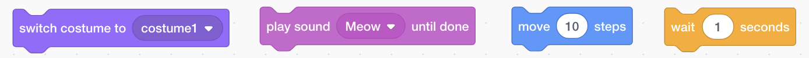
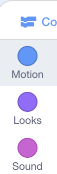

## कोड ब्लॉक्स समाविष्ट करणे आणि काढून टाकणे

मस्त! आपण आपला प्रथम स्क्रॅच प्रोग्राम लिहिला आहे. स्क्रॅचमध्ये कोड बद्दल अधिक जाणून घेण्याची वेळ! स्क्रॅच कोड **blocks** बनलेला आहे जसे की:



आपल्याला**code blocks palette**, आढळतील, ते त्यांच्या भूमिकेनुसार भिन्न श्रेण्यांमध्ये वर्गीकृत केलेले असतात.

## \--- collapse \---

## title: भिन्न प्रकारातील ब्लॉक वापरणे

त्या वर्गातील ब्लॉक्स पाहण्यासाठी श्रेणी नावावर क्लिक करा. येथे, **Motion** श्रेणी निवडली आहे:



आपण क्लिक केलेल्या श्रेणीतील सर्व ब्लॉक्स सूचीमध्ये दर्शविले आहेत:


आपण इच्छित ब्लॉक वर क्लिक करू शकता आणि नंतर त्यास सध्याच्या स्प्राइट पॅनेलमध्ये ड्रॅग करा आणि सोडून द्या. एकदा ते पॅनेलमध्ये असल्यास आपण त्यास फिरवू शकता आणि त्यास इतर ब्लॉक्सशी कनेक्ट करू शकता.

\--- /collapse \---

ब्लॉक काय करतो हे आपण पाहू इच्छित असल्यास, त्यास चालविण्यासाठी आपण त्यावर डबल-क्लिक करू शकता!

\--- task \---

ते काय करतात हे पाहण्यासाठी काही ब्लॉक्सवर डबल-क्लिक करून पहा.

\--- /task \---

## \--- collapse \---

## title: कोड चालविणे

सहसा, जेव्हा काही विशिष्ट घडते तेव्हा आपला कोड स्वयंचलितपणे चालू व्हावा अशी आपली इच्छा असते. म्हणूनच आपले अनेक प्रोग्राम्स**Events** श्रेणीमधील ब्लॉकसह प्रारंभ होतील, बहुतेकदा हे एक:

```blocks3
    when green flag clicked
```

या ब्लॉकला कनेक्ट केलेले कोड ब्लॉक ** ग्रीन ध्वजावर ** क्लिक केल्यानंतर चालतील.

कोड ब्लॉक वरपासून खालपर्यंत चालतात, म्हणून आपण आपल्या ब्लॉक्सला एकत्रित करण्याच्या क्रमवारीकडे लक्ष द्या. या उदाहरणात, स्प्राइट `म्हणेल`{:class= "block3looks"} `हॅलो!`, `म्याव` आवाज` प्ले`{:class="block3sound"} करण्यापूर्वी.

```blocks3
    when green flag clicked
    say [Hello]
    play sound [meow v]
```

\--- /collapse \---

आपल्या प्रोग्राममध्ये आपल्याला नको असलेले कोड ब्लॉक हटविणे किंवा डिलीट करणे सोपे आहे! त्यांना फक्त कोड ब्लॉक पॅलेटमध्ये पुन्हा ड्रॅग करा.

** सावधगिरी बाळगा: ** त्यांना कोड ब्लॉक्स पॅलेटमध्ये ड्रॅग केल्याने आपण ड्रॅग करत असलेल्या ब्लॉकशी कनेक्ट केलेले सर्व ब्लॉक डिलीट होतील, म्हणून आपण जे ब्लॉक काढून टाकू इच्छिता त्यापासून आपण ठेऊ इच्छित असलेले कोड ब्लॉक वेगळे करा. आपण चुकीने काही कोड ब्लॉक हटविल्यास आणि त्या परत मिळवू इच्छित असल्यास, सर्वकाही परत मिळविण्यासाठी उजवे-क्लिक करा आणि नंतर ** undo** वर क्लिक करा.


\--- task \---

काही कोड ब्लॉक्स जोडणे, हटविणे आणि हटविणे रद्द करण्याचा प्रयत्न करा!

\--- /task \---

### हे सर्व एकत्र करून

कोड कसे फिरवायचे आणि कशा गोष्टी घडतात हे आता आपणास ठाऊक आहे, स्क्रॅच मांजरीला वर्तुळात फिरण्यासाठी एक प्रोग्राम तयार करण्याची वेळ आली आहे!

\--- task \---

आपल्याकडे स्प्राईट सूचीमध्ये मांजरीचे स्प्राइट निवडलेले असल्याची खात्री करा आणि नंतर पुढील ब्लॉक्सला स्प्राइट पॅनेलमध्ये ड्रॅग करा आणि त्यांना कनेक्ट करा. आपण त्यांना **इव्हेंट** आणि **मोशन** सूचीमध्ये पहाल.

```blocks3
    when green flag clicked
    move [10] steps
```

\--- /task \---

\--- task \---

आता स्टेजच्या वरील हिरव्या झेंड्यावर क्लिक करा.


\--- /task \---

आपण मांजर सरळ रेषेत चालताना पाहिले पाहिजे... आपल्याला पाहिजे तसे नाही, बरोबर?

टीप: आपण बर्‍याच वेळा ध्वज क्लिक केल्यास आणि मांजर दूर गेल्यास आपण त्यास मागे ड्रॅग करू शकता!

\--- task \---

मांजरीच्या स्प्राइटला वर्तुळात चालण्यासाठी वळण ब्लॉकला शेवटी जोडा. हे देखील **मोशन ** यादीमध्ये आहे.

```blocks3
    when green flag clicked
    move [10] steps
+    turn cw (15) degrees
```

\--- /task \---

## \--- collapse \---

## title: वर्तुळात फिरविणे कसे कार्य करते?

हा ब्लॉक स्प्राइटला वर्तुळ बनविणार्‍या पूर्ण ३६० अंशांमधून १५ अंश फिरवतो. नंबरवर क्लिक करून आणि नवीन व्हॅल्यू टाइप करुन आपण ती संख्या आणि चरणांची संख्या बदलू शकता.


\--- /collapse \---

\--- task \---

आता आपले कार्य जतन करा!

\--- /task \---