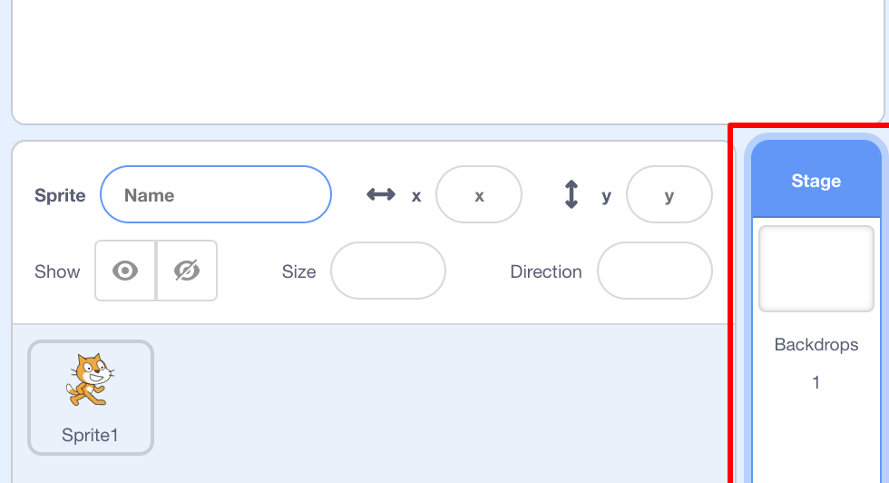
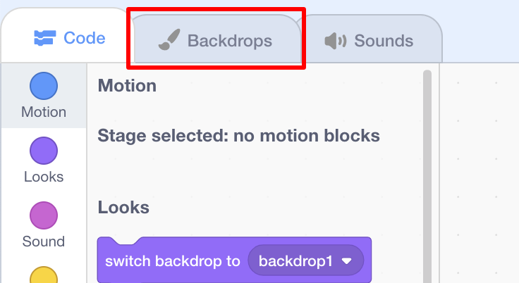

## दृष्य सेट करणे

आपला प्रकल्प अद्भुत दिसण्यासाठी आपल्याकडे Scratch पार्श्वभूमी आणि स्प्राइट्सची एक लायब्ररी आहे.

\--- task \---

स्टेज निवडा.

**Backdrops** क्लिक करा.

**Choose backdrop from library** चिन्हावर क्लिक करा.

मग तुमची आवडती पाण्याच्या पृष्ठभागाखाली पार्श्वभूमी निवडा!

\--- /task \---

मस्त! नक्कीच, आता आपल्याकडे मांजर पाण्याखाली आहे आणि मांजरी सामान्यत: त्याचे मोठे चाहते नसतात. परंतु आपण त्याचे निराकरण करू शकता, कारण आपण मांजरीला शार्क बनवू शकता!

\--- task \---

प्रथम, मांजरीचे स्प्राइट निवडा आणि **Costumes** टॅबवर क्लिक करा.

नंतर **Choose costume from Library**निवडा

ही शार्क प्रतिमा निवडा आणि**OK**क्लिक करा.

आता प्रत्येक मांजरीचे कॉस्ट्युम निवडून **x** वर क्लिक करून काढा.

\--- /task \---

आता आपल्याकडे शार्क आहे - उत्कृष्ट!