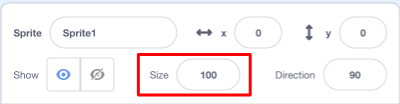

## सर्व स्प्राईट्स

आता आपल्याकडे एक शार्क आहे जो आपण एरो की वापरुन फिरू शकता. छान! त्याने आता थोडी मासे पकडण्याची वेळ.

\--- task \---

**New sprite** बटण क्लिक करा आणि उघडणार्‍या स्क्रीनवर एक मासा निवडा.


जर आपली मासा आपल्या शार्कच्या तुलनेत थोडी मोठी असेल तर आपण दोन्ही स्प्राईट्सला योग्य आकार देण्यासाठी आकार नियंत्रण वापरू शकता!



स्प्राईट्स मोठा किंवा लहान करण्यासाठी आकार नियंत्रणामध्ये संख्या बदला.

\--- /task \---

मस्त! नंतर, आपण प्लेअरच्या मदतीशिवाय, मासे स्वत: भोवती फिरण्यासाठी काही कोड जोडाल. आपला खेळाडू शार्क हलवेल आणि मासे पकडण्याचा प्रयत्न करेल.

## \--- collapse \---

## title: उलट दिशेने जाणाऱ्या शार्कचे काय?

ती शार्क पाठीमागे पोहणे थोडेसे मजेशीर वाटेल. जसे आपण सामान्यत: मागे चालण्याऐवजी फिरत असता, शार्क मागील बाजूस पोहण्याऐवजी मागे फिरत असे. सुदैवाने आपल्यासाठी, स्क्रॅचचा यासाठी एक ब्लॉक आहे!

दिशेने `point in direction`{:class="block3motion"} ब्लॉक आपल्याला आपला स्प्राइट ज्या दिशेने दर्शवित आहे त्या दिशेने निवड करू देतो. आपणास हे **Motion** ब्लॉकमध्ये सापडेल. आपण इच्छिता तेथे स्प्राइट दर्शविण्यासाठी आपण कितीही अंश टाइप करू शकता.

\--- /collapse \---

\--- task \---

**Motion** सूचीमधून `point in direction`{:class="block3motion"} ब्लॉकच्या दोन प्रती घ्या आणि त्यांना याप्रमाणे आपल्या शार्कच्या कोडशी जोडा:

```blocks3
    when [left arrow v] key pressed
+     point in direction (-90)
    move (10) steps
```

```blocks3
    when [right arrow v] key pressed
+     point in direction (90)
    move (10) steps
```

\--- /task \---

\--- task \---

`move`{:class="block3motion"} ब्लॉकमधील चरणांची संख्या ` -10 ` ते ` 10 ` बदला.

आता आपण शार्कला हलविण्यासाठी `point in direction`{:class="block3motion"} ब्लॉक निवडल्यावर, आपणास थोडेसे विचित्र होत असल्याचे लक्षात येईल. शार्क कदाचित बर्यापैकी वळत नसेल!


\--- /task \---

## \--- collapse \---

## title: हे उलट्या बाजूस का जाते?

येथे अडचण अशी आहे की शार्क स्प्राइट सुरु झाले, जसे सर्व स्प्राइट्स, 'ऑल-अराउंड' **rotation style**, करतात आणि आपल्याकडे जे असणे आवश्यक आहे ती म्हणजे 'डावी-उजवी' शैली.

नेहमी प्रमाणे, त्यासाठी एक ब्लॉक आहे आणि तो **Motion** मध्ये आहे!

\--- /collapse \---

\--- task \---

`set rotation style`{:class="block3motion"} ब्लॉकसाठी **Motion** श्रेणीमध्ये पहा.

आधीच्या आपल्या शार्क रीसेट कोडमध्ये ब्लॉक जोडा आणि रोटेशन शैलीला `left-right`{:class="block3motion"} वर सेट करा, जसे की:

```blocks3
    when green flag clicked
+     set rotation style [left-right v]
    go to x: (0) y: (0)
```

\--- /task \---