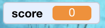

## गुणांची नोंद

खेळाडूने किती मासे पकडले याची नोंद ठेवण्यासाठी आपणास स्कोअर, त्यात भर घालण्याचा एक मार्ग आणि खेळ पुन्हा सुरू झाल्यावर तो रीसेट करण्याचा एक मार्ग आवश्यक आहे.

प्रथम: स्कोअर संचयित करीत आहे!

--- task ---

कोड टॅबमध्ये **Variables** वर क्लिक करा, नंतर **Make a Variable** वर क्लिक करा.


`score` नाव म्हणून प्रविष्ट करा.


आपले नवीन Variables पहा!



--- /task ---

--- collapse ---
---
title: वेरिएबल्स काय आहेत?
---

जेव्हा आपल्याला प्रोग्राममध्ये माहिती संचयित करायची असेल तर आपण **variables** वापरता. त्यावर एका लेबल असलेल्या बॉक्ससारखे विचार करा: आपण त्यात काहीतरी ठेवू शकता, त्यामध्ये काय आहे ते तपासा आणि त्यामध्ये काय बदलू शकता. आपणास व्हेरिएबल्समध्ये **variables** विभागामध्ये आढळतील, परंतु त्यांना तेथे दर्शविण्यासाठी प्रथम आपण त्यांना तयार करणे आवश्यक आहे!

--- /collapse ---

जेव्हा आपल्याला शार्क जेव्हा एखादा मासा खाईल तेव्हा आपण व्हेरिएबल अद्यतनित करणे आणि गेम पुन्हा सुरू केल्यावर ते रीसेट करणे आवश्यक आहे. दोन्ही करणे खूपच सोपे आहे:

--- task ---

**Variables** विभाग मधून, `set [my variable v] to [0]`{:class="block3variables"} आणि `change [my variable v] by [1]`{:class="block3variables"} ब्लॉक्स घ्या. ब्लॉक्समधील छोट्या बाणावर क्लिक करा, सूचीमधून `score` निवडा आणि नंतर आपल्या प्रोग्राममध्ये ते ब्लॉक्स ठेवा:

### शार्क साठी कोड

```blocks3
    when green flag clicked
+    set [score v] to [0]
    set rotation style [left-right v]
    go to x: (0) y: (0)
```

### माशासाठी कोड

```blocks3
    if <touching [Sprite1 v] ?> then
+        change [score v] by [1]
        hide
        wait (1) secs
        go to x: (pick random (-240) to (240)) y: (pick random (-180) to (180))
        show
    end
```

--- /task ---

मस्त! आता आपल्याकडे स्कोअर आणि सर्वकाही आहे.