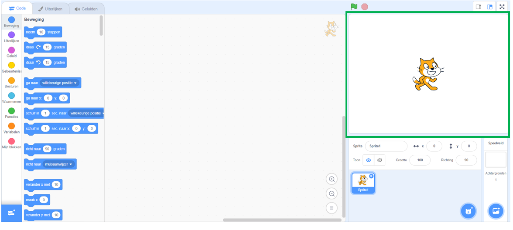
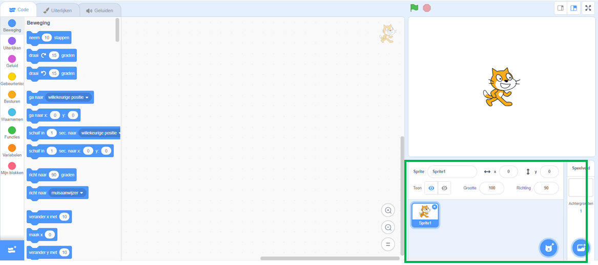
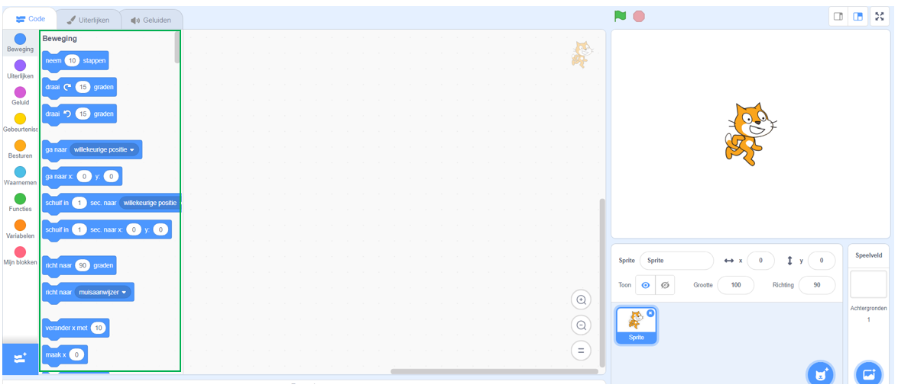
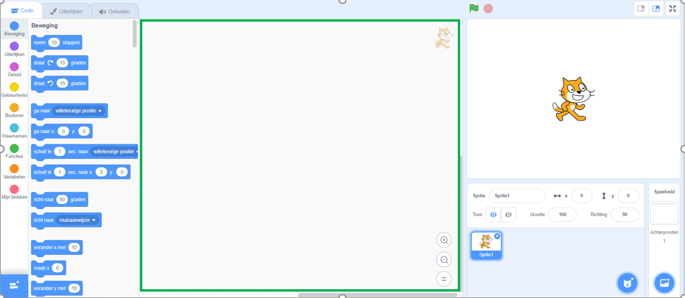
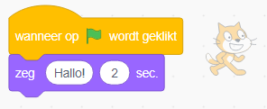

## Beginnen

Zodra je Scratch opent, zie je een venster zoals hieronder.

--- task --- Zoek naar de volgende gebieden en onthoud waar ze zijn. --- /task ---

### Het speelveld



--- collapse ---
---
title: Wat is het Speelveld?
---

Dit is waar je Scratch programma's worden uitgevoerd. Het heeft:

* Eén of meer **achtergronden** \(afbeeldingen op de achtergrond van het scherm\)

* Alle **codeblokken** die daarbij horen \(hier komen we zo op\)

--- /collapse ---

### De sprite lijst



--- collapse ---
---
title: Wat is een sprite?
---

Elk item dat je in het Speelveld kunt toevoegen, is een **sprite**.

Een sprite bevat:

* De **afbeelding** op het Speelveld
* Mogelijke extra **kostuums** \(uiterlijken\) dat het heeft
* Alle **geluiden** die bij de sprite horen
* Alle **codeblokken** die bij de sprite horen 

--- /collapse ---

### Het codeblokken palet



--- collapse ---
---
title: Codeblokken
---

Code in Scratch komt in de vorm van blokken die je met elkaar verbindt om programma's te maken. Je kiest blokken uit het palet met **codeblokken**, sleept ze naar het **huidige sprite paneel** en verbindt ze dan met elkaar.

Er zijn tien categorieën van blokken. Ze hebben een kleurcode en je kunt kiezen tussen de blokken door op de items in de lijst bovenaan het palet met **codeblokken** te klikken.

--- /collapse ---

### Het huidige sprite paneel



--- collapse ---
---
title: Wat is de huidige sprite?
---

De **huidige sprite** is degene die is geselecteerd in de **sprite lijst**.

Het **huidige sprite paneel** is waar je de code, kostuums en geluiden voor de geselecteerde sprite kunt zien.

--- /collapse ---

Tijd om te gaan programmeren!

--- task --- Klik op de Scratch kat in de sprite lijst. De kat is nu de huidige sprite.

Kies de **Gebeurtenissen** categorie in het code blokken palet, klik op het `wanneer op groene vlag wordt geklikt :: events hat`{:class="block3events"} blok, en sleep het naar het huidige sprite paneel.

```blocks3
    wanneer op de groene vlag wordt geklikt :: events hat
```

--- /task ---

--- task --- Ga nu naar **Uiterlijken** in het code blokken palet en zoek dit blok:

```blocks3
    zeg (Hallo!) (2) sec. :: looks
```

Klik erop, houd de muisknop ingedrukt en sleep hem naar het huidige sprite paneel en laat de knop los.

--- /task ---

--- task --- Nu het tweede blok ook in het huidige sprite paneel staat, verbindt je het aan de onderkant van het eerste blok door erop te klikken en het onder het eerste blok te slepen zodat ze aan elkaar vastklikken, zoals dit:

 --- /task ---

--- task --- Klik nu op de **Ga** knop en kijk wat er gebeurt! --- /task ---