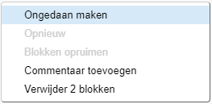

## Toevoegen en verwijderen van codeblokken

Geweldig! Je hebt je allereerste Scratch programma geschreven. Tijd om wat meer te leren over hoe je code in en uit Scratch kunt zetten! Scratch code bestaat uit **blokken** zoals deze:


Je vindt alle blokken in het palet met **codeblokken**, onderverdeeld in verschillende categorieën op basis van wat ze doen.

## \--- collapse \---

## title: Gebruik blokken uit de verschillende categorieën

Klik op een categorienaam om de blokken in die categorie te bekijken. Hier is de **Beweging** categorie geselecteerd:


Alle blokken in de categorie waarop je hebt geklikt, worden weergegeven in de lijst:


Je kunt op het gewenste blok klikken en deze vervolgens naar het huidige sprite paneel slepen en loslaten. Zodra het in het paneel zit, kun je het verplaatsen en verbinden met andere blokken.

\--- /collapse \---

Als je wilt zien wat een blok doet, kun je erop dubbelklikken om het uit te laten voeren!

\--- task \--- Dubbelklik op de blokken om te zien wat ze doen. \--- /task \---

## \--- collapse \---

## title: De code uitvoeren

Meestal wil je dat je code automatisch wordt uitgevoerd wanneer er iets specifieks gebeurt. Daarom beginnen veel van je programma's met een blok uit de **gebeurtenissen** categorie, meestal deze:

```blocks3
    wanneer op groene vlag wordt geklikt
```

De codeblokken die zijn aangesloten op dit blok wordt uitgevoerd nadat op de **groene vlag** is geklikt.

Codeblokken lopen van boven naar beneden, dus de volgorde waarin je de blokken samenvoegt, is van belang. In dit voorbeeld zal de sprite `Hallo!` `zeggen` voordat het het `meow` geluid `afspeelt`{:class="block3sound"}.

```blocks3
    wanneer op de groene vlag wordt geklikt
  zeg [Hallo]
  speel geluid [meow v] af
```

\--- /collapse \---

Het verwijderen van codeblokken die je niet wilt gebruiken in je programma is eenvoudig! Sleep ze gewoon terug naar het palet met codeblokken.

**Pas op:** door je blok naar het codeblok paneel te slepen, worden alle blokken die aan dat blok hangen ook verwijdert. Zorg er dus voor dat de blokken die je wilt houden losgekoppeld zijn van het blok dat je wilt verwijderen. Als je per ongeluk blokken hebt verwijdert en ze terug wilt halen, klik dan met je rechtermuisknop en vervolgens op de **Ongedaan maken** optie om alles weer terug te krijgen.



\--- task \--- Probeer eens codeblokken toe te voegen, te verwijderen en weer terug te halen! \--- /task \---

### Alles bij elkaar brengen

Nu je weet hoe je code kunt verplaatsen en dingen kunt laten gebeuren, is het tijd om een ​​programma te maken waarmee de Scratch Cat in een cirkel kan lopen!

\--- task \--- Zorg dat je de kat sprite geselecteerd hebt in de spritelijst, en sleep dan de volgende blokken in het sprite paneel en verbindt ze met elkaar. Je vindt ze in de **Gebeurtenissen** en **Beweging** categorieën.

```blocks3
    wanneer op groene vlag wordt geklikt
    neem [10] stappen
```

\--- /task \---

\--- task \--- Klik nu op de groene vlag boven het Speelveld.

 \--- /task \---

Je zou de kat in een rechte lijn moeten zien lopen... niet precies wat je wilt, toch?

Opmerking: als je te vaak op de vlag klikt en de kat loopt uit beeld, dan kun je hem terug slepen!

\--- opdracht \--- Zet het draai blok aan het eind zodat de kat in een rondje kan lopen. Het zit ook in de **Beweging** categorie.

```blocks3
    wanneer op groene vlag wordt geklikt
   neem [10] stappen
+    draai cw (15) graden
```

\--- /task \---

## \--- collapse \---

## title: Hoe werkt draaien?

Dit blok zorgt ervoor dat de sprite 15 graden van de volledige 360 ​​graden draait die een cirkel vormen. Je kunt dat aantal en het aantal stappen wijzigen door op het nummer te klikken en een nieuwe waarde in te voeren.


\--- /collapse \---

\--- task \--- Sla nu je project op! \--- /task \---