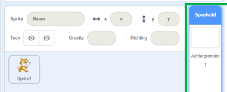
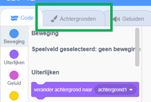
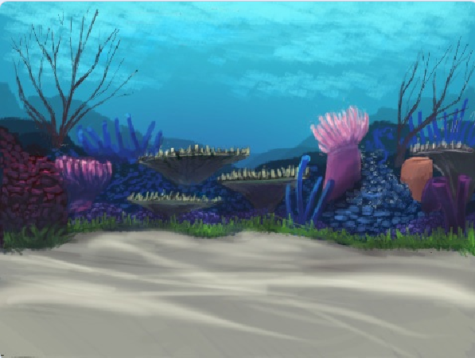
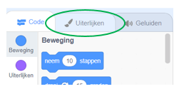
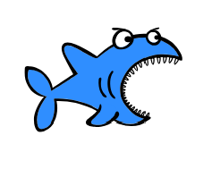
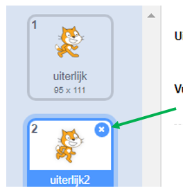

## Het instellen van de scène

Scratch heeft een bibliotheek met achtergronden en sprites die je kunt gebruiken om je project er geweldig uit te laten zien.

--- task --- 

Selecteer het Speelveld.

Klik op **Achtergronden**.

Klik op het **Kies een achtergrond** icoon.

Kies dan je favoriete onderwaterachtergrond!

 

--- /task ---

Geweldig! Maar nu heb je natuurlijk een kat onder water, en katten zijn daar meestal geen grote fans van. Maar dat kun je oplossen, want je kunt de kat veranderen in een haai!

--- task --- 

Selecteer eerst de kat sprite en klik op de **Uiterlijken** tab.

Klik dan op **Kies een uiterlijk**

Selecteer deze haai afbeelding en klik op **OK**.

Verwijder nu de kat uiterlijken door ze stuk voor stuk te selecteren en op **x** te klikken.

 

--- /task ---

Nu heb je een haai - uitstekend!