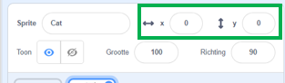

## Dingen verplaatsen

Op dit moment beweegt je haai in een rondje, en het zou veel gaver zijn om hem aan te sturen met de pijltjestoetsen. Met deze kaart leer je hoe dat moet!

--- task --- Begin met het verwijderen van alle code die je hebt voor de haai. --- /task ---

Zoals je vast al geraden hebt, heb je de **Gebeurtenissen** en **Beweging** blokken weer nodig!

--- task --- Zoek deze keer dit blok op en sleep het naar het huidige sprite paneel:

```blocks3
    wanneer [spatiebalk v] is ingedrukt :: events hat
```

Klik op de kleine pijl (▼) naast `spatie`. Je ziet nu een lijst met alle toetsen waaruit je kunt kiezen. --- /task ---

Je hebt vier van de `wanneer toets is ingedrukt`{:class="block3events"} blokken nodig - één voor elk van je pijltjestoetsen.

--- task --- Om je haai te laten bewegen, verbindt je deze blokken op de volgende manier aan de **beweging** blokken:

```blocks3
    wanneer [pijltje links v] is ingedrukt :: events hat
neem (-10) stappen
```

```blocks3
    wanneer [pijltje rechts] is ingedrukt :: events hat
neem (10) stappen
```

```blocks3
    wanneer [pijltje omhoog] is ingedrukt :: events hat
```

```blocks3
    wanneer [pijltje omlaag] is ingedrukt :: events hat
```

--- /task ---

**Let op**: `-10` betekent 'ga 10 stappen terug'.

--- task --- Klik nu op de groene vlag om je code te testen. --- /task ---

Nu beweegt je haai naar voren en naar achteren, wat heel gaaf is, maar hij gaat nog niet omhoog of naar beneden. Als je kijkt bij de **Beweging** blokken, zul je zien dat er geen blokken zijn voor 'omhoog' of 'omlaag'. Er zijn wel veel blokken die te maken hebben met **x** en **y** coördinaten - laten we die proberen!

--- task--- Neem twee `verander y met`{:class="block3motion"} blokken en werk je code als volgt bij:

```blocks3
    wanneer [pijltje omhoog] is ingedrukt :: events hat
+    verander y met (10)
```

```blocks3
    wanneer [pijltje omlaag] is ingedrukt :: events hat
+   verander y met (-10)
```

--- /task ---

Als je nu op de pijltjestoetsen klikt, beweegt je haai over het hele speelveld!

--- collapse ---
---
title: Hoe werken x- en y-coördinaten?
---

Als we het hebben over de positie van dingen, zoals sprites, dan gebruiken we vaak x- en y-coördinaten. De **x-as** van het Speelveld coördinaten systeem loopt van **links naar rechts**, en de **y-as** van **beneden naar boven**.


Een sprite kan gevonden worden op de coördinaten van zijn middelpunt, bijvoorbeeld `(15,-27)`, waarbij `15` de positie op de x-as is, en `-27` de positie op de y-as.

+ Om een indruk te krijgen van hoe dit werkt, selecteer je een sprite en gebruik je de **x** en **y** besturingselementen om het over het speelveld te laten bewegen, hierbij vul je verschillende waarden in voor de coördinaten.



+ Probeer verschillende waarden uit om te zien waar de sprite heen gaat! In Scratch loopt de x-as van `-240` tot `240`, en de y-as van `-180` tot `180`.

--- /collapse ---

### Het spel herstarten

De haai beweegt nu over je hele scherm, maar stel je voor dat dit een spel is: hoe herstart je het dan, en wat gebeurt er aan het begin van elk spel?

De haai moet weer op zijn beginpositie komen als een speler het spel start. Ze beginnen het spel door op de groene vlag te klikken, dus je moet de x- en y-coördinaten van de haai veranderen als dat gebeurt.

Dat is best wel simpel! Het midden van het speelveld is `(0, 0)` in `(x, y)` coördinaten.

Je hebt alleen een **Gebeurtenissen** blok nodig voor de groene vlag, en het **ga naar** blok uit **Beweging**.

--- task --- Sleep een `wanneer groene vlag is ingedrukt :: events hat`{:class="block3events"}, **Gebeurtenis** blok naar het huidige sprite paneel.

```blocks3
    wanneer op de groene vlag wordt geklikt :: events hat
```

Zoek dan het `ga naar`{:class="block3motion"} **beweging** blok en zet het vast aan je vlag **Gebeurtenissen** blok.

```blocks3
    wanneer groene vlag is ingedrukt :: events hat
+  ga naar x: (0) y: (0)
```

Stel zowel de `x` als `y` coördinaten in op `0` in het `ga naar`{:class="block3motion"} blok als ze nog niet op `0` staan.

--- /task ---

--- task --- Klik nu op de groene vlag: je zou nu moeten zien dat de haai weer in het midden van het speelveld staat! --- /task ---