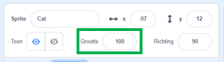
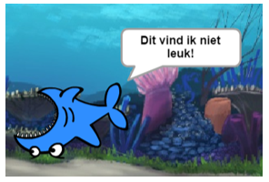

## Alle sprites

Nu heb je een haai die je kunt laten bewegen met de pijltjestoetsen. Gaaf! Hoog tijd om wat vissen toe te voegen die hij kan vangen.

--- task ---

Klik op de **Kies een sprite** knop en kies een vis uit het scherm dat geopend wordt.


Als je vis een beetje groot is vergeleken met je haai, dan kun je Grootte gebruiken om beide sprites het juiste formaat te geven!



Verander het getal achter Grootte om de sprite groter of kleiner te maken.

--- /task ---

Geweldig! Later zul je code toevoegen om de vis zelfstandig te laten bewegen, zonder dat de speler helpt. Je speler zal de haai aansturen om te proberen de vis te vangen.

--- collapse ---
---
title: Hoe zit het met de achterstevoren haai?
---

Het ziet er een beetje gek uit om de haai achterstevoren te laten zwemmen. Net zoals jij je liever omdraait in plaats van achteruit te lopen, wil de haai zich ook omdraaien in plaats van achterstevoren te zwemmen. Gelukkig heeft Scratch hier een blok voor!

Het `richt naar graden`{:class="block3motion"} blok laat je de richting bepalen waarnaar je sprite wijst. Je vindt het in de **Beweging** blokken categorie. Je kunt zelf het aantal graden bepalen om de sprite in de juiste richting te laten wijzen. 
--- /collapse ---

--- task --- 
Gebruik een paar `richt naar graden`{:class="block3motion"} blokken uit de **Beweging** lijst en voeg ze als volgt aan de haaicode toe:

```blocks3
    wanneer [pijltje links v] is ingedrukt
+   richt naar (-90) graden
neem (10) stappen
```

```blocks3
    wanneer [pijltje rechts v] is ingedrukt
+   richt naar (90) graden
neem (10) stappen
```

--- /task ---

--- task --- 
Verander het aantal stappen in de `beweging`{:class="block3motion"} blokken van `-10` tot `10`.

Als je de haai beweegt nu je de `richt naar graden`{:class="block3motion"} blokken hebt toegevoegd, zul je iets raars zien. De haai draait niet helemaal goed!



--- /task ---

--- collapse ---
---
title: Waarom draait de haai ondersteboven?
---

Het probleem is dat de haai begon, zoals alle sprites doen, met de 'helemaal rond' **draaistijl**, en wat je nodig hebt is de 'links-rechts' stijl.

Zoals altijd is daar een blok voor in **Beweging**!

--- /collapse ---

--- task --- 
Zoek in de **Beweging** categorie naar het blok `maak draaistijl`{:class="block3motion"}.

Voeg dit blok toe aan de herstartcode van de haai, en maak als volgt de draaistijl `links-rechts`{:class="block3motion"}:

```blocks3
    wanneer op de groene vlag wordt geklikt
+   maak draaistijl [links-rechts v]
ga naar x: (0) y: (0)
```

--- /task ---