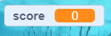

## Score bijhouden

Om bij te houden hoeveel vissen de speler vangt, moet je iets hebben om de score in op te slaan, een manier om erbij op te tellen, en een manier om opnieuw te beginnen als het spel herstart wordt.

Ten eerste: de scoren opslaan!

\--- task \--- Ga naar de **Variabelen** blokken categorie en klik op **Maak een variabele**.


Type `score` als de naam.


Bekijk je nieuwe variabele!

 \--- /task \---

## \--- collapse \---

## title: Wat zijn variabelen?

Als je informatie wilt opslaan in een programma, dan gebruik je iets dat **variabele** heet. Zie het als een doos met een label erop: je kunt er iets instoppen, controleren wat er in zit, en veranderen wat er in zit. Je vindt de variabelen in de **Variabelen** categorie, maar je moet ze eerst zelf maken zodat ze te zien zijn!

\--- /collapse \---

Nu moet de variabele elke keer bijgewerkt worden als de haai een vis pakt, en opnieuw beginnen als het spel wordt herstart. Beide zijn vrij simpel om te doen:

\--- task \--- Pak uit de **Variabelen** categorie de `maak [mijn variabele v] [0]`{:class="block3variables"} en `verander [mijn variabele v] met [1]`{:class="block3variables"} blokken. Klik op de kleine pijltjes in de blokken, kies `score` uit de lijst, en zet de blokken in je programma:

### Code voor de haai

```blocks3
    wanneer op groene vlag wordt gedrukt
+ maak [score v] [0]
maak draaistijl [links-rechts v]
ga naar x: (0) y: (0)
```

### Code voor de vis

```blocks3
    als <raak ik [Sprite1 v]> dan
+ verander [score v] met [1]
verdwijn
wacht (1) sec
ga naar x: (willekeurig getal tussen (-240) en (240)) y: (willekeurig getal tussen (-180) en (180))
verschijn
einde
```

\--- /task \---

Gaaf! Nu heb je zelfs een score.