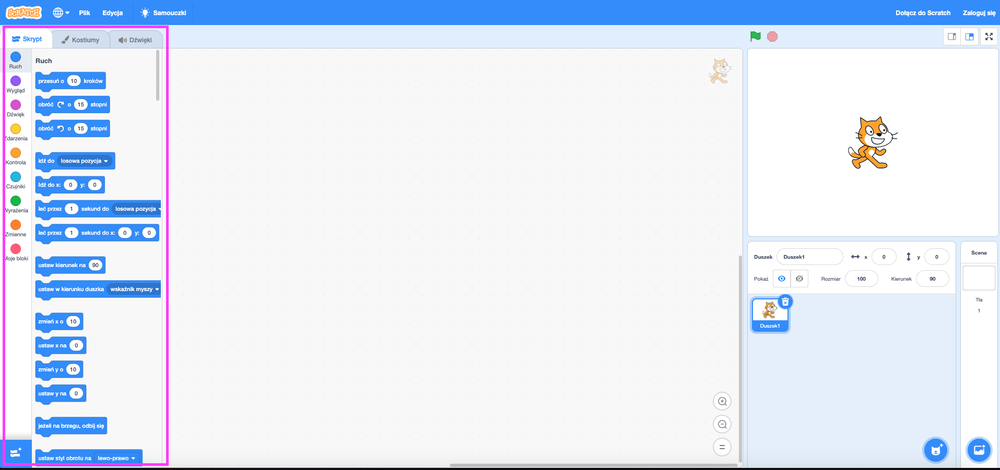
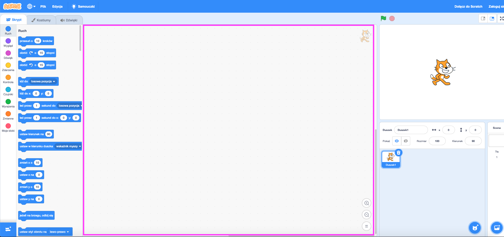

## Przygotowanie do pracy

Po uruchomieniu Scratch zobaczysz okno takie jak to poniżej.

\--- task \--- Poszukaj każdego z poniższych obszarów na ekranie i zapamiętaj, gdzie są. \--- /task \---

### Scena


## \--- collapse \---

## title: Co to jest scena?

W tym miejscu działają programy Scratch. Scena zawiera:

* Jedno lub więcej **tła** (obrazy na tle ekranu)

* Dowolne **bloki kodu** powiązane z tym (dojdziemy do tego później)

\--- /collapse \---

### Lista duszków


## \--- collapse \---

## title: Co to jest duszek?

Każdy element, który możesz dodać na scenie, jest **duszkiem**.

Duszek zawiera:

* **Obraz** na scenie
* Wszelkie dodatkowe **kostiumy** (wyglądy), które posiada
* Wszelkie **dźwięki** z nim powiązane
* Dowolne **bloki kodu** związanych z nim 

\--- /collapse \---

### Paleta bloków kodu



## \--- collapse \---

## title: bloki kodu

Kod w programie Scratch ma postać bloków, które łączysz w celu tworzenia programów. Wybierasz bloki z **palety bloków kodu**, przeciągasz je do **panelu bieżącego duszka**, a następnie łączysz je ze sobą.

Istnieje dziesięć kategorii bloków. Są one oznaczone kolorami i można wybierać między nimi, klikając elementy na liście u góry **palety bloków kodu**.

\--- /collapse \---

### Panel bieżącego duszka



## \--- collapse \---

## title: Co to jest bieżący duszek?

**Bieżący duszek** jest to ten, który został zaznaczony na **liście duszków**.

**Panel bieżącego duszka** to miejsce, w którym możesz zobaczyć kod, kostiumy i dźwięk dla wybranego duszka.

\--- /collapse \---

Czas na programowanie!

\--- task \--- Na liście duszków kliknij na Kota Scratcha. Kot jest teraz bieżącym duszkiem.

Wybierz kategorię **Zdarzenia** w palecie bloków kodu, kliknij blok `kiedy flaga kliknięta`{:class="block3events"} i przeciągnij go do panelu bieżącego duszka.

```blocks3
    kiedy flaga kliknięta
```

\--- /task \---

\--- task \--- Następnie przejdź do **Wygląd** w palecie bloków kodu i znajdź ten blok:

```blocks3
    powiedz [Witaj!] przez (2) sek
```

Kliknij go, przytrzymaj przycisk myszy, a następnie przeciągnij go do panelu bieżącego duszka i puść przycisk.

\--- /task \---

\--- task \--- Teraz, gdy drugi blok znajduje się w panelu bieżącego duszka, podłącz go do dolnej części pierwszego bloku, klikając i przeciągając go ponownie, aby przesunąć go poniżej drugiego bloku, aż oba bloki połączą się razem, tak jak poniżej:

 \--- /task \---

\--- task \--- Teraz kliknij przycisk **Uruchom Program** i zobacz, co się stanie! \--- /task \---