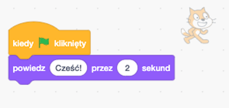

## Przygotowanie do pracy

Po uruchomieniu Scratch zobaczysz okno takie jak to poniżej.

\--- task \---

Look for each of the following areas and remember where they are.

\--- /task \---

### Scena


## \--- collapse \---

## title: Co to jest scena?

This is where your Scratch programs run. It has:

* Jedno lub więcej **tła** (obrazy na tle ekranu)

* Dowolne **bloki kodu** powiązane z tym (dojdziemy do tego później)

\--- /collapse \---

### Lista duszków


## \--- collapse \---

## title: Co to jest duszek?

Any item you can add on the Stage is a **sprite**.

A sprite includes:

* **Obraz** na scenie
* Wszelkie dodatkowe **kostiumy** (wyglądy), które posiada
* Wszelkie **dźwięki** z nim powiązane
* Dowolne **bloki kodu** związanych z nim 

\--- /collapse \---

### Paleta bloków kodu


## \--- collapse \---

## title: bloki kodu

Code in Scratch comes in the form of blocks that you connect to make programs. You choose blocks from the **code blocks palette**, drag them into the **current sprite panel**, and then connect them to each other.

There are ten categories of blocks. They are colour-coded, and you can choose between them by clicking on the items in the list at the top of the **code blocks palette**.

\--- /collapse \---

### Panel bieżącego duszka


## \--- collapse \---

## title: Co to jest bieżący duszek?

The **current sprite** is the one that's selected in the **sprite list**.

The **current sprite panel** is where you can see the code, costumes, and sounds for the selected sprite.

\--- /collapse \---

Time to get coding!

\--- task \---

In the sprite list, click on the Scratch Cat. The cat is now the current sprite.

Choose the **Events** category in the code blocks palette, click the `when flag clicked`{:class="block3events"} block, and drag it into the current sprite panel.

```blocks3
    kiedy flaga kliknięta
```

\--- /task \---

\--- task \---

Then go to **Looks** in the code blocks palette and find this block:

```blocks3
    powiedz [Witaj!] przez (2) sek
```

Click on it, hold down the mouse button, and then just drag it into the current sprite panel and let go of the button.

\--- /task \---

\--- task \---

Now that the second block is in the current sprite panel, connect it to the bottom of the first block by clicking and dragging it again to move it below the other block until they snap together, like this:



\--- /task \---

\--- task \---

Now click the **Green Flag** to start your program and watch what happens!

\--- /task \---