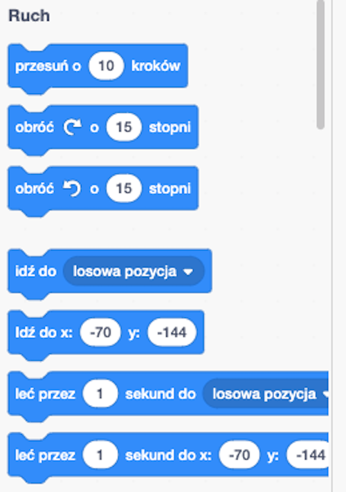
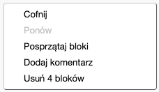

## Dodawanie i usuwanie bloków kodu

Świetnie! Napisałaś swój pierwszy program w Scratch. Czas dowiedzieć się nieco więcej o wprowadzaniu i usuwaniu kodu w Scratch! Kod w Scratch składa się z **bloków** takich jak te:


Znajdziesz tu wszystkie bloki w **palecie bloków kodu**, podzielone na różne kategorie w zależności od tego, co robią.

## \--- collapse \---

## title: Używanie bloków z różnych kategorii

Kliknij na nazwę kategorii, aby zobaczyć bloki w tej kategorii. Tutaj wybrana jest kategoria **Ruch**:


Wszystkie bloki w klikniętej kategorii są wyświetlane na liście:



You can click on the block you want, and then just drag it into the current sprite panel and let go. Po umieszczeniu go w panelu możesz go przenosić i łączyć z innymi blokami.

\--- /collapse \---

Jeśli chcesz zobaczyć, co robi blok, kliknij go dwukrotnie, aby go uruchomić!

\--- task \---

Try double-clicking on some of the blocks to see what they do.

\--- /task \---

## \--- collapse \---

## title: Uruchamianie kodu

Usually, you want your code to run automatically whenever something specific happens. This is why many of your programs will start with a block from the **Events** category, most often this one:

```blocks3
    kiedy flaga kliknięta
```

The code blocks connected to this block will run after the **green flag** is clicked.

Code blocks run from top to bottom, so the order in which you snap your blocks together matters. In this example, the sprite will `say`{:class="block3looks"} `Hello!` before it will `play`{:class="block3sound"} the `meow` sound.

```blocks3
    kiedy flaga kliknięta
    powiedz [Cześć]
    odtwarzaj dźwięk [meow v]
```

\--- /collapse \---

Removing or deleting code blocks you don’t want in your program is easy! Just drag them back into the code blocks palette.

**Be careful:** dragging them into the code blocks pallette will delete all the blocks connected to the block you drag, so make sure to separate code blocks you want to keep from those you want to remove. If you delete some code blocks by accident and want to get them back, right-click and then click on the **undo** option to get everything back.



\--- task \---

Try adding, deleting, and undeleting some code blocks!

\--- /task \---

### Składanie wszystkiego w całość

Now you know how to move code around and make things happen, it's time for you to create a program to make the Scratch Cat walk in a circle!

\--- task \---

Make sure you have the cat sprite selected in the sprite list, and then drag the following blocks into the sprite panel and connect them. You’ll find them in the **Events** and **Motion** lists.

```blocks3
    kiedy flaga kliknięta
    przesuń o [10] kroków
```

\--- /task \---

\--- task \---

Now, click on the green flag above the Stage.


\--- /task \---

You should see the cat walking in a straight line...not exactly what you want, right?

Note: If you click the flag too many times and the cat walks away, you can drag it back!

\--- task \---

Snap the turn block to the end to make the cat sprite walk in a circle. It’s in the **Motion** list too.

```blocks3
    kiedy flaga kliknięta
    przesuń o [10] kroków
+ obróć cw o (15) stopni
```

\--- /task \---

## \--- collapse \---

## title: Jak działa obracanie?

This block makes the sprite turn 15 degrees of the full 360 degrees that make up a circle. You can change that number, and the number of steps, by clicking on the number and typing in a new value.


\--- /collapse \---

\--- task \---

Now save your work!

\--- /task \---