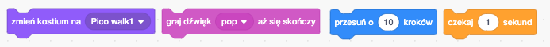

## Dodawanie i usuwanie bloków kodu

Świetnie! Napisałaś swój pierwszy program w Scratch. Czas dowiedzieć się nieco więcej o wprowadzaniu i usuwaniu kodu w Scratch! Kod w Scratch składa się z **bloków** takich jak te:



Znajdziesz tu wszystkie bloki w **palecie bloków kodu**, podzielone na różne kategorie w zależności od tego, co robią.

## \--- collapse \---

## title: Używanie bloków z różnych kategorii

Kliknij na nazwę kategorii, aby zobaczyć bloki w tej kategorii. Tutaj wybrana jest kategoria **Ruch**:


Wszystkie bloki w klikniętej kategorii są wyświetlane na liście:


Po umieszczeniu go w panelu możesz go przenosić i łączyć z innymi blokami. Po umieszczeniu go w panelu możesz go przenosić i łączyć z innymi blokami.

\--- /collapse \---

Jeśli chcesz zobaczyć, co robi blok, kliknij go dwukrotnie, aby go uruchomić!

\--- task \---

\--- task \--- Spróbuj dwukrotnie kliknąć na niektóre bloki, aby zobaczyć, co robią.

\--- /task \---

## \--- collapse \---

## title: Uruchamianie kodu

Zazwyczaj kod ma być uruchamiany automatycznie za każdym razem, gdy wydarzy się coś konkretnego. Dlatego wiele programów będzie rozpoczynać się od bloku z kategorii **Events**, najczęściej tego:

```blocks3
    kiedy flaga kliknięta
```

Bloki kodu połączone z tym blokiem zostaną uruchomione po kliknięciu **zielonej flagi**.

Bloki kodu uruchamiane są od góry do dołu, więc kolejność, w jakiej łączysz bloki, ma znaczenie. W tym przykładzie duszek `powie`{:class="block3looks"} `Witaj!` zanim `odtworzy`{:class="block3sound"} dźwięk `miau` (ang. meow).

```blocks3
    kiedy flaga kliknięta
    powiedz [Cześć]
    odtwarzaj dźwięk [meow v]
```

\--- /collapse \---

Usuwanie lub kasowanie bloków kodu, których nie chcesz w swoim programie, jest łatwe! Po prostu przeciągnij je z powrotem do palety bloków kodu.

**Uważaj:** przeciągnięcie ich do palety bloków kodu spowoduje usunięcie wszystkich bloków połączonych z przeciągniętym blokiem, więc upewnij się, że oddzielasz bloki kodu, które chcesz zachować, od tych, które chcesz usunąć. Jeśli przez przypadek usuniesz niektóre bloki kodu i chcesz je odzyskać, kliknij prawym przyciskiem myszy, a następnie kliknij opcję **cofnij**, aby wszystko odzyskać.


\--- task \---

\--- task \--- Spróbuj dodać, usunąć i przywrócić niektóre bloki kodu!

\--- /task \---

### Składanie wszystkiego w całość

Teraz, gdy już wiesz, jak poruszać kodem i sprawiać, by coś się działo, nadszedł czas na stworzenie programu, który sprawi, że kot Scratch będzie chodził w kółko!

\--- task \---

\--- task \--- Upewnij się, że na liście duszków został wybrany duszek kota, a następnie przeciągnij następujące bloki do panelu duszka i połącz je. Znajdziesz je na listach **Zdarzenia** i **Ruch**.

```blocks3
    kiedy flaga kliknięta
    przesuń o [10] kroków
```

\--- /task \---

\--- task \---

Teraz kliknij zieloną flagę nad sceną.


\--- /task \---

Powinieneś zobaczyć kota idącego w linii prostej... nie dokładnie to, czego chcesz, prawda?

Uwaga: Jeśli klikniesz flagę zbyt wiele razy, a kot odejdzie, możesz przeciągnąć go z powrotem!

\--- task \---

\--- task \--- Doczep blok obrotu na końcu, aby duszek kota chodził po okręgu. Znajduje się również na liście **Ruch**.

```blocks3
    kiedy flaga kliknięta
    przesuń o [10] kroków
+ obróć cw o (15) stopni
```

\--- /task \---

## \--- collapse \---

## title: Jak działa obracanie?

Ten blok powoduje, że ikonka obraca się o 15 stopni (z pełnych 360 stopni tworzących okrąg). Możesz zmienić tę liczbę i liczbę kroków, klikając numer i wpisując nową wartość.


\--- /collapse \---

\--- task \---

\--- task \--- Teraz zapisz swoją pracę!

\--- /task \---