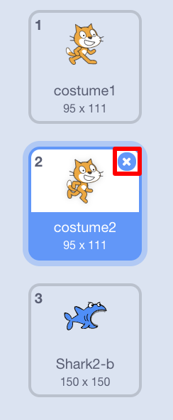

## Ustawianie sceny

Scratch ma bibliotekę tła i duszków, których możesz użyć, aby Twój projekt wyglądał niesamowicie.

--- task --- Wybierz scenę.

Kliknij na **Tła**.

Kliknij ikonę **Wybierz tło z biblioteki**.

Następnie wybierz swoje ulubione podwodne tło!

 --- /task ---

Świetnie! Oczywiście teraz masz kota pod wodą, a koty zwykle nie są wielkimi fanami wody. Ale możesz to naprawić, ponieważ możesz zmienić kota w rekina!

--- task --- Najpierw wybierz duszka kota i kliknij zakładkę **Kostiumy**.

Następnie kliknij **Wybierz kostium z biblioteki**

Wybierz ten obraz rekina i kliknij **OK**.

Teraz usuń kostiumy kota, wybierając każdy z nich i klikając **x**.

 --- /task ---

Teraz masz rekina - doskonale!