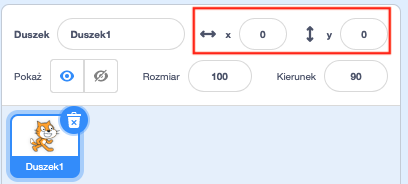

## Poruszanie rzeczami

W tej chwili twój rekin porusza się w kółko, ale kontrolowanie go za pomocą klawiszy strzałek byłoby o wiele przyjemniejsze. Na tej karcie dowiesz się, jak to zrobić!

\--- task \--- Zacznij od usunięcia całego kodu, który masz dla rekina. \--- /task \---

Jak pewnie się domyśliłaś, będziesz potrzebowała ponownie bloków **Zdarzenia** i **Ruch**!

\--- task \--- Tym razem poszukaj tego bloku i przeciągnij go do panelu bieżącego duszka:

```blocks3
    kiedy klawisz [spacja v] naciśnięty
```

Kliknij małą strzałkę (▼) obok `spacji`. Zobaczysz listę wszystkich klawiszy, które możesz wybrać. \--- /task \---

Będziesz potrzebowała czterech bloków `kiedy klawisz jest naciśnięty`{:class="block3events"} - po jednym dla każdego ze strzałek.

\--- task \--- Aby twój rekin się poruszył, połącz te bloki z blokami **Ruch** ten sposób:

```blocks3
    kiedy klawisz [strzałka w lewo v] naciśnięty
    przesuń o (-10) kroków
```

```blocks3
    kiedy klawisz [strzałka w prawo v] naciśnięty
    przesuń o (10) kroków
```

```blocks3
    kiedy klawisz [strzałka w górę v] naciśnięty
```

```blocks3
    kiedy klawisz [strzałka w dół v] naciśnięty
```

\--- /task \---

**Uwaga**: `-10` oznacza „cofnij o 10 kroków”.

\--- task \--- Kliknij zieloną flagę, aby przetestować swój kod. \--- /task \---

Teraz twój rekin porusza się do tyłu i do przodu, co jest całkiem fajne, ale nie porusza się w górę ani w dół. Ponadto, jeśli spojrzysz na bloki **Ruch**, zobaczysz, że nie ma żadnych bloków dla ruchu „w górę” lub „w dół”. Istnieje jednak wiele związanych ze współrzędnymi **x** i **y** - spróbujmy je wykorzystać!

\--- task \--- Złap dwa bloki `zmień y o`{:class="block3motion"} i zaktualizuj swój kod tak:

```blocks3
    kiedy klawisz [strzałka w górę v] naciśnięty
+ zmień y o (10)
```

```blocks3
    kiedy klawisz [strzałka w dół v] naciśnięty
+ zmień y o (-10)
```

\--- /task \---

Teraz, gdy naciśniesz klawisze strzałek, rekin porusza się po scenie!

## \--- collapse \---

## title: Jak działają współrzędne X i Y?

Aby mówić o pozycjach obiektów, takich jak duszki, często używamy współrzędnych x i y. **Oś x** układu współrzędnych sceny biegnie od **lewej do prawej**, a **oś y** biegnie od **dołu do góry**.


Duszek może być umieszczony za pomocą współrzędnych jego środka, na przykład `(15, -27)`, gdzie `15` jest jego pozycją wzdłuż osi x a `-27` to jego położenie wzdłuż osi y.

+ Aby przekonać się, jak to na prawdę działa, wybierz duszka i użyj elementów sterujących **x** i **y**, aby przesuwać go po scenie, ustawiając różne wartości współrzędnych.



+ Wypróbuj różne pary wartości, aby zobaczyć, gdzie idzie duszek! W trybie Scratch oś X przechodzi od `-240` do `240`, a oś y wynosi od `-180` do `180`.

\--- /collapse \---

### Ponowne uruchomienie gry

Rekin porusza się teraz po całym ekranie, ale wyobraź sobie, że to gra: jak ją uruchomić od nowa i co się dzieje na początku każdej gry?

Musisz zabrać rekina do jego pierwotnej lokalizacji, w momencie kiedy gracz rozpoczyna grę. Rozpoczną tę grę, klikając zieloną flagę, więc kiedy to się stanie, musisz zmienić współrzędne x i y duszka rekina.

To naprawdę proste! Środek sceny to `(0, 0)` jako współrzędne `(x, y)`.

Wszystko, czego potrzebujesz, to blok **Zdarzenia** dla tej zielonej flagi, oraz blok **idź do** z kategorii **Ruch**.

\--- task \--- Przeciągnij blok `kiedy kliknięto zieloną flagę`{:class="block3events"} z kategorii **Zdarzenia** na panelu bieżącego duszka.

```blocks3
    kiedy kliknięto zieloną flagę
```

Następnie znajdź blok `idź do`{:class="block3motion"} w kategorii **Ruch** i dołącz go do bloku **zdarzenia z flagą**.

```blocks3
    gdy flaga kliknięta
+ idź do x: (0) y: (0)
```

Ustaw obie współrzędne `x` i `y` na `0` w bloku `idź do`{:class="block3motion"}, jeśli nie są jeszcze ustawione na `0`.

\--- /task \---

\--- task \--- Teraz kliknij zieloną flagę: powinieneś zobaczyć rekina wracającego na środek sceny! \--- /task \---