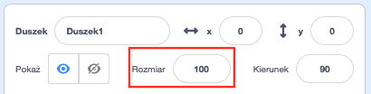
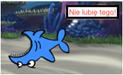

## Wszystkie duszki

Teraz masz rekina, którym możesz poruszać za pomocą klawiszy strzałek. Nieźle! Czas dodać rybę, którą by mógł złapać.

\--- task \---

Kliknij przycisk **Nowy duszek**, a na ekranie, który zostanie otwarty, wybierz rybę.


Jeśli twoja ryba jest trochę duża w porównaniu z twoim rekinem, możesz użyć kontroli rozmiaru, aby oba duszki miały odpowiedni rozmiar!



Zmień liczbę w kontrolce rozmiaru, aby zwiększyć lub zmniejszyć duszka.

\--- /task \---

Świetnie! Później dodasz trochę kodu, aby ryby same się poruszały, bez pomocy gracza. Twój gracz będzie kierował rekinem i spróbuje złapać rybę.

## \--- collapse \---

## title: A co z rekinem poruszającym się wstecz?

Wygląda trochę śmiesznie, gdy rekin płynie do tyłu. Tak jak zwykle odwracasz się zamiast chodzić do tyłu, tak rekin również odwróciłby się, zamiast pływać do tyłu. Na szczęście dla Ciebie Scratch ma do tego blok!

Blok `ustaw kierunek na`{:class="block3motion"} pozwala wybrać kierunek, w który odwraca się twój duszek. Znajdziesz go w sekcji bloków **Ruch**. Możesz wpisać dowolną liczbę stopni, aby skierować duszka w dowolnym kierunku.

\--- /collapse \---

\--- task \---

Grab a couple of copies of the `point in direction`{:class="block3motion"} block from the **Motion** list and connect them to your shark's code, like this:

```blocks3
    gdy klawisz [strzałka w lewo v] naciśnięty
+ ustaw kierunek na (-90)
    przesuń o (10) kroków
```

```blocks3
    gdy klawisz [strzałka w prawo v] naciśnięty
+ ustaw kierunek na (-90)
    przesuń o (10) kroków
```

\--- /task \---

\--- task \---

Change the number of steps in the `move`{:class="block3motion"} blocks from `-10` to `10`.

If you try moving the shark around now after you've added the `point in direction`{:class="block3motion"} blocks, you might notice something a little strange happening. The shark may not be turning quite right!



\--- /task \---

## \--- collapse \---

## title: Dlaczego obraca się do góry nogami?

The problem here is that the shark sprite started, as all sprites do, with the 'all around' **rotation style**, and what you need it to have is the 'left-right' style.

As usual, there’s a block for that, and it’s in **Motion**!

\--- /collapse \---

\--- task \---

Look in the **Motion** category for the block `set rotation style`{:class="block3motion"}.

Add the block to your shark reset code from earlier, and set the rotation style to `left-right`{:class="block3motion"}, like this:

```blocks3
    kiedy kliknięto zieloną flagę
+ ustaw styl obrotu na [lewy-prawy v]
    idź do x: (0) y: (0)
```

\--- /task \---