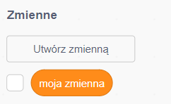
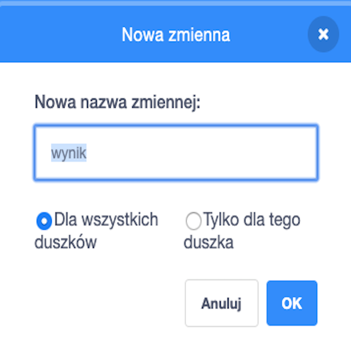
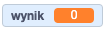

## Zapamiętywanie wyniku

To keep score of how many fish the player catches, you’ll need somewhere to store the score, a way of adding to it, and a way of resetting it when the game is restarted.

First: storing the score!

\--- task \--- Go to the **Variables** blocks category and click on **Make a Variable**.



Enter `score` as the name.



Check out your new variable!

 \--- /task \---

## \--- collapse \---

## title: What are variables?

When you want to store information in a program, you use something called a **variable**. Think of it like a box with a label on it: you can put something in it, check what’s in it, and change what’s in it. You’ll find variables in the **Variables** section, but you need to create them first for them to show up there!

\--- /collapse \---

Now you need to update the variable whenever the shark eats a fish, and to reset it when the game is restarted. Doing both is pretty easy:

\--- task \--- From the **Variables** section, take the `set [my variable v] to [0]`{:class="block3variables"} and `change [my variable v] by [1]`{:class="block3variables"} blocks. Click on the little arrows in the blocks, choose `score` from the list, and then put the blocks into your program:

### Code for the shark

```blocks3
    when green flag clicked
+    set [score v] to [0]
    set rotation style [left-right v]
    go to x: (0) y: (0)
```

### Code for the fish

```blocks3
    if <touching [Sprite1 v] ?> then
+        change [score v] by [1]
        hide
        wait (1) secs
        go to x: (pick random (-240) to (240)) y: (pick random (-180) to (180))
        show
    end
```

\--- /task \---

Cool! Now you’ve got a score and everything.