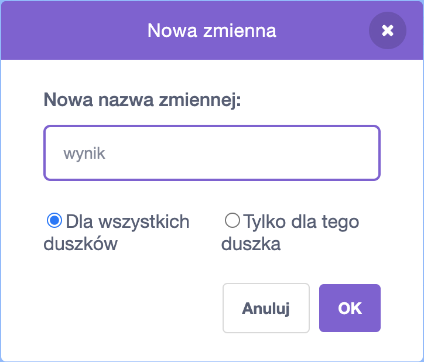

## Zapamiętywanie wyniku

Aby zapamiętać ile ryb złapie gracz, musisz gdzieś przechowywać wynik oraz musisz mieć sposób na zwiększenie go i zresetowanie wyniku po ponownym uruchomieniu gry.

Po pierwsze: zapisywanie wyniku!

\--- task \---

Go to the **Variables** blocks category and click on **Make a Variable**.


Enter `score` as the name.



Check out your new variable!


\--- /task \---

## \--- collapse \---

## title: Czym są zmienne?

When you want to store information in a program, you use something called a **variable**. Think of it like a box with a label on it: you can put something in it, check what’s in it, and change what’s in it. You’ll find variables in the **Variables** section, but you need to create them first for them to show up there!

\--- /collapse \---

Now you need to update the variable whenever the shark eats a fish, and to reset it when the game is restarted. Doing both is pretty easy:

\--- task \---

From the **Variables** section, take the `set [my variable v] to [0]`{:class="block3variables"} and `change [my variable v] by [1]`{:class="block3variables"} blocks. Click on the little arrows in the blocks, choose `score` from the list, and then put the blocks into your program:

### Kod rekina

```blocks3
    kiedy kliknięto zieloną flagę
+    ustaw [wynik v] na [0]
    ustaw styl obrotu na [lewo-prawo v]
    idź do x: (0) y: (0)
```

### Kod dla ryb

```blocks3
    jeżeli <dotyka [rekin v]?> to
+        zmień [wynik v] o [1]
        ukryj
        czekaj (1) sekund
        Idź do x: (losuj liczbę od (-240) do (240)) y: (losuj liczbę od (-180) do (180))
        pokaż
    koniec
```

\--- /task \---

Cool! Now you’ve got a score and everything.