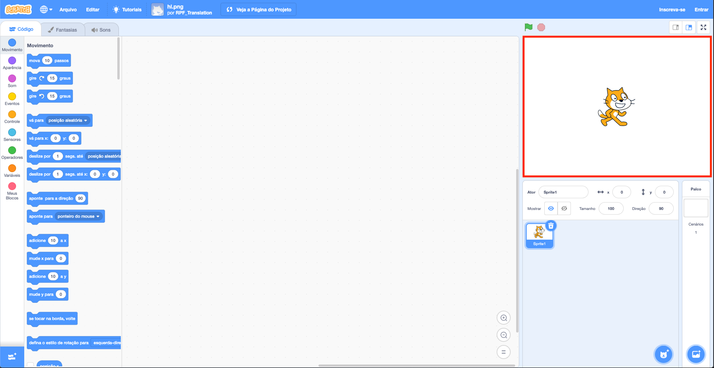
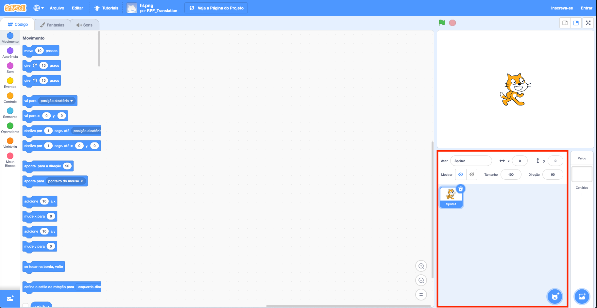
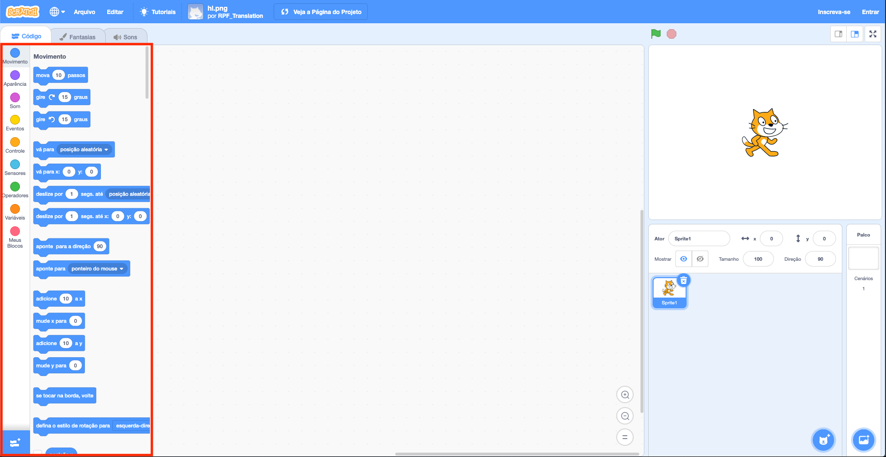
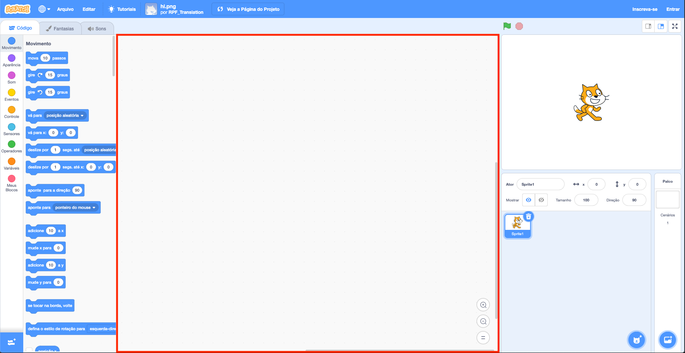
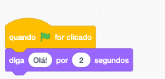

## Preparando

Depois de abrir o Scratch, você verá uma janela como a abaixo.

\--- task \---

Procure cada uma das seguintes áreas e lembre-se de onde elas estão.

\--- /task \---

### O Palco



## \--- collapse \---

## title: O que é o Palco?

É aqui que seus programas do Scratch são executados. Tem:

* Um ou mais **planos de fundo**\(imagens no fundo da tela\)

* Quaisquer **blocos de código** associados a ele \(vamos chegar a isso\)

\--- /collapse \---

### A lista de atores



## \--- collapse \---

## title: O que é um ator?

Qualquer item que você possa adicionar no palco é um **ator**.

Um ator inclui:

* A **imagem** no Palco
* Quaisquer **fantasias** extras \(aparência\) que tem
* Quaisquer **sons** associado a ele
* Quaisquer **blocos de código ** associados a ele 

\--- /collapse \---

### A paleta de blocos de código



## \--- collapse \---

## title: Blocos de código

O código no Scratch vem na forma de blocos que você conecta para criar programas. Você escolhe blocos da **paleta de blocos de código**, arrasta eles até o **painel do ator atual**, e então conecta-os um ao outro.

Existem dez categorias de blocos. Eles são codificados em cores e você pode escolher entre eles clicando nos itens na lista no topo da **paleta de blocos de código**.

\--- /collapse \---

### O painel do ator atual



## \--- collapse \---

## title: Qual é o ator atual?

O **ator atual** é o que está selecionado na **lista de atores**.

O **painel do ator atual** é onde você pode ver o código, as fantasias e os sons do ator selecionado.

\--- /collapse \---

Hora de começar a programar!

\--- task \---

Na lista de atores, clique no gato Scratch. O gato agora é o ator atual.

Escolha a categoria **Eventos** na paleta de blocos de código, clique no bloco `quando ⚑ for clicado`{:class="block3events"} e arraste-o para o painel do ator atual.

```blocks3
    quando a bandeira verde for clicada
```

\--- /task \---

\--- task \---

Em seguida, vá para **Aparência** na paleta de blocos de código e encontre este bloco:

```blocks3
    diga [Olá!] por (2) s
```

Clique nele, mantenha pressionado o botão do mouse e arraste-o para o painel do ator atual e solte o botão.

\--- /task \---

\--- task \---

Agora que o segundo bloco está no painel do ator atual, conecte-o à parte inferior do primeiro bloco clicando e arrastando-o novamente para movê-lo abaixo do outro bloco até que eles se encaixem, assim:



\--- /task \---

\--- task \---

Agora clique na **Bandeira Verde** e veja o que acontece!

\--- /task \---