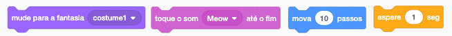
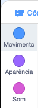
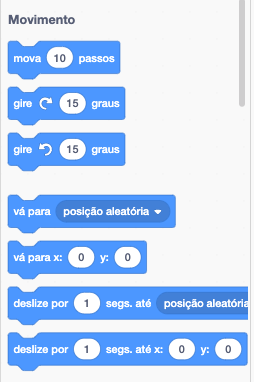
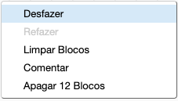

## Adicionando e removendo blocos de código

Ótimo! Você escreveu seu primeiro programa Scratch. Hora de aprender um pouco mais sobre como entrar e sair do código do Scratch! O código do Scratch é feito de **blocos** como esses:



Você encontrará todos os blocos na **paleta de blocos de código**, classificados em diferentes categorias de acordo com o que eles fazem.

--- collapse ---
---
title: Usando blocos das diferentes categorias
---

Clique no nome de uma categoria para ver os blocos nessa categoria. Aqui, a categoria **Movimento** está selecionada:



Todos os blocos na categoria que você clicou são mostrados em uma lista:



Você pode clicar no bloco que deseja e, em seguida, basta arrastá-lo para o painel do ator atual e soltar. Uma vez no painel, você pode movê-lo e conectá-lo a outros blocos.

--- /collapse ---

Se você quer ver o que faz um bloco, você pode clicar duas vezes nele para executá-lo!

--- task ---

Tente clicar duas vezes em alguns dos blocos para ver o que eles fazem.

--- /task ---

--- collapse ---
---
title: Executando o código
---

Geralmente, você quer que seu código seja executado automaticamente sempre que algo específico acontecer. É por isso que muitos dos seus programas começarão com um bloco da categoria **Eventos**, geralmente este:

```blocks3
    when green flag clicked
```

Os blocos de código conectados a este bloco serão executados após a **bandeira verde** ser clicada.

Os blocos de código são executados de cima para baixo; portanto, a ordem na qual você encaixa seus blocos é importante. Neste exemplo, o ator executará `diga`{:class="block3looks"} `Olá!` antes que ele `toque o som`{:class="block3sound"} `miau`.

```blocks3
    when green flag clicked
    say [Olá]
    play sound [meow v]
```

--- /collapse ---

É fácil remover ou excluir blocos de código que você não deseja no seu programa! Basta arrastá-los de volta para a paleta de blocos de código.

**Cuidado:** arrastá-los para a paleta de blocos de código excluirá todos os blocos conectados ao bloco que você arrasta; portanto, separe os blocos de código que deseja manter daqueles que deseja remover. Se você excluir alguns blocos de código por acidente e quiser recuperá-los, clique com o botão direito do mouse e, em seguida, clique na opção **Desfazer** para recuperar tudo.



--- task ---

Tente adicionar, excluir e cancelar a exclusão de alguns blocos de código!

--- /task ---

### Juntando tudo

Agora você sabe como mover o código e fazer as coisas acontecerem, é hora de criar um programa para fazer o gato Scratch andar em um círculo!

--- task ---

Verifique se o ator gato está selecionado na lista de atores e arraste os seguintes blocos para o painel do ator e conecte-os. Você os encontrará nas listas **Eventos** e **Movimento**.

```blocks3
    when green flag clicked
    move [10] steps
```

--- /task ---

--- task ---

Agora, clique na bandeira verde acima do palco.


--- /task ---

Você deve ver o gato andando em linha reta... não é exatamente o que você quer, certo?

Nota: Se você clicar na bandeira muitas vezes e o gato se afastar, você pode arrastá-lo de volta!

--- task ---

Encaixe o bloco gire no final para fazer o gato andar em um círculo. Está na lista **Movimento** também.

```blocks3
    when green flag clicked
    move [10] steps
+    turn cw (15) degrees
```

--- /task ---

--- collapse ---
---
title: Qual o funcionamento do giro?
---

Esse bloco faz o ator girar 15 graus dos 360 graus completos que formam um círculo. Você pode alterar esse número e o número de etapas clicando no número e digitando um novo valor.


--- /collapse ---

--- task ---

Agora salve seu trabalho!

--- /task ---