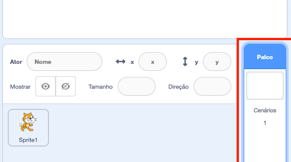
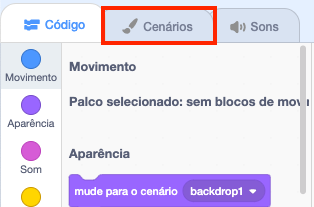
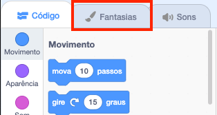

## Preparando o cenário

O Scratch possui uma biblioteca de planos de fundo e atores para você usar para tornar seu projeto incrível.

\--- task \---

Selecione o Palco.

Clique em **Cenários**.

Clique em **Selecionar Cenário da Biblioteca**.

Em seguida, escolha o seu plano de fundo subaquático favorito!

\--- /task \---

Ótimo! Claro, agora você tem um gato debaixo d'água, e os gatos geralmente não são grandes fãs disso. Mas você pode consertar isso, porque você pode transformar o gato em um tubarão!

\--- task \---

Primeiro, selecione o ator gato e clique na aba **Fantasias**.

Em seguida, clique em **Escolher Fantasia da Biblioteca**

Selecione esta imagem de tubarão e clique em ** OK. **.

Agora remova as fantasias de gato selecionando cada uma delas e clicando no **x**.

\--- /task \---

Agora você tem um tubarão - excelente!