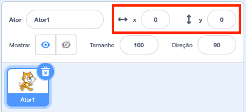

## Movendo as coisas

No momento, seu tubarão se move em círculos, e seria muito mais divertido controlá-lo com as setas do teclado. Neste cartão, você vai aprender a fazer isso!

\--- task \---

Comece excluindo todo o código que você tem para o tubarão.

\--- /task \---

Como você provavelmente imaginou, você vai precisar de blocos **Eventos** e **Movimento** novamente!

\--- task \---

Desta vez, procure esse bloco e arraste-o para o painel ator atual:

```blocks3
    quando a tecla [space v] for pressionada
```

Clique na pequena seta (▼) ao lado de `espaço`. Você verá uma lista de todas as teclas do teclado que você pode escolher.

\--- /task \---

Você vai precisar de quatro dos blocos `quando a tecla for pressionada`{:class="block3events"} — um para cada uma das teclas de seta.

\--- task \---

Para fazer seu tubarão se mover, conecte esses blocos a blocos de **Movimento** assim:

```blocks3
    when [left arrow v] key pressed
    move (-10) steps
```

```blocks3
    when [right arrow v] key pressed
    move (10) steps
```

```blocks3
    when [up arrow v] key pressed
```

```blocks3
    when [down arrow v] key pressed
```

\--- /task \---

**Nota**: `-10` significa 'voltar 10 passos'.

\--- task \---

Agora clique na bandeira verde para testar seu código.

\--- /task \---

Agora seu tubarão se move para trás e para a frente, o que é bem legal, mas não se move para cima ou para baixo. Além disso, se você olhar pelos blocos de **Movimento**, você verá que não há blocos para 'cima' ou para 'baixo'. Há vários deles relacionados com as coordenadas **x** e **y** — vamos tentar essas!

\--- task \---

Pegue dois blocos `mude y para`{:class="block3motion"} e atualize seu código assim:

```blocks3
    when [up arrow v] key pressed
+     change y by (10)
```

```blocks3
    when [down arrow v] key pressed
+     change y by (-10)
```

\--- /task \---

Agora, quando você pressiona as setas do teclado, o tubarão se move por todo o palco!

## \--- collapse \---

## title: Como funcionam as coordenadas x e y?

Para falar sobre as posições de objetos, como atores, muitas vezes usamos as coordenadas x e y. O **eixo x** do sistema de coordenadas do palco é executado da **esquerda para a direita** e o **eixo y** corre de **baixo para cima**.


Um ator pode ser localizado pelas coordenadas de seu centro, por exemplo `(15, -27)` , onde `15` é sua posição ao longo do eixo x e `-27` sua posição ao longo do eixo y.

+ Para ter uma ideia de como isso realmente funciona, selecione um ator e use os controles **x** e **y** para movê-lo pelo palco, definindo valores diferentes para as coordenadas.



+ Tente pares de valores diferentes para ver para aonde o ator vai! No Scratch, o eixo x vai de `-240` até `240`, e o eixo y vai de `-180` até `180`.

\--- /collapse \---

### Reiniciando o jogo

O tubarão se move por toda a tela agora, mas imagine que seja um jogo: como você o reinicia e o que acontece no início de cada jogo?

Você precisa levar o tubarão à sua localização original quando o jogador iniciar o jogo. Eles vão iniciar o jogo clicando na bandeira verde, então você precisa mudar as coordenadas x e y do ator tubarão quando isso acontecer.

Isso é realmente muito fácil! O centro do palco é `(0, 0)` em coordenadas `(x, y)`.

Então, tudo o que você precisa é de um bloco **Eventos** para essa bandeira verde, e o bloco **vá para** de **Movimento**.

\--- task \---

Arraste um bloco `quando ⚑ for clicado`{:class="block3events"} de **Eventos** para o painel do ator atual.

```blocks3
    quando a bandeira verde clicado
```

Em seguida, encontre o bloco `vá para`{:class="block3motion"} de **Movimento**, e anexe-o ao seu bloco da bandeira da categoria **Eventos**.

```blocks3
    when green flag clicked
+     go to x: (0) y: (0)
```

Defina as coordenadas `x` e `y` para `0` no bloco `vá para`{:class="block3motion"} se ainda não estiverem com `0`.

\--- /task \---

\--- task \---

Agora clique na bandeira verde: você verá o tubarão retornar ao centro do palco!

\--- /task \---