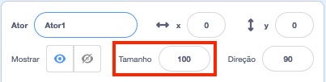
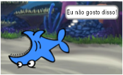

## Todos os atores

Agora você tem um tubarão que você pode mover usando as setas do teclado. Legal! Hora de adicionar alguns peixes para ele pegar.

\--- task \---

Clique no botão **Selecione um Ator**, e na tela que se abre, escolha um peixe.


Se o seu peixe é um pouco grande comparado ao seu tubarão, você pode usar o controle de tamanho para tornar os dois atores do tamanho certo!



Altere o número no controle de tamanho para aumentar ou diminuir o tamanho do ator.

\--- /task \---

Ótimo! Mais tarde, você adicionará algum código para fazer o peixe se mover sozinho, sem a ajuda do jogador. Seu jogador moverá o tubarão e tentará pegar o peixe.

## \--- collapse \---

## title: E o tubarão ao contrário?

Parece um pouco engraçado ter esse tubarão nadando para trás. Assim como você geralmente você se vira em vez de andar para trás, o tubarão se vira em vez de nadar para trás. Felizmente para você, Scratch tem um bloco para isso!

O bloco `aponte para a direção`{:class="block3motion"} permite escolher a direção que seu ator está apontando. Você o encontrará na seção de blocos **Movimento**. Você pode digitar qualquer número de graus, para apontar o ator para onde quiser.

\--- /collapse \---

\--- task \---

Pegue algumas cópias do bloco `aponte para a direção`{:class="block3motion"} da seção **Movimento** e conecte-as ao código do seu tubarão, assim:

```blocks3
    when [left arrow v] key pressed
+     point in direction (-90)
    move (10) steps
```

```blocks3
    when [right arrow v] key pressed
+     point in direction (90)
    move (10) steps
```

\--- /task \---

\--- task \---

Altere o número de passos nos blocos `mova _ passos`{:class="block3motion"} de `-10` para `10`.

Se você tentar mover o tubarão agora depois de adicionar os blocos `aponte para a direção`{:class="block3motion"}, você pode notar algo um pouco estranho acontecendo. O tubarão pode não estar virando direito!



\--- /task \---

## \--- collapse \---

## title: Por que fica de cabeça para baixo?

O problema aqui é que o ator tubarão iniciou, como todos os atores, com o **estilo de rotação** 'rotação completa', e o que você precisa de ter é o estilo 'esquerda-direita'.

Como sempre, há um bloco para isso, e está em **Movimento**!

\--- /collapse \---

\--- task \---

Olhe na categoria **Movimento** para o bloco `defina o estilo de rotação para`{:class="block3motion"}.

Adicione o bloco ao seu código de início do tubarão já existente, e defina o estilo de rotação para `esquerda-direita`{:class="block3motion"}, assim:

```blocks3
    when green flag clicked
+     set rotation style [left-right v]
    go to x: (0) y: (0)
```

\--- /task \---